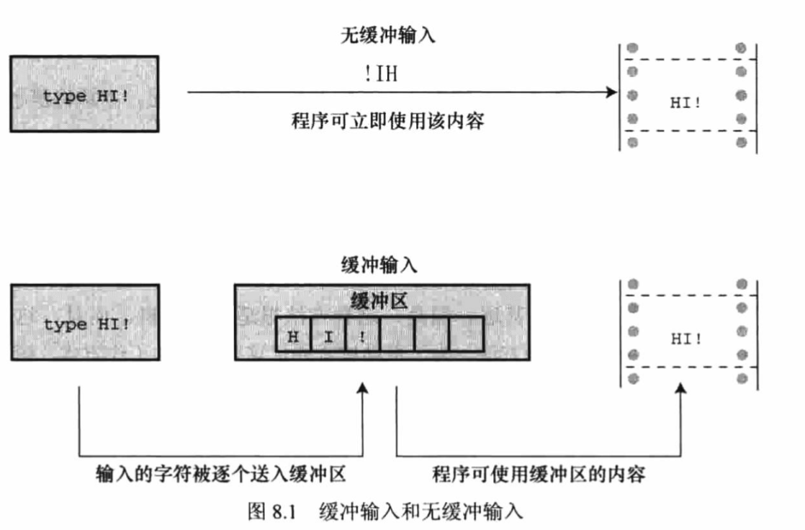
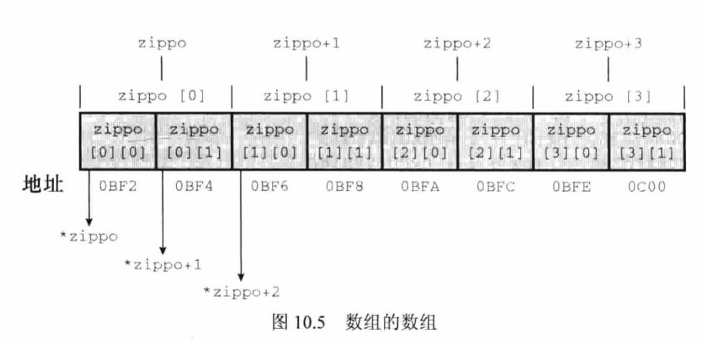

# C 语言学习笔记 By Zn

## C 语言数据类型关键字

### 表示整型的

- int
- long
- short
- unsigned

  - 提供基本整数型的变式 如, unsigned short int 代表非负整数.

- signed(C90)
  - 整数型默认范围的关键字 表面范围为正负整数。

### 表示浮点(小数)

- float
- double

### 表示字符 

- char 字符类型 (也可表达为较小的整数)

### 表示其他

- void (C90)

- \_Bool (C99) 布尔值

  > 可以使用 stdbool.h 文件兼容 C++ 的 bool

- \_Complex (C99) 复数

- \_Imaginary (C99) 虚数

> 以上通过关键字创建的类型, 如按计算机的储存方式
> 可分为两大基本类型: 整数类型和浮点数类型

### 浮点数与 E 科学计数

1. 基本的科学计数格式为:

`1.23`(小数部分)`E8`(指数部分)

E 代表 10 的倍数, 上面这个数就是 1.23\*10^8, 所以,

```text
3.16E7 -> 3.16 * 10^7
7.0 -> 0.7E1
```

这种数在计算机里被视为浮点数，而计算机是用**二进制和 2 的幂**进行储存的，而不是 10 的幂。

整型和浮点型的实际区别:

- 整数没有小数部分，浮点数有小数部分。

- 浮点数可以表示的范围比整数大。

- 对于一些算术运算（如，两个很大的数相减），浮点数损失的精度更多。

  > 因为在任何区间内（如，1.0 到 2.0 之间）都存在无穷多个实数，所以 计算机的浮点数不能表示区间内所有的值。浮点数通常只是实际值的近似值。例如，7.0 可能被储存为浮点值 6.99999。

- 浮点运算比整数运算慢。不过，现在许多 CPU 都包含浮点处理器，缩小了速度上的差距。

  > 故很多时候 CPU 的算力衡量中经常有多少 TFlops 的术语,就来源于此.

## C 语言基本数据类型

### int

- 范围: -32768~32767 (由 ISO C 规定, 这是 16 位存储的范围)

- 声明: 单独声明 或 同时声明(逗号分隔)

- 赋值:

  - 直接赋值
  - scanf() 等函数取值

- 打印的**转换说明**字符 `%d`

  > 打印的时候有少写了参数会怎么样?

  > ```c
  > int main(void)
  > {
  >     int ten = 10;
  >     int two = 2;
  >     printf("Doing it right: ");
  >     printf("%d minus %d is %d\n", ten, 2, ten - two);
  >     printf("Doing it wrong: ");
  >     printf("%d minus %d is %d\n", ten); // 遗漏2个参数
  >     return 0;
  > }
  > ```

  > 编译并运行该程序，输出如下：
  > Doing it right: 10 minus 2 is 8
  > Doing it wrong: 10 minus 16 is 1650287143
  >
  > 在第一行输出中，第 1 个%d 对应 int 类型变量 ten；第 2 个%d 对应 int 类型常量 2；第 3 个%d 对应 int 类型表达式 ten - two 的值。
  >
  > 在第二行输出中，第 1 个%d 对应 ten 的值，但是由于没有给后两个%d 提供任何值，所以打印出的值是**内存中的任意值**（因为内存中储存的数据不同，而且编译器管理内存的位置也不同,不同情况都不一样）。

#### 使用 8/16 进制

- 8 进制以 0 开头

  ```c
   int oct_a = 010;  // 十进制数8
   int oct_b = 020;  // 十进制数16
  ```

- 16 进制以 0x 和 0X 开头

  ```c
   int hex_a = 0x10;
   int hex_b = 0X20;
  ```

- 打印

- 十进制显示数字，使用 `%d`；
- 以八进制显示数字，使用 `%o`；
- 以十六进制显示数字，使用 `%x`；
- 另外，要显示各进制数的前缀 0、0x 和 0X，必须分别使用`%#o`、`%#x`、`%#X`。

```c
 printf("DEC: oct_a=%d, oct_b=%d, hex_a=%d, hex_b=%d\n", oct_a, oct_b, hex_a, hex_b);
    printf("OCT: oct_a=%o, oct_b=%o, hex_a=%o, hex_b=%o\n", oct_a, oct_b, hex_a, hex_b);
    printf("HEX: oct_a=%x, oct_b=%x, hex_a=%x, hex_b=%x\n", oct_a, oct_b, hex_a, hex_b);
    printf("WITH PREFIX: oct_a=%#o, hex_a=%#x, hex_b=%#X", oct_a, hex_a, hex_b);

/*
        DEC: oct_a=8, oct_b=16, hex_a=16, hex_b=32
        OCT: oct_a=10, oct_b=20, hex_a=20, hex_b=40
        HEX: oct_a=8, oct_b=10, hex_a=10, hex_b=20
        WITH PREFIX: oct_a=010, hex_a=0x10, hex_b=0X20
*/

```

#### int 修饰符

> C 语言提供 3 个附属关键字修饰基本整数类型：short、long 和 unsigned。

- `short int`类型（或者简写为`short`） 

  占用的存储空间可能比 int 类型少，常用于较小数值的场合以节省空间。

  与 int 类似，short 是有符号类型, **存储 16 位数字**。现代语言称之为 `int16`

  > unsigned short i;　 i 可以表示 0~65535
  >
  > signed（默认）short i;　 i 可以表示-32768~+32767

  > 含 2 个字节
  >
  > - signed 取值范围为：-2^15 ~ 2^15 - 1
  >
  > - unsigned 为 2^16 - 1

- `long int`或`long`

  占用的存储空间可能比 int 多，适用于较大数值的场合, 有符号的最大值大概 21亿。

  与 int 类似，**存储 32 位数字**, long 是有符号类型。 现代语言称之为 `int32`

  **在现代系统中, int 的范围通常与 long 相同。**

  > 含 4 个字节
  >
  > - signed 取值范围为：-2^31 ~ (2^31 -1),
  > - unsigned 为 (2^32 - 1)

  > 打印转换说明 `%ld` `%lu`

  > - 如果系统中 int 和 long 的大小相同，使用%d 就行。但是，这样的程序被移植到其他系统（int 和 long 类型的大小不同,老机器）中会无法正常工作。

- `long long int`或`long long`（C99 标准加入）

  占用的储存空间可能比 long 多，适用于更大数值的场合。

  该类型**至少占 64 位**。与 int 类似，long long 是有符号类型。现代语言称之为 `int64`

  > 含 8 个字节，取值范围为：-2^63 ~ (2^63 -1), unsigned 为 2^64 -1

  > 打印转换说明 `%lld` `%llu`

- `unsigned int`或`unsigned` **无符号整型**

  只用于**非负值**的场合, 默认整型是 `signed`, 即有符号整型, 因此 `unsigned` **可表示的正整数比对应的有符号整型大**。

  例如，16 位 unsigned int 允许的取值范围是 0 ～ 65535，而不是-32768 ～ 32767。用于表示正负号的位现在用于表示另一个二进制位，所以无符号整型可以表示更大的数。

  > 打印转换说明 `%lu`

- 在 C90 标准中，添加了`unsigned long int`(`unsigned long`)和

  `unsigned int`或 `unsigned short`类型。

  > 打印转换说明 `%lu`

- C99 标准又添加了`unsigned long long int`(`unsigned long long`)。

  > 打印转换说明 `%llu`

- 在任何有符号类型前面添加关键字`signed`，可强调使用有符号类型的意图。例如，short、short int、signed short、signed short int**都表示同一种类型**。

### char

> char 类型实际上储存的是整数而不是字符。计算机使用数字编码来处理字符，即用特定的整数表示特定的字符。

- 范围: ASCII -> Unicode ...etc.

- 声明: 单独声明 或 同时声明(逗号分隔)

- 赋值:

  - 字符常量 **`使用单引号` **

    - `my_char = 'A'` 只能容纳一个字符

  - 赋值为十进制整数 ACSII 对应的数字 如 `char grade = 65(A)` , 但不是好规范

  - 转义序列 '\n' '\t' 等

    - 转义序列可以使用八进制 \0oo o 为(0~7) 或者十六进制 \xhh h 为(0~f)

      > 注意 **八进制转义可以省略 0**, 即能写出 **&#39;\007&#39; &#39;\07&#39; &#39;\7&#39;** 而这三种都表示相同的值, 比如 &#39;\41&#39; -&gt; 33(10) -&gt; !

- 打印:

  - **转换说明** `%c`

  - 可以被打印成 `%d`

    > printf 中转换声明只是打印的一种转换形式,
    >
    > 而非数据存储的形式

    ```c
    int main(void)
    {
        char ch;
    
        printf("Enter a character: ");
        // & 表示将用户输入的值赋值给 ch
        scanf("%c", &ch);
        // 使用 %d 可以将 char 的 ascii 码输出
        printf("ch = %c, code is %d", ch, ch);
        // Enter a character: %
        // ch = %, code is 37
    
        return 0;
    }
    ```

### \_Bool 布尔

> C99 标准添加了*Bool 类型，用于表示布尔值，即逻辑值 true 和 false。*
>
> 因为 C 语言用值 1 表示 true，值 0 表示 false，所以\_Bool 类型实际上也是一种整数类型。
>
> 但原则上它仅占用**1 位存储空间**，因为对 0 和 1 而言，1 位的存储空间足够了。

```c
// 声明 布尔值
_Bool bol = 0; // 赋值使用 0 | 1

// 打印使用 %d
printf("%d\n", bol);
// 0

if (!bol)
{
    printf("bol is false\n");
    // bol is false
}
```

```c
/* 大小比较 */

  _Bool bol = 0;
  int  num = 0;

  printf("sizeof bol: %d Byte\n", sizeof(bol));
  printf("sizeof num: %d Byte\n", sizeof(num));
  // sizeof bol: 1 Byte
  // sizeof num: 4 Byte
```

- C99 提供 `stdbool.h` 头文件, 让 bool 成为 _Bool 的别名, 并把 true = 1, false = 0, **这样写出来的代码可以与 C++ 兼容**

### 浮点数

浮点数类型包含

`float` `double` and `long double`

#### float

- 转换声明 `%f`

> C 标准规定，float 类型必须**至少能表示 6 位有效数字**，且取值范围至少是 `10^-37～10^+37`。前一项规定指 float 类型必须至少精确表示小数点后的 6 位有效数字，如 33.333333。后一项规定用于方便地表示诸如太阳质量（2.0e30 千克）、一个质子的电荷量（1.6e-19 库仑）或国家债务之类的数字。通常， 系统储存一个浮点数要占用 32 位。其中 8 位用于表示指数的值和符号，剩下 24 位用于表示非指数部分（也叫作尾数或有效数）及其符号。

#### double

- 转换声明 `%lf` <- 在读取变量时是必须的, 打印的时候非必须

> 取值范围与 `float` 相同 , 但是至少必须能表示 10 位有效数字。一般情况 下，double 占用 64 位而不是 32 位。一些系统将多出的 32 位全部用来表示非指数部分，这不仅增加了有效数字的位数（即提高了精度），而且还减少了舍入误差。另一些系统把其中的一些位分配给指数部分，以容纳更大的指数，从而增加了可表示数的范围。无论哪种方法，double 类型的值**至少有 13 位有效数字**，超过了标准的最低位数规定。

#### long double

> C 语言的第 3 种浮点类型是 long double，以满足比 double 类型更高的精度 要求。不过，C 只保证 long double 类型至少与 double 类型的精度相同。

---

- 范围: 10^-37 ～ 10^+37 有效数字不定 6 / 13 /+

- 声明: 单独声明 或 同时声明(逗号分隔)

- 赋值:

  - 浮点型常量

    ```c
    3.1415
    .123
    1.23e-5
    -4.5E+10
    100.
    ```

  - 注意事项:

    > 默认声明的浮点常量为 `double` 类型 \*\*

    1. 使用 `f/F` 覆盖默认设置, 确保浮点常量为 `float`

    ```c
    float some = 4.0 * 2.0
       // 4.0 2.0 默认会使用 double 进行运算, 这可能造成性能问题
    
    ---
    /* fix */
    float some_float = 4.0f * 2.0f;
    ```

           	2. 使用使用 `l/L` 覆盖默认设置, 确保浮点常量为

  `long double` 类型(推荐 L 以免小写 l 与数字 1 混淆)

- 十六进制(不常用)

  > 使用 p/P 代替 e/E , 用 2 的幂代替 10 的幂

  `0xa.1fp10`

  - 0xa -> 十进制 10

  - .1f -> (第一位小数 1)1/16 + (第二位小数 f)15/256

  - p10 -> 2 ^ 10 -> 1024

  最终这个值为 (10 + 1/16 + 15/256) \* 1024 = 10364.0

- 打印

  - **转换说明** 
    - `%f` float
    - `%lf` double (读取的时候必须声明 l 字母)
  - 打印指数计数法的浮点数 `%e`
  - 位数控制: % 符号 + .(有效数字位数) + 标记 如两位有效数字 float `%.2f`

- 精度的 example 说明

  ```c
  	float  f1 = 1.23456789012345;  // float 仅支持 6 位有效数字
      double d1 = 1.23456789012345;
  
      // 1. float 与 double 都使用 %f 打印
      // 2. %f 默认打印 6 为有效数字, 这也是 float 的最小有效数字要求
  
      printf("%f\n", f1);
      // 1.234568
  
      // 3.可以看到 float 在超过 6 位有效数字后 精确度变得不好保证, 故超过 6 位的小数应使用 double 保存
  
      printf("%.7f\n", f1);
      // 1.2345679
      printf("%.8f\n", f1);
      // 1.23456788            <= 丢失精度
      printf("%.9f\n", f1);
      // 1.234567881           <= 丢失精度
      printf("%.10f\n", f1);
      // 1.2345678806          <= 丢失精度
  
      printf("%.10f\n", d1);
      // 1.2345678901          <= double 精度依然保证
      printf("%.14f\n", d1);
      // 1.23456789012345      <= double 精度依然保证
  ```

### 复数和虚数类型

> 一般而言，虚数类型都是可选项。C11 标准把整个复数软件包都作为可选项。

简而言之，C 语言有 3 种复数类型：`float_Complex`、`double_Complex`和 `long double_Complex`。

例如，`float_Complex` 类型的变量应包含两个 float 类型的值，分别表示复数的实部和虚部。

类似地， C 语言的 3 种虚数类型是`float__Imaginary`、`double_Imaginary` 和`long double_Imaginary`。

如果包含`complex.h`头文件，便可用`complex`代替 `_Complex`，用 `imaginary` 代替 `_Imaginary`，还可以用 `I` 代替-1 的平方根。

> 小结：基本数据类型由 11 个关键字组成：int、long、short、unsigned、char、 float、double、signed、`_Bool`、`_Complex`和 `_Imaginary`。

### 命名规范

> 许多程序员和公司内部都有系统化的命名约定，在变量名中体现其类型。
>
> 例如，用 `i_` 前缀表示 int 类型，`us_`前缀表示 unsigned short 类型。
>
> 这样， 一眼就能看出来 i_smart 是 int 类型的变量， us_versmart 是 unsigned short 类型 的变量。

## 常量,预处理器和格式化输入输出

### #define

C 语言可以使用 #define 声明符号常量, 通过 C 预处理器进行编译时替换

- 格式 `#define NAME value`

- 末尾不需要加分号
- 常量推荐全大写

Example:

```c
#include <stdio.h>

/** 定义常量格式 #define NAME value */
#define WORD "Hello"

/* 常量定义不需要分号结尾 */
#define PI 3.1415926

/* 高阶 使用常量定义函数 */
#define AREA(r) (PI * r * r)

int main(void)
{
    int r;
    printf("%s\n", WORD);
    // Hello
    printf("circle radius? ");
    // circle radius? 5
    scanf("%d", &r);

    printf("PI is using %.7f\n", PI);
    // PI is using 3.1415926
    printf("circle area = %.7f\n", AREA(r));
    // circle area = 78.5398150

    return 0;
}
```

### const

```c
#include <stdio.h>

int main(void)
{
    // 使用 const 关键字声明不可变的常量变量
    const int NO_CHANGE = 100;

    NO_CHANGE = 200;  // error: assignment of read-only variable 'NO_CHANGE'

    printf("%d", NO_CHANGE);

    return 0;
}
```

### 明示常量

- C 头文件 limits.h 和 float.h 分别提供了与整数类型和浮点类型大小限制相
  关的详细信息。
- 可参考电子书 P79


### printf 的原则

- 如果内部的转换声明对应的表达式不符合, 输出是不确定的, 如果都是数字类型, 可能出现类型转换,

  如果是完全不同的类型, 可能会导致不输出

- 返回 int 类型, 即 printf 的原表达式实参包含有多少个字符或者说这个表达式的字符串长度 (转义符, 空格也被计入)

  ```c
  // Example: 
  printf("%d", printf("a: %d\n", 11));
  // a: 11
  // 6 <- 等同于 strlen("a: %d\n")
  ```

  

### printf 格式化演示

- 数字格式化

```c
#include <stdio.h>

int main(void)
{
    int NUM = 1234;

    printf("*%d*\n", NUM);
    // *1234*

    /** 1. %数字d 表示字符宽度. 如果超出了宽度, 则使用更宽字段 */
    printf("*%4d*\n", NUM);
    // *1234*
    printf("*%4d*\n", 12345678);
    // *12345678*

    // 2. 使用 - 代表数字位于字段的左端
    printf("*%10d*\n", NUM);
    // *      1234*
    printf("*%-10d*\n", NUM);
    // *1234      *

    /** 3.使用 0 代表在数字前补 0, 输入出现 - /指定精度 则忽略 */
    printf("*%06d*\n", NUM);
    // *001234*
    printf("*%-06d*\n", NUM);
    // *1234  *

    /** 对于浮点数 */
    const double D = 1234.567;

    printf("*%4.2f*\n", D);
    // *1234.57*
    printf("*%+4.2f*\n", D);
    // *+1234.57*
    printf("*%10.2f*\n", D);
    // *   1234.57*
    printf("*%010.2f*\n", D);
    // *0001234.57*
    printf("*%-10.2f*\n", D);
    // *1234.57   *
    printf("*%10.2E*\n", D);
    // * 1.23E+003*

    return 0;
}
```

- 字符串

```c
#include <stdio.h>

#define WORD "Hello World!"

int main(void)
{
    printf("[%2s]\n", WORD);
    // [Hello World!]

    printf("[%20s]\n", WORD);
    // [        Hello World!]

    printf("[%-20s]\n", WORD);
    // [Hello World!        ]

    /** 用 .数字 表示应输出字符串中的多少个字符, 如果超出了原有数量则显示全部 */

    printf("[%20.5s]\n", WORD);
    // [               Hello]
    printf("[%-20.5s]\n", WORD);
    // [Hello               ]
    printf("[%-20.15s]\n", WORD);
    // [Hello World!        ]

    return 0;
}
```

### scanf 的原则

- 以空字符(空格 制表符 换行)作为变量的起始

  (因此输入字符串不能带空格, 使用 fgets 可解决)

- 如果用 scanf()读取**基本变量**类型的值，在变量名前加上一个`&`；

- 如果用 scanf()把**字符串读入字符数组**中，不要使用`&`。

  > & 地址运算符

- 限制读入字符串的数量, 可以使用数字作为修饰符

  ```c
  scanf("%5s", word);
  // abcdefghi
  printf("%s", word);
  // abcde
  ```

  

- scanf **返回读取到目标数据的数量**

  ```c
  printf("%d", scanf("%lf", &db));
  
  // 1. 这里要求输入一个类型 double 的值
  // 2. 如果输入 数字 类型, 返回 1 (数据符合类型)
  // 3. 如果输入 其他 类型, 返回 0 (数据不符合类型)
  ```

  ```c
  printf("%d", scanf("%lf, %d", &db, &i));
  // 根据读取到的数量 可以是 0-2
  ```

### 在循环中读取清除缓冲区的处理**

- 适用于 getchar() scanf() 等输入场景
- 可参考 [[C语言 getchar()原理及易错点解析](https://blog.csdn.net/weixin_44551646/article/details/98076863)]

- 编写一个程序，要求用户输入两个浮点数，并打印两数之差除以两数乘积的结果。

  在用户输入非数字之前，程序应循环处理用户输入的每对值

- 下面这个例子, 去掉 getchar() 当用户输入有误时, 程序会一直循环打印中间的 printf 语句

> 解释:
>
> - 当你输入一个字符按回车后，你实际上是在缓冲区输入了两个字符，一个是你输入的，一个是换行符本身，**这会导致你输入一个字符后, 这个换行符还留在缓冲区里**面, 在下次进入循环时, 读取的参数位置就会出问题
>
> - 解决方法是清除缓冲或吃掉那个回车，方法很多，比如用**fflush(stdin)或者getchar()**

```c
double calc_num(double a, double b);

int main(void)
{
    double a, b;
    do {
        printf("Enter two double: \n");
        // getchar();  // 加上后可防止回车符导致无限循环
        while
    } while (scanf("%lf %lf", &a, &b) != 2);

    printf("Result %lf", calc_num(a, b));
    return 0;
}
... 
```

那加入输入的内容带有未知个空格, 总不能每一个字符都清理一次 getchar()

于是有了更完整的形式:

```c
...  
while (getchar() != 'y') {
        printf("now %d\n", ++n);
		// 通过下面这个 while 读取缓冲区剩余的部分删除缓存
        // 1. 如果里面不是换行符,也就是多余的部分, 相当于什么都不做
        // 2. 如果读取了 \n 可以认为这是用户输入的末端
        // while 不再循环, 缓冲区这个时候也空出来了, 代码继续
        while (getchar() != '\n')
            continue;
    }

    printf("Done\n");
...
```


> https://www.zhihu.com/question/29549162/answer/1363157642
>
> 
>
> 你输入了ab［enter］ （这里的［enter］为回车键），在缓冲区中有上述输入的3个字符。
>
> 在你按下enter时，getchar便开始从缓冲区读取数据。
>
> 因为getchar每次只读取一个字符，第一个getchar读取a，执行a中的情况，然后进入到while那一行，然后接下来由于有getchar 要读取一个字符，而a已经被读取，则读取b，b符合while条件，则进行continue。但是由于while里的getchar不像第一个getchar中的值被赋给了ch，那么就相当于什么都不做。（其实即使被赋给了ch，结果也一样的）然后由于continue，则返回到while循环，getchar又要读取一个字符，则读取的是＼n，相当于读取b的时候什么都没做就读取了＼n，而缓冲区中的数据被读取后，则数据可以近似认为消失，那么b就消失了，即丢弃了b。读取＼n的时候，虽然不满足循环条件，但是它是先读取再判断是否符合条件，也即＼n也和b一样消失了，即被丢弃。
>
> 此时不再进行循环，退出循环，即此步骤只读取了第一个字符，丢弃其余字符。
>
> 此时你再输入新的字符时，因为b和enter被丢弃，下一个读取的不会是b，再下一个也不是enter。此时读取的是你输入的第一个字符。


### printf 和 scanf 的 \* 修饰符

- printf

  - 作用, 允许用户提供字段宽度的占位参数

  - 例子

    ```c
    #include <stdio.h>
    
    int main(void)
    {
        int field;
        int num = 123;
        /**  printf * 修饰符 作用 提供字段宽度 */
    
        printf("Enter width of field\n");
        scanf("%d", &field);
        // 6
    
        // * 用于转换宽度 最后变为 %6d
        printf("field: |%*d|\n", field, num);
        // field: |   123|
    
        float fl = 123.456;
        int   precision;
        printf("Enter width and precision of field\n");
        scanf("%d %d", &field, &precision);
        // 8 2
    
        // * 按参数位次可以有多个, 例如: 用于打印浮点数
        printf("field: |%*.*f|\n", field, precision, fl);
        // field: |  123.46|
    
        return 0;
    }
    ```

- scanf

  - 作用 跳过输出项(比如读取文件特定列内容时, 跳过前置内容)

  - 例子

    ```c
    #include <stdio.h>
    
    int main(void)
    {
        /**  scanf * 修饰符 作用 跳过字段 */
        float salary;
    
        printf("Name Age Gender Salary\n");
    
        scanf("%*s %*d %*s %f", &salary);
        // John 20 Male 12300.32
    
        printf("Oh I' see, your salary is %.2f\n", salary);
        // Oh I' see, your salary is 12300.32
    
        return 0;
    }
    ```

## 字符串入门

### 使用数组存储字符串

```c
...
    int size, letters;
    char name[40]; // name 是可以容纳 40 个字符的字符数组.

	printf("Hi! What's your first name?\n");
	scanf("%s", name); // 注意，在scanf()中，name没有&前缀，

	size = sizeof name;
    letters = strlen(name);

	printf("%s, your first name has %d letters,\n", name,
	letters);
	printf("and we have %d bytes to store it.\n", size);
	return 0;
...
```

```c
Log:

Hi! What's your first name?
Christine

Christine, your first name has 9 letters,
and we have 40 bytes to store it.
```

- C 语言**没有**专门用于储存字符串的变量类型

- 空字符（null character），**C 语言用它标记字符串的结束**。空字符不是数字 0，它是非打印字符，其 ASCII 码值是（或等价于）0。

- **C 中的字符串一定以空字符结束**，这意味着数组的容量必须至少比待存储字符串中的字符数**多 1**。

- 字符串**未被使用的元素**将会被初始化为 `\0` 空字符。

- 声明字符串时, 为了方便, 可以不固定长度, 让编译器自动计算

  ```c
  const char str[] = "This is a string";
  
  printf("string: %s, length = %d", str, strlen(str));
  // string: This is a string, length = 16
  ```

  

#### 字符串与字符 "x" 与 'x'

"x" 是字符串常量, 'x' 则是字符常量

1. 'x' 是基本类型 char, "x" 是派生类型 char[]
2. "x" 实际由两个字符组成, 即 'x' 和 空字符\0(null char)

### strlen()

- 功能: 用于给出字符串变量的**实际字符(不含尾部空字符)(Byte)长度**

- 如果是 sizeof 则为声明大小

- 依赖原型 `string.h`


### getchar()

- 功能: 从输入队列中返回下一个字符

- 不需要转换声明, 只能处理字符

- Example

  ```c
  ch = getchar();
  // 这条语句相当于下面
  scanf("%c", &ch);
  ```

  

### putchar()

- 功能: 打印输入参数字符

- 不需要转换声明, 只能处理字符

- Example

  ```c
  putchar(ch);
  // 这条语句相当于下面
  printf("%c", ch);
  ```

  


## 运算符、表达式和语句

### 表达式 expression

- 表达式由一个或多个**运算符**和**运算对象**组成

- 每个表达式都有一个值

- 关系表达式返回 `真假值`, C 只有 0 是假值,

  其他都是真值


### 语句 statement 

- 语句是 C 的基本构建块, **以分号结尾**

- 一条语句相当于完整的计算机指令

  > a = 1 是表达式
  >
  > a = 1; 是语句

- 最简单的语句是空语句 `;`

- 语句的种类: 

  > C 标准中声明不是语句, C++ 是

  - 空语句

  - 表达式语句 (赋值/函数)

  - 迭代语句 (while / for)

  - 跳转语句 (return / goto)

  - 复合语句 块(花括号包裹)

    > 比如在 while 中包括的块, 块确保了内部的语句都是一次循环的一部分, 内部的子语句被视为一条语句

- 值得注意的是, 初始化可以在函数外部进行

  ```c
  #include <stdio.h>
  
  const int   MAGIC_NUM = 42;
  const float PI        = 3.1415926;
  char        a         = 'A';
  
  int main(void)
  {
      printf("%d %.6f \n", MAGIC_NUM, PI);
      printf("a %c \n", a);
  
      return 0;
  }
  ```

  


### 运算符

#### 赋值运算符 = 

> 赋值运算符的左侧必须引用一个 **特定的存储(内存)位置** (指向一个指针, 只不过变量名有这样的属性) , C 使用 **可修改的左值** (也就是非 const 的对象, const 的初次赋值称为初始化) 标记那些可赋值的实体.

- 左值 lvalue (标识或定位存储位置的标签)
  - 也被称为项 - 运算对象(operand) - 运算符操作的对象
- 右值 rvalue 表达式的值

- 可与算术运算符结合起来 += -= *= /= %=

####  算术运算符

> 以下运算符只能用于数值表达式的计算

- 加法运算符 +
- 减法运算符 -
- 符号运算符 ± 也称一元运算符(只需要一个运算对象)
- 乘法运算符 *
- 除法运算符 /
- 求模运算符 %

> 1. 如果将浮点数和整数一起运算, 则 C 会统一转换为浮点数运算
>
> 2. 如果整数相除是浮点数, C 会截断, 留下整数部分
> 3. 负数的整数除法, 采用 ceil: -3.8 -> -3


#### 关系运算符 

- 外部优先级 低于`算术运算符`, 高于`赋值运算符`

- 内部优先级 `大于小于类`高于`相等不等`

- 相等运算符 `==`

- 不等运算符 `!=`

- `<` , `<=` ,`>=` ,`>`

  > 在比较浮点数时, 尽量只使用 < 和 >. 因为浮点数有舍入误差
  >
  > 比如 1/3 保留小数 6 位,  * 3 乘积是 .999999 != 1
  >
  > 可以使用 math.h 的 fabs() 函数比较, 它返回一个浮点值的绝对值

- 示例 比较浮点数

  ```c
  #include <math.h>
  #include <stdio.h>
  int main(void)
  {
      const double PI = 3.1415926;
      double       user_pi;
  
      printf("What is PI value in your opinion: ");
      scanf("%lf", &user_pi);
      // fabs 比较浮点数 math.h, 返回绝对值
      while (fabs(user_pi - PI) > 0.0001) {  // 绝对值大于目标精度时, 继续让用户输入
          printf("Try again! more precisely\n");
          scanf("%lf", &user_pi);
      }
  
      // 用户输入达到精度要求 结束, 打印
      printf("Right, PI is about %.8f, your inputs: %lf", PI, user_pi);
  
      /*
        What is PI value in your opinion: 3.14
        Try again! more precisely
        3.1415
        Right, PI is about 3.14159260, your inputs: 3.141500
      */
      return 0;
  }
  ```


#### 递增/递减运算符

-  `++a` `a++` `a--` `--a`

- 分前缀模式(先递增再使用)和后缀模式(先使用再递增)

>  优先级很高, 只比圆括号低一级

>  **不要滥用, 会让代码可读性和稳定性降低**
>
> - 变量出现在函数的多个参数中, 不要使用
> - 变量多次出现在同一个表达式中, 不要使用


#### 逻辑运算符

- `&&` 与
- `||` 或
- `!` 非 

> 优先级:
>
> ! 高于算术运算符，同递增运算符，只低于圆括号
>
> && || 两个高于赋值运算符, 低于关系运算符

> 使用 iso646.h 可以使用逻辑运算符的备选 and or not


#### 条件(三元)运算符

```c
variable = expression ? expression_true : expression_false
```


#### sizeof 运算符

`sizeof` 类型大小是 C 语言的内置运算符，以 **字节** **Byte** 为单位给出指定类型的大小。C99 和 C11 提供 `%zd` 转换说明匹配 `sizeof` 的返回类型

> 一些不支持 C99 和 C11 的 编译器可用 `%u` 或 `%lu` 代替 `%zd`。

> 建议所有的 sizeof 调用都使用圆括号包裹变量 sizeof(...)

**在 32/64 位 的系统上常见的变量 size:**

| 类型               | sizeof (Byte 字节) |
| ------------------ | ------------------ |
| char / \_Bool      | 1                  |
| short              | 2                  |
| int / long / float | 4                  |
| double / long long | 8                  |
| long double        | 16                 |


#### 强制类型转换运算符 cast operator

在值的左侧使用如下格式:

`(type)value` 使得右侧的值转换成括号内的指定类型

```c
...
    int i;
    i = (int)(5.0 * 2.0)
    printf("%d", i);
```

```c
    float a = 1.6, b = 1.7;
    int   result;

    result = a + b;  // 3.3
    // 在 printf 中进行自动类型转换, 触发整数的截断
    printf("%d \n", result);  // 3

    // 提前对两个运算对象进行转换
    result = (int)a + (int)b;  // 1 + 1
    printf("%d \n", result);   // 2
```

一般来说都不太应该混合使用类型导致出现上面这两种类型转换情况, 除非这是个 feature 

##### char() 转换函数

- 使用此函数可以将一个 int 类型的值转换成字符 char(int)


#### 逗号运算符

- 优先级最低

-  示例 
  ```c
  // 逗号运算符最常见的使用场景
  for(a = 1, b = a + 2; ... ; a++)
  {
      ...
  }
  ```

- 注意事项
  - 在 `函数传参` 和 `初始化声明` 的时候, 逗号只是做**分隔符**而**不是运算符**
  - `price = 249,500;` 等同于 `price = 249; 500;`, 而 `price = (249,500)` 则等同于舍弃 249, 赋值 500.


## 控制流程

### while

#### 模式

- 块模式 通用 (单行/复合语句)

```c
while (condition)
{
	// statement(s)...
}
```
- 简单语句模式, 无括号模式 (单行语句参与循环)

```c
while (condition)
    // single statement
```

#### 循环条件 

- condition != 0 (不为假)

- 每次循环被称为一次迭代(**iteration**)

#### 终止条件

- 上一次循环结束, 本次循环 condition 为假
- 遇到了 break

#### 注意

```c
while(...);
	// code..;
```

while 本身是一条单独的语句, 如果直接在

判别处**加上分号**, 则循环体就变成了**空语句**,

这个 while 是没有意义的.

> 有时候会有特殊的需求, 比如想跳过输入直到第一个非空字符或数字, 应该这么写:

```c
while(scanf("%d", &num) == 1)
    ; // 注释且单独一行, 方便代码可读性和维护
```


### for

- 模式

```c
for (initialize; test; update)
    statement
```

```c
for (initialize; test; update)
{
    /* code */
}
```

- 循环流程

  

  1. initialize 初始化  如 i = 0

  2. test 条件表达式

     2.1 为真, 执行内部语句, goto 3

     2.2 为假 goto 4

  3. 执行 update 语句 (i++), goto 2
  4. 结束

- 流程语句可以不写在括号内, 但是要保留分号
- 初始化表达式并不一定要赋值, 可以是任何语句, 只不过这个语句只会在 for 循环开始执行一次.

### do while

> for, while 都是入口条件循环, 即每次迭代之前检查条件,
>
> do while 则是出口条件循环, 即每次迭代之后检查条件,
>
> 这样一来至少会发生一次迭代。

- 模式

  ```c
  do {
      statement
  } while ( expression );
  ```

- 典型用途: 如, 持续获取用户输入直到输入不满足条件语句,

  这样可以少写一次 scanf()

- 注意点: 最好将用户io部分放在迭代的最后, 防止不符合条件时语句继续执行


### if

- 模式

  - 单行(简单)语句

  ```c
  if ( expression )
  	statement
  ```

  - 复合语句

  ```c
  if ( expression )
  {
  	statements
  }
  ```


### if-else-else if

- 模式

  - 单行(简单)语句

  ```c
  if ( expression )
  	statementA
  else
      statementB
  ```

  - 复合语句

  ```c
  if ( expression )
  {
  	statementA
  } else
  {
      statementB
  }
  ```

  - 复合语句 + 简单语句组合 (这是允许的)

  ```c
  if ( expression )
  {
  	statementA
  } else
      statementB
  ```

#### else if

```c
int score;
printf("Enter score(0-100): ");

if (scanf("%d", &score) != 1) {
    printf("Wrong input");
}
else if (score > 100) {
    printf("Out of score range");
}
else {
    if (score >= 95)
        printf("A");
    else if (score >= 80)
        printf("B");
    else if (score >= 70)
        printf("C");
    else if (score >= 60)
        printf("D");
    else
        printf("E");
} 
```


### if-esle 匹配注意事项*

规则是, 如果没有花括号, **else 与离他最近的 if 匹配**

- 示例1

  ```c
  // 如果不加花括号, else 其实是 与 n < 12 的 if 匹配
  if (n > 6) 
      if (n < 12) 
          printf("You are right");
  else
      printf("You lose");
  
  // n = 5 , 无输出
  // n = 8 , You are right
  // n = 16 , You lose
  ```

- 示例2

  ```c
  // 如果需要让最外层 if else 匹配 必须加上括号(实际也推荐编写代码这样操作)
   if (n > 6) {
       if (n < 12) {
           printf("You are right");
       }
   }
   else
       printf("You lose");
  ```


### 循环 continue break

- 适用于所有类型循环 while for do while

- continue 跳过本次迭代剩余部分

  > for 循环中执行 continue 后会正常执行迭代后的副作用(比如count++),
  >
  > while 则一般没有这种情况(除非判断表达式中做了操作), 只是重复执行代码块

- break 终止循环迭代代码块 和在 switch 语句使用

- 有必要时才使用

  > 如果代码块的判断只有一次, 能够使用多重逻辑序列 比如 && ||,就不需要再后面补充关键字, 避免代码复杂化


### switch 

- 模式

  ```c
  switch (expression)
  {
  	case CONST_VAL: // must be a constant value
      case CONST_VAL2: // (optional) accept multiple values
  		/* code */
  		break; // optional, continue to next case
  	...
  	default:
  		/* optional fallback */;
          break;
  }
  ```

- 示例

  ```c
  int main(void)
  {
      char ch;
  
      printf("enter a char, # to exit: ");
      while ((ch = getchar()) != '#') {
          switch (ch) {
              case 'a':
                  printf("this is a\n");
                  break;
              case 'b':
                  printf("this is b\n");
                  break;
              // 无 break
              case 'c':
                  printf("this is c\n");
              case 'd':
                  printf("this is d or c\n");
                  break;
              // 多 case
              case 'e':
              case 'E':
                  printf("this is e or E\n");
                  break;
              default:
                  printf("404 not found\n");
                  break;
          }
  
          // 跳过剩余部分
          getchar();
          // while (getchar() != '\n')
          //     continue;
  
          printf("Now Enter another one, # to exit: ");
      }
  
      printf("Goodbye!");
      return 0;
  }
  ```


### goto (不推荐)

- 模式

  ```c
  if ( ... ) 
      goto tag_name
     
  tag_name:  
  	// some code
  ```

- 示例

  ```c
      char ch = getchar();
  
      if (ch == 'X')
          goto part_x;
      goto part_nor;
  
  part_x:
      printf("Oh, something happen!\n");
  part_nor:
      printf("normal routine finished.\n");
  ```

> C 语言保留类似 BASIC Fortran 的 goto 能力
> 因为(旧版本)他们没有 break/continue, 而且不支持 if 后跟块或复合语句, 所以这两种语言逻辑上实现不方便, 
>
> C 的 if-else break/continue 相比之, 逻辑更清晰, 结构更先进.(甚至goto 都不用写数字 :笑)
>
> 实际上 break/continue 是 goto 的特殊形式, 只不过语义化
>
> 教材说: **原则上 根本不要在 C 语言中使用 goto**

- 什么时候使用呢? 

  ```c
  for(...) {
  	for (...) {
  		for(...) {
  			if (case) 
  				goto done; // 直接跳出嵌套循环
  		}
  	}
  }
  
  done: .... // 对的 这个时候用就比较方便
  ```

  


## 数组

- 声明

  ```c
  type array_name[length]
  ```

- 初始化(动态数组)

  ```c
  // 声明动态数组并初始化
  int nums[] = {1, 2, 3, 4, 5, 6, 7, 8, 9, 10};
  ```
  
- 赋值

  ```c
  float fl_arr[20];
  
  fl_arr[1] = 20.1;
  scanf("%f", &fl_arr[2]);
  ```

  

## 输入与输出

### 缓冲区

- 英文 `buffer`

- 缓冲输入： 现代计算机系统基本为缓冲输入, 即按下回车之前不会重复打印刚才输入的字符

  输入会被存储到临时缓冲区 `buffer` 内, **按下回车后程序才可以使用。**

- 无缓冲输入可用在游戏对用户操作的响应




### 缓冲分类

- 完全缓冲I/O : 缓冲区填满后刷新

  > 通常出现在文件输入中, 大小取决于系统,
  >
  > 512 Bytes / 4096 Bytes

- 行缓冲I/O: 输入出现换行符就刷新

  > 键盘输入通常是行缓冲

- 调用无缓冲的方式?

  在 PC 下, 可以使用 conio.h 

  ```c
  #include <stdio.h>
  #include <conio.h>
  int main(void)
  {
      char ch;
  
      // 引入 conio.h 实现无缓冲输入
      // getche() - 回显的无缓冲 getch() - 无回显无缓冲
      while ((ch = getche()) != '#')
          putchar(ch);
  
      return 0;
  }
  ```

  

### 文件结尾

- 利用 Ctrl+Z (^z) 较老的系统

- 利用文件的大小判断

- C 语言在 getchar() / scanf() 读取文件检测到结尾时返回一个特殊的值

  > `EOF` (end of file), 在 `stdio.h` 有定义: `#define EOF -1`
  >
  > 至于为什么是 -1, 是因为 char 的范围可能是 0~255, 故 -1 不会
  >
  > 代表其他任何字符, 就将其作为文件尾标识。	
  > 因此, 可以使用: (声明 int ch, 因为 EOF 不存在于 char 当中)
  >
  > `while ((ch = getchar()) != EOF)` 判断是否到达文件结尾

- 在 unix 和 linux 可以用 Ctrl+D 实现键盘发送 EOF | PC 则是 Ctrl+Z

  (实测 unix 的 Ctrl+Z 也可以发送 EOF, 但是 PC 用 Ctrl+D 则无效)


### 重定向

准备如下程序 echo-io.c , 这也是上一节所说的反射io程序, 以这个程序配合操作系统重定向,就可以实现 读取文件内容 和 将用户输入的内容写入文本文件

```c
// echo-io.c
#include <stdio.h>

int main(void)
{
    int ch;

    while ((ch = getchar()) != EOF)
        putchar(ch);

    return 0;
}
```


#### 重定向输入 <

模式: `文本读取程序 < 文本文件`

示例: `./echo-io < word.txt` 

结果: 打印 `word.txt` 的内容

#### 重定向输出 >

模式: `文本输入程序(用户输入文本) > 文本文件`

示例: `./echo-io > word.txt`

结果: 输入一段文本, 然后发送 EOF 给命令行, word.txt 内容被**覆写**为刚才的输入

#### 组合重定向

如果希望实现文件拷贝重命名, 还可以这样:

`./echo-io < word > anotherword` 

或者 `/echo-io > anotherword < word `

实现功能与重定向运算符顺序无关, 但是输入输出的文件名不能一致.

有几条原则:

 - 重定向运算符只能连接**一个可执行文件、命令** 和**一个数据文件**
 - 重定向运算符不能连续读取**多个**文件输入和将输出定向至**多个**文件

#### 其他运算符

- `>>` 用于将数据添加到文件末尾, 而不是覆写
- `|` 将文件的输出链接到另一个文件的输入 (例如 linux 的  cmd|grep 'xx' )

## 函数

### 形参和实参

- 对应名词, (形式 formal / actual 实际) + (argument / parameter) ,但是在 C99 规定,  形参是 `parameter`, 实参应该使用 `argument`

  因此变为 formal parameter 形参 | actual parameter 实参

-  缩写 argument -> arg  | parameter -> param


### C 语言的函数基本组成

- 声明函数 **

  - 也称为函数原型, 指明了返回值和入参, 这些信息也被称为函数的**签名**

       ```c
        double power(double n, int p);
        // 这个函数传入两个参数 参数第一位是 double, 第二位是 int
        // 运行完后 函数将返回 double 类型的值
       ```

  - 注意

      > 编译器在首次执行函数前, 需要知道函数的定义
      >
      > 必须通过前置声明预先说明函数的**参数和返回类型**
      >
      > 并将函数原型**放在 main 函数之前**
      
      > 如果函数的定义置于 main **的顶部, 就可以省略**,
      >
      > 否则就是必须的, C 的标准风格则是 main 前置,
      >
      > 除非引入头文件
      
      > 传入函数的变量是局部变量, 如果没有指针引用, 则内部操作
      >
      > 不引起外部的改变
      
      > 通过函数声明, 编译器就可以在入参不符合参数规定的情况下做一次
      >
      > 强制转换并抛出警告, 比如传入 int 参数的 double 类型值,
      >
      > 就会被转换为 int. 而没有函数声明编译器则会根据参数类型
      >
      > 做默认处理, 运行不受影响, 但会导致取出错误的栈值.(书P254)
      
      > 如果返回的类型和return处传递的类型不一致, 会发生强制转换

- 定义函数

  - 包括函数声明部分和函数体

  - ```c
    double power(double n, int p)
    {
        double result = 1;
        int i = 0;
        for(i; i < p; i++) {
            result *= n;
        }
        return result;
    }
    ```


## 指针*

### 一元`&`运算符

C 语言用这个运算符标识指针, 用于存储变量的地址. 一元`&`运算符给出变量的指针

#### 打印指针

- 使用 `%p` 转换声明

  ```c
  {
      int num = 42;
  
      printf("num is %d, its pointer %p", num, &num);
      // num is 42, its pointer 000000000061FE1C
  }
  ```


> 指针是一种新的类型, 所以不能拿指针做数学运算

### 局部变量

下面的 Example 可以看到 在函数 test 中即便传入的都是 num 变量, 他们的内存地址 (指针) 是不一样的, test 中的 num 是局部变量

> C 这样默认传值非传址的设计是为了防止函数本身直接产生的副作用

```c
#include <stdio.h>
void test(int num);

int main(void)
{
    int num = 42;

    // 一元 & 给出变量指针, 并通过 %p 转换声明打印出来
    printf("num is %d, its pointer %#p\n", num, &num);
    // num is 42, its pointer 000000000061FE1C (WINDOWS)
    // num is 42, its pointer 0x7fffe26adf3c  (LINUX)

    test(num);

    return 0;
}

void test(int num)
{
    printf("In function test, num is %d, its pointer %#p\n", num, &num);
    // In function test, num is 42, its pointer 0X000000000061FDF0 (WINDOWS)
    // In function test, num is 42, its pointer 0x7fffe26adf1c (LINUX)
}
```

### 地址位数

上面的演示也能看到，不同系统下内存的位数 bit 可能不一致,

- Windows 下是 16 位 16进制数 -> 16 * 4 =  64 位地址
- Linux/Unix 下是 12 位 16进制数 -> 12 * 4 =  48 位地址


### 使用指针

**指针(内存地址)就是对于计算机来讲你在语句中所声明变量的内部名称**

> 程序员视角 变量名 <-> 值  
>
> 计算机视角 地址 <-> 值

指针 pointer 是一个值为内存地址的变量(或数据对象)，上面的演示说明，

如果不改变相同的内存地址，主函数如 main 的变量是不能在子函数调用修改的。

要将一个变量的内存地址指向另一个变量，可以：

```c
ptr = &value; 
// 把 value 地址赋予 ptr, 所以 ptr 就 "指向" value 的内存地址
// ptr 是左值(变量) ; &value 是右值(常量)
```


### 间接运算符 *

如果 `ptr = &foo;` ，使用**间接运算符** `*` (indirection operator) 找出

存储在 `value` 变量的真实值:

```c
ptr = &foo;
val = *ptr;
/* 上面的语句等价于 */
val = foo;
```

使用指针 & 和间接运算符 *，间接地完成了赋值，这也是间接运算符名称的由来。

>  也称 **解引用运算符**。

> 使用解引用运算符的时候要注意, **不要在未初始化的变量上使用!**
>
> ```c
> // 错误
> double* pd;
> *pd = 1.2;
> ```
>
> 创建一个指针时, 系统只分配了储存指针本身的内存, 而未分配存储数据的内存, 所以是先用已分配的地址初始化指针/ 或者进阶地用 malloc() 手动分配内存。

#### 优先级

* `*` 运算符和自增减`++` `--` 运算符的优先级是相同的, 但如果两者同时出现时, 是从右往左结合

  ```c
  *start++ // 先 start++, 然后 *start, 但指针在取值后才会移动
  *(start)++ // 这样等价, 但更清楚
  (*start)++ // 这样是取到值再+1,改变了原变量指向的值,不是递增指针!    
  *++start // 先移动指针, 再使用移动后的值   
  ```

  如果还不理解, **参考P294程序清单 10.12**


### 声明指针

声明指针变量，需要依赖于所指向的类型，即如果指向 int 就要声明 int 的指针变量

```c
int * num;
char * ch;
float * percent, * rate;
// 新式的写法 紧随类型
double* pi;
```

使用 `*` 号表明声明的变量是指针, *(指针变量) -> 解引用声明的类型 `*num -> int`

> `*` 和指针名称的空格不硬性要求, 但一般声明加空格(或者新式紧跟类型的写法), 解引用变量时省略


### 空指针* NULL

C 语言用 `NULL` 标识(存储在 stdio.h中)空指针, 这个值不与任何数据有效地址对应,

后面遇到的很多函数(如字符串 `fgets`)的返回值, 用 `NULL` 标识 `EOF` 或者未成功的情况

与空字符不同, 空字符是整数, 值为 0 的 char, 占 1 字节; 而**空指针是地址, 通常占 4 字节.**


### 示例:改变主调函数的变量

```c
#include <stdio.h>

// 因为直接修改, 无需返回值
// 声明指针变量 (类型* 形参 ...)
void swap(int* m, int* n);

int main(void)
{
    /** 使用指针改变主调函数的变量 x, y 交换它们的值 */
    int x = 4, y = 8;

    printf("Before x=%d y=%d\n", x, y);
    // 传入指针(址) 而非传值
    swap(&x, &y);
    printf("After x=%d y=%d\n", x, y);

    // Before x=4 y=8
    // After x=8 y=4
    return 0;
}

void swap(int* m, int* n)
{
    int temp;
    temp = *m;  // 从指针取值
    // 交换, 赋值要解引用 而非 m = *n(将值赋给了指针变量, 错误);
    *m = *n;
    *n = temp;
}
```


## 数组与指针

### 声明 

`数组类型 变量名[数组大小]`

数组大小的声明可以是符号整型常量 也可以是表达式, (不能是浮点或者非正数)

- 使用变量初始化可能不被允许

```c
int a1[5*2 + 1];
int a2[SIZE];
int a3[sizeof(int) + 1];
int a4[(int)2.5]; // 强制转换的浮点数, 不强制转换不行
```

### 初始化

- 使用花括号初始化数组

```c
int arr[10] = {1,2,3,4,5,6,7,8,9,10}; 
const int no_mod[3] = {1,2,3}; // 不可更改的数组
```

- 让编译器自动匹配数组长度 (只能在初始化使用, 不能在声明中使用空括号)

```c
int arr[] = {1,2,3,4,5,6};
```

- 指定初始化器写法

```c
// 传统写法的初始化
int a[6] = {0, 0, 0, 0, 0, 212};
// 指定初始化器(可与普通写法混合)
int b[10] = {1, 2, [4] = 100, [7] = 10, 1234, 5678};

for (int i = 0; i < 10; i++) {
    printf("b[%d] = %d\n", i, b[i]);
}
/*
    使用混合写法后 在指定下标后出现的值会紧跟前面的指定下标
    b[0] = 1
    b[1] = 2
    b[2] = 0
    b[3] = 0
    b[4] = 100
    b[5] = 0
    b[6] = 0
    b[7] = 10
    b[8] = 1234
    b[9] = 5678

*/
```

- 注意事项

  - 对于数值型数组, 如果只进行了部分初始化, 剩余元素都会被初始化为 0;

  - 字符串(字符数组)的部分初始化, 则其他元素为不可打印的字符(应该是内存的一系列垃圾数据)

    ```c
    
        char str[10];
    
        str[0] = 'a';
        str[1] = 'b';
    
        // printf("|%-10s|", str);
        // |ab        |
    
        for (int i = 0; i < 10; i++) {
            printf("str[%d]=%d\n", i, str[i]);
        }
    
        /*
            str[0]=97   <-初始化过的字符
            str[1]=98   <-初始化过的字符
            str[2]=-122
            str[3]=-86
            str[4]=107
            str[5]=85
            str[6]=-4
            str[7]=127
            str[8]=0
            str[9]=0
         */
    
    ```

### 注意事项

- C 的编译器**不检查数组边界**(为了快) 超过数组下标的语句编译器可能不会检查到, 或者会导致错误, 程序异常等等, 使用前要确保下标不越界。（所以推荐使用符号常量声明数组大小）


### 多维数组

- 声明

  `数组类型 变量名[主数组大小][子数组大小][...子子数组大小][...]`

- 初始化(二维数组示例)

  ```c
  float statistic[5][12] = {
      {1.0, 1.1, 1.2, 1.3, 1.4, 1.5, 1.6, 1.7, 1.8, 1.9, 2.1, 2.2},
      {1.0, 1.1, 1.2, 1.3, 1.4, 1.5, 1.6, 1.7, 1.8, 1.9, 2.1, 2.2},
      {1.0, 1.1, 1.2, 1.3, 1.4, 1.5, 1.6, 1.7, 1.8, 1.9, 2.1, 2.2},
      {1.0, 1.1, 1.2, 1.3, 1.4, 1.5, 1.6, 1.7, 1.8, 1.9, 2.1, 2.2},
      {1.0, 1.1, 1.2, 1.3, 1.4, 1.5, 1.6, 1.7, 1.8, 1.9, 2.1, 2.2},
  };
  ```


### 数组与指针的关系*

- 声明一个指针变量, 将数组地址指向它.
- 循环这个数组 打印 （指针 + index）的地址, 探究指针地址与 index 的关系.

```c
#include <stdio.h>

int main(void)
{
    // 创建数组
    int nums[] = {1, 2, 3, 4, 5, 6};
    // 创建数组指针 (赋值的时候不需要加 &)
    int* pta = nums;

    printf("Pointer address %p, value %d\n", pta, *pta);
    // Pointer address 0x7ffccd6c1160, value 1

    for (int i = 0; i < sizeof nums / sizeof *pta; i++) {
        // *(pta + i) == nums[i]
        // pta + i -> 地址后移 sizeof arr[n] -> sizeof int -> 4
        printf("Index:%d, Pointer:%p, Value: %d\n", i, pta + i, *(pta + i));
    }

    /*
      每次递增 4 位, 也就是 对应 int 所占内存 4 字节
      Index:0, Pointer:0x7ffccd6c1160, Value: 1
      Index:1, Pointer:0x7ffccd6c1164, Value: 2
      Index:2, Pointer:0x7ffccd6c1168, Value: 3
      Index:3, Pointer:0x7ffccd6c116c, Value: 4
      Index:4, Pointer:0x7ffccd6c1170, Value: 5
      Index:5, Pointer:0x7ffccd6c1174, Value: 6
     */

    return 0;
}
```


- 可以得出两个结论,

  1. 将数组指向指针变量（不用 &）, **该变量指向的值是数组的第一个元素的值**。

  2. **数组的指针每加 1, 就递增它是指向类型的大小（Byte）** 或者说**指针变量的**

     **变动（自身地址的值）= 有符号整数 * 数组类型大小**, 比如：
     
     - 声明的是 short 数组, 每递增一个元素,地址后移 2 位; 
     
     - 声明的是 double 数组, 每递增一个元素, 地址后移 8 位。
     
     - 数组定义 `arr[n]` 其实就类似 `*(arr + n)`, 
     
       意味为: 到内存的 arr 地址, 移动 n 个单元, 查找这个单元下的值。
     
     ```c
     ptr_arr + 2 == &arr[2] // 相同的地址;
     *(ptr_arr + 2) == arr[2] // 相同的值; 
     // 注意不要使用 *ptr_arr + 2, 这就成了取第一个元素的值再 + 2
     ```

- 还可以引申出来几个结论
  1. 指针的自增减或者减去某个整数**就是回退数组下标**
  2. 两个**来自指向相同数组的**指针求差值，**返回的就是相隔元素的数量**  （不相同的不能保证，可能报错）
  3. 可以用关系运算符比较两个指针的值

> 此外, 指针的运算**只影响其指向元素的地址**: `ptr`; 而非这个指针变量被分配的内存地址: `&ptr`


### 函数数组形参*

有了上面数组与指针的关系, 我们在函数中使用数组形参就可以通过指针来进行

- 首先声明函数, 可以是以下几种**等价**形式

  ```c
  int fn(int* arr, int size); <- 可用于声明和定义
  int fn(int* , int);  <- 仅声明，函数定义中不能省略
  // ---
  int fn(int arr[], int size); <- 可用于声明和定义
  int fn(int [], int); <- 仅声明，函数定义中不能省略
  ```

- 指针形式(`int* arr`)和 `int arr[]` 形式, 都**表示 arr 是指向 int 的指针**, 但 `int arr[]` 这种形式**只能用在函数做形参**使用, 不过在**语义上更好**,这告诉我们这个形参是个 int 类型的数组。

### 通过宏定义获取数组长度*

很可惜 C 语言如果希望快捷获取数组的长度, 并没有 len(arr) arr.len 这种办法, 

因为函数只能接收 arr 的指针变量, 无法得到函数的实际大小.

**但是, 通过定义宏, 我们也可以实现获取数组长度**

```c
#define ARR_SIZE(arr) sizeof arr / sizeof(arr[0])

int main(void) {
    int nums[] = {1, 2, 3, 4, 5, 6};

    printf("length of nums: %zd\n", ARR_SIZE(nums));
    // length of nums: 6
    
    return 0;
}
```

### 示例：函数数组参数表示法

```c
#include <stdio.h>

// 声明一个统计数组之和的函数 以下两种等价
// unsigned sum(int* arr, int size);  // 指针形式
unsigned sum(int arr[], int size);  // 数组形参形式

int main(void)
{

    int nums[] = {1, 2, 3, 4, 5, 6};

    printf("Sums of nums array: %u", sum(nums, 6));
    // Sums of nums array: 21
    return 0;
}

// 由外部传入函数长度
unsigned sum(int arr[], int size)
{
    unsigned sum;
    printf("Array pointer has sizeof %zd Bytes\n", sizeof arr);
    printf("Array's value has sizeof %zd Bytes\n", sizeof *arr);
    // Array pointer has sizeof 8 Bytes <- 指针变量的大小是 8 字节
    // Array's value has sizeof 4 Bytes <- 这是一个 int/long

    for (int i = 0; i < size; i++) {
        // 已知 *(arr + i) == arr[i] 所以可以直接使用
        sum += arr[i];
    }

    return sum;
}
```


### 示例：函数数组指针表示法

> C 确保数组指针在 start+SIZE 即刚好超过数组末尾的第一个位置时有效。

```c
#include <stdio.h>

#define SIZE 6

unsigned sum_pt(int* start, int* end);

int main(void)
{
    int nums[SIZE] = {1, 2, 3, 4, 5, 6};
    // 数组指向指针 为数组第一位元素 (注意数组整体赋值指针变量时, 不需要 &)
    int* ptr_start = nums;
    //  注意index 是从 0开始的, 将指针指向实际的数组结尾的后一位
    int* ptr_end = ptr_start + SIZE;

    printf("Total of array nums: %u", sum_pt(ptr_start, ptr_end));
    // Total of array nums: 21

    return 0;
}

// 因为 start end 都指向同一数组, 我们不再需要传递数组变量
// 只需要移动指针就可以遍历数组的值
unsigned sum_pt(int* start, int* end)
{
    unsigned sum = 0;

    // 指针地址本身也可以做关系运算
    while (start < end) {
        // sum += *start;
        // start++;

        // 进一步简化
        // sum += *start++; 等价
        sum += *(start++);
    }

    return sum;
}
```


### 总结指针的相关操作

> 详细参阅P296-297

- 可赋值 （数组名、地址运算符&变量名、另一个指针的值 三种）
- 解引用 （*运算符）
- 取址 （&ptr + %p 转换声明）
- 指针整数相加,右移 （== +sizeof type * int)
- 指针整数相减,左移 （== -sizeof type * int)
- 指针自递增递减
- 同指向的指针求差 (得到地址的单位差值int)
- 同指向的指针比较运算

### 保护数组数据

#### 形参使用 const

```c
int sum(const int arr[], int size)
// 告诉编译器 函数不能修改数组 arr 的元素, 如果在函数中改变元素的值, 编译器会报错
// 形参的约束不代表要求原数组是 const 常量, 一般如果这个函数不修改数组元素, 建议加上标识
```

#### const 指针

```c
int nums[6] = {1,2,3,4};
const int locked_nums[6] = {1,2,3,4};
const int* ptr = nums; // ✔️const 指针可以指向数组 (不限制数组是否 const)
int* n_ptr = locked_num; // ❌不能把 const 数组的地址赋给普通指针;
ptr++; // ✔️const 指针可以移动
*ptr = 3; // ❌ const 指针不允许修改值
nums[2] = 3; //✔️ 通过下标修改值, 因为原数组并未被 const 约束
```

```c
// 函数形参使用
int for_each_arr(const int* start, const int* end)
```

> 这样的规则有效地保护了数据,
>
> - **对于不改变数组值的 const* 形参, 我们可以传入非 const 和 const 数组**
>
> - **对于可改变数组值的 普通* 形参, 我们只可以传入非 const 数组**

#### const 声明的不同位置影响

```c
const int* pt = &nums[2]; // 只读 const 指针, 可以移动, 不能修改值

int* const pt = &nums[2]; // 固定 const 指针, 不能移动, 能修改值

const int* const p4 = &nums[2]; // 固定只读 const 指针, 不能移动, 不能修改值
```


### 多维数组指针


#### 指针在多维数组中的含义*

```c
#include <stdio.h>

int main(void)
{
    // 声明 二维数组
    int table[4][2] = {{1, 3}, {5, 7}, {2, 4}, {6, 8}};

    // 打印探究指针的关系

    printf("table = %p, table[0] = %p\n", table, table[0]);
    // table = 0x7ffcca0c40e0, table[0] = 0x7ffcca0c40e0
    // 结论1. table 的地址指向 table 的第一个元素 (含两个int的数组), *table == table[0]


    printf("*table = %p, *table + 1 = %p, table + 1 = %p\n", *table, *table + 1, table + 1);
    // *table = 0x7ffcca0c40e0, *table + 1 = 0x7ffcca0c40e4, table + 1 = 0x7ffcca0c40e8
    printf("table[0] = %p, table[0] + 1 = %p\n", table, table[0] + 1);
    // table[0] = 0x7ffcca0c40e0, table[0] + 1 = 0x7ffcca0c40e4
    // 结论2. *table + 1 是第一维下移动到第二维数组的 + 1位元素, table + 1 是移动到下一个二维数组


    printf("table[0] + 2 = %p, *table + 2 = %p\n", table[0] + 2, *table + 2);
    // table[0] + 2 = 0x7ffcca0c40e8, *table + 2 = 0x7ffcca0c40e8
    printf("*(table[0] + 2) = %d, *(*table + 2) = %d\n", *(table[0] + 2), *(*table + 2));
    // *(table[0] + 2) = 5, *(*table + 2) = 5
    // 结论3. 指针递增超过数组容量, 地址移向下一个数组的首位(验证多维数组在内存分配的连续性)


    printf("*table[0] = %d, table[0][0] = %d, **table = %d\n", *table[0], table[0][0], **table);
    // *table[0] = 1, table[0][0] = 1, **table = 1
    // 结论4. 对*table[0] 进行解引用 就得到了第二维数组的首位
    // 结论5. **table 两次解引用和 table[0][0] 作用相同, 都是到了第二维数组的首位


    printf("table[2][1] = %d, *(*(table + 2) + 1) = %d", table[2][1], *(*(table + 2) + 1));
    // table[2][1] = 4, *(*(table + 2) + 1) = 4
    // 上面演示了如何用指针取得 二维数组的值
    return 0;
}
```

**通解和示意图**

`table` <-二维数组首元素的地址, 即内含的第 1 个(一维数组)地址

`table + 2`  <- 二维数组的第 3 个元素(一维数组)的地址

`*table + 2`  <- 二维数组打平, 为整体第 3 个元素(非数组元素)的地址

`*(table + 2)` <- 二维的第三个元素(一维数组)的第 1 个元素的地址

`*(table + 2) + 1` <- 二维的第三个元素(一维数组)的第 2 个元素的地址

`*(*(table + 2) + 1)`<- 二维的第三个元素(一维数组)的第 2 个元素的值





#### 创建指向多维数组的指针

如果语句为: 

```c
int* pax[2];
```

`[]` 优先级高于 `*`, `[]` 表明 `pax` 为含有两个元素的数组, 然后 `*` 表示这个数组包含两个指针对象, 最后这个指针的指向类型是 `int` 类型, **所以并非是声明指针, 而是声明了指针数组**。


**如果要声明指向多维数组的指针, 需要使用圆括号:**

```c
int (* pax)[2];
```

此时 * 和 pax 先结合, 声明的是一个指向数组(含两个 int 类型的值)的指针, 这就是多维数组指针。


指针的数组表示法与上面数组的表示法一致, 既可以用指针表示数组, 也可以用数组本身的地址表示:

```c
#include <stdio.h>

int main(void)
{
    int table[4][2] = {{1, 3}, {5, 7}, {2, 4}, {6, 8}};

    // 创建一个指向二维数组的指针
    // 需要先将*与变量用圆括号包裹, 否则是声明数组
    int(*ptr)[2];

    ptr = table;

    printf("ptr = %p, table = %p \n", ptr, table);
    // ptr = 0x7fff7799df10, table = 0x7fff7799df10

    printf("*ptr = %p, *table = %p , table[0] = %p \n", *ptr, *table, table[0]);
    // *ptr = 0x7fff7799df10, *table = 0x7fff7799df10 , table[0] = 0x7fff7799df10 

    printf("ptr = %p, ptr + 1 = %p \n", ptr, ptr + 1);
    // ptr = 0x7fff7799df10, ptr + 1 = 0x7fff7799df18 

    printf("*ptr = %p, *ptr + 1 = %p \n", *ptr, *ptr + 1);
    // *ptr = 0x7fff7799df10, *ptr + 1 = 0x7fff7799df14 

    printf("**ptr = %d, *ptr[0] = %d, ptr[0][0] = %d, table[0][0] = %d\n", **ptr, *ptr[0],
            ptr[0][0], table[0][0]);
    // **ptr = 1, *ptr[0] = 1, ptr[0][0] = 1, table[0][0] = 1
    
    printf("ptr[1][1] = %d, *(*(ptr + 1) + 1) = %d\n", ptr[1][1], *(*(ptr + 1) + 1));
    // ptr[1][1] = 7, *(*(ptr + 1) + 1) = 7
    return 0;
}
```


### 多维数组函数处理

#### 形参声明

```c
void foo(int (*pt)[4]); // 传递二维指针 
void foo(int pt[][4]); // 等价, 只不过只能在函数形参用(可联想下之前一维数组的例子)

void foo(int pt[][COLS], int rows); // 使用常量和形参传递 行/列参数
void foo(int pt[ROWS][COLS], int rows); // 有效, 但 ROWS 多余, 会被忽略
void foo(int pt[][], int rows); // 错误的, 因为编译器无法知道指针指向内含的元素数量


// N 维数组, 只能省略最左边的方括号
int sum4d(int arr[][1][2][3][4], int rows)
```


### VLA 变长数组

C99 新增, 允许使用变量表示数组的维度, 直接看下面的程序示例:

```c
#include <stdio.h>

int main(void)
{
    // 变长数组
    // 限制1. 无法在声明中初始化
    // 限制2. 无法实现 static 和 extern 说明符
    // 限制3. 变长数组只是可以在声明使用变量, 而非创建后修改维度
    int rows = 2;
    int cols = 2;

    int arr[rows][cols];  // 声明变长数组
    int(*ptr)[cols];
    ptr       = arr;
    arr[1][0] = 1;
    arr[1][1] = 2;

    printf("arr[1]: {%d, %d}\n", arr[1][0], arr[1][1]);
    rows      = 3;
    cols      = 3;
    arr[1][2] = 3;
    // 这是个不能被编译器检查出来的问题, 其实就相当于 *(*(ptr + 1) + 2) = 3 ,
    // 数组没有变化, 因为数组值在内存上是连续的, 你只不过是覆盖了第二个二维数组的第一个值, 不信你解开试试下面的语句;
    // *(*(ptr + 1) + 2) = 3;
    printf("Now, change VLA arr to %d rows, %d cols, and let 'arr[1][2] = 3' \n", rows, cols);

    printf("arr[1][2] = %d, arr[2][0] = %d\n", arr[1][2], arr[2][0]);
    // arr[1][2] = 3, arr[2][0] = 3
    // 打印的结果, 也表明了 VLA 在声明后 数组本身没有改变

    printf("In conclusion: VLA doesn't mean you can change the dimension\n"
           "of the array after initialization, but to use a variable to define it.");
    return 0;
}
```


### VLA 用于函数形参

在此之前我们好像只能通过形参传入 rows 

```c
void foo(int pt[][COLS], int rows); 
```

有了 VLA 声明后, 函数参数传递动态大小的数组就变为有效了:

```c
// 先写 row col 变量形参, 然后再写数组参数
    
// 根据逗号运算符从左往右的顺序, 这种写法是错误的
// int sum2d(int arr[row][col], int row, int col)
int sum2d(int row, int col, int arr[row][col])
{
  int sum = 0;

  for(int i = 0; i < row; i++)
    for(int j = 0; j < col; j++)
      sum += arr[i][j];

  return sum;
}

```


### 复合字面量

通过声明复合字面量常数, 我们能够直接声明字面量数组并使用他们。

#### 格式   

- 带长度参数: `(int[SIZE]) {1,2,3,4}`
- n 维数组同函数形参, 只能省略第一维长度 `(int[][3][4]){1,2,3,4,5,6}`
- 动态: `(int[]) {1,2,3,4}`

#### 示例

```c
#include <stdio.h>

#define SIZE 3

void show(const int ar[], int n) {
  for (int i = 0; i < n; i++)
    printf("%d ", ar[i]);

  putchar('\n');
}

void show2(int row, int col, const int ar[row][col]) {
  for (int i = 0; i < row; i++) {
    for (int j = 0; j < col; j++)
      printf("%d ", ar[i][j]);
    putchar('\n');
  }
  putchar('\n');
}

int main(void) {
  // 一维数组
  show((int[SIZE]){1, 2, 3}, SIZE);
  show((int[]){8, 3, 9, 2}, 4);

  // 二维数组
  show2(2, 3, (int[2][3]){1, 2, 3, 4, 5, 6}); // 允许
  show2(2, 3, (int[][3]){1, 2, 3, 4, 5, 6});  // 允许

  // show2(2, 3, (int[][]){1,2,3,4,5,6}); // 错误

  // n 维数组
  // show_n(2, (int[][3][4]){1,2,3,4,5,6});


  // 复合字面量赋值给指针变量
  float *ptr;

  ptr = (float[]){1.2f, 2.4f};

  printf("%.3f", *(ptr + 1));


  return 0;
}
```


## 字符串详解

### 几种使用字符串的方式

```c
// 1. define 常量 字面量字符串
#define STR "Hello World"

int main(void) {
  // 2. 数组声明
  char word[20] = "Professional";

  // 3. 指针表示
  char *p_str = "The C Programming Language";

  // 4 连续或者空白字符隔开的字符串常量也会被串联
  char longstr[50] = "This "  "is a "
                     "long string "
                     "and break "
                     "word "
                     "down";
    
    return 0;
}
```


### 与指针的关系

因为字符串实际是字符数组组成的, 了解了数组之后, 我们不难得出以下

```c
char ch1[] = "Helvolta";
// 等价声明: char* ch1 = "Helvolta";

printf("ch1 = %p, &ch1[0] = %p\n", ch1, &ch1[0]); // pt ch1 == &ch1[0]
printf("*ch1 = %c, ch1[0] = %c, ch1 = %s\n", *ch1, ch1[0], ch1);
// *ch1 = H, ch1[0] = H, ch1 = Helvolta


printf("*(ch1 + 3) = %c, ch1[3] = %c\n", *(ch1 + 3), ch1[3]);
// *(ch1 + 3) = v, ch1[3] = v

*(ch1 + 3) = 'z';

printf("*(ch1 + 3) = %c, ch1[3] = %c\n", *(ch1 + 3), ch1[3]);
// *(ch1 + 3) = v, ch1[3] = z

```

### 数组字符串和指针的区别

- **数组**声明的字符串是**常量**, **指针**声明的字符串是**变量**

  ```c
  // 1. ✔️ 数组表示 两者相同
  printf("ar_str[0] = %c, pt_str[0] = %c\n", ar_str[0], pt_str[0]);
  
  // 2. ✔️ 加减运算 两者相同
  printf("*(ar_str + 2) = %c, *(pt_str + 2) = %c\n", *(ar_str + 2), *(pt_str + 2));
  
  // 3. 自加减运算 数组不允许自身移动
  // printf("*(ar_str++) = %c", *(ar_str++)); 报错
  printf("*(pt_str++) = %c\n", *(pt_str++));
  
  pt_str--;
  // 因此只有指针形态的允许这样遍历
  while (*(pt_str) != '\0')
  	putchar(*(pt_str++));
  // Helvolta
  
  // 4. 因为数组名（非const数组元素是变量）是常量, 指针是变量
  pt_str = ar_str;  // 指针指向数组, 成立
  // ar_str = pt_str;  // 数组不能被赋值
  ```

- 指针引用的字符串字面量在内存中是统一的

  ```c
   // 探讨 字符串字面量, 指针引用字面量的区别
  
      char* pt_ch   = "STR";
      char  ar_ch[] = "STR";
  
      printf(" \"STR\"= %p, define RDM = %p \n", "STR", RDM);
      // "STR"= 0x402010, define RDM = 0x402010
      printf("pt_ch = %p, ar_ch = %p \n", pt_ch, ar_ch);
      // pt_ch = 0x402010, ar_ch = 0x7fff27b78ffc
  ```

  ```c
      char* str = "TheString";
      char* copy;
      copy = str;
  
      printf("str- value = %s, &str = %p, *str = %p\n", str, &str, *str);
      // str- value = TheString, &str = 0x7ffc881ac3c8, *str = 0x54
      printf("copy- value = %s, &copy = %p, *copy = %p\n", copy, &copy, *copy);
      // copy- value = TheString, &copy = 0x7ffc881ac3c0, *copy = 0x54
  ```

  是否非常神奇, 可以这么解释: 

  - 当一个文件中声明了**一模一样**的字符串字面量时, 编译器只会**使用一个内存地址存储**
  - 将一个指针字符串赋值给另一个指针字符串, **他们的值也指向同一个**字面量内存地址

  - 字面量是在初始化时存储在静态存储区中的, 而数组声明的字符串其右值的字符串字面量也会经历这个过程, 但只有在**运行时**才会为数组分配内存, 此时才把**字符串拷贝到数组中**
  - 这样一来**数组声明的字符串**有**两个副本**, 一个是静态内存的字符串字面量, 另一个是储存在 ar_ch 的字符串.

> **需要注意的:**
>
> ```c
> pt_ch[0] = 'K';
> ```
>
> 这种写法语法检查可能不会报错, 但是可能会在运行导致内存错误
>
> 如果编译器允许这样修改, 则影响所有使用这个字面量的代码! STR -> KTR
>
> 
>
> **推荐写法**
>
> ```c
> const char* pt_ch_const = "STR";
> ```
>
> 
>
> 因为数组是获得字符串副本, 则不会有这个问题
>
> ```c
>   ar_ch[0] = 'A';
> 
>   printf("ar_ch = %s, pt_ch = %s", ar_ch, pt_ch);
> 
>   // ar_ch = ATR, pt_ch = STR
> ```

> 总结: **如果不修改字符串, 不要用指针指向字符串字面量**


### 声明字符串数组

- 数组形式

  - 我们无法这样声明一个字符串数组: `st_array[SIZE][]`, 即只限定元素数量而不限定值的长度
  - 因此所有数组形式的字符串数组都是矩形数组, 元素长度相同
  - 数组形式的字符串数组 sizeof = 各维度的乘积(1char = 1Byte)

  ```c
  
  void print_arr(int row, int col, char (*arr)[col])
  {
      for (int r = 0; r < row; r++)
          puts(*arr++);
  
      putchar('\n');
  }
  
  int main(void)
  {
      char st_array[SIZE][LEN] = {
          "aaa",
          "bbb",
          "ccc",
          "ddd",
      };
  
      print_arr(SIZE, LEN, st_array);
      printf("sizeof st_array is %u\n", sizeof st_array);
      // sizeof st_array is 80 -> 4 * 20
  
  ```

  > 小结: 数组形式的数组是**矩形数组**

- 指针形式

  - 指针形式非常灵活高效, 能够声明不同长度的字符串数组
  - 本质上是用 SIZE 个指针变量存储字符串字面量
  - 指针形式的字符串数组 sizeof = SIZE * 8(1 pointer size)

  ```c
  void print_pt_arr(int size, char** arr)
  {
      char* pt;
      for (int i = 0; i < size; i++) {
          // pt = *arr;
          // while (*pt != '\0')
          //     putchar(*pt++);
          // *arr++;
          // putchar('-');
          puts(*arr++);
      }
  
      putchar('\n');
  }
  // ....
  char* pt_str[SIZE] = {
          "aaa",
          "bbbbbb",
          "cc",
          "d",
      };
      print_pt_arr(SIZE, pt_str);
      printf("sizeof pt_str is %u\n", sizeof pt_str);
      // sizeof pt_str is 32 -> 8(sizeof *pt) *4
  
  ```

  

### 字符串函数

#### puts

- 接收一个字符串地址, 一直读取到`\0` 空字符处(必须有, 不能读取字符数组)
- puts 函数**仅用于输出字符串**
- puts 函数打印字符串的结尾会**自动生成一个换行符**
- 可以**通过预先的指针偏离, 数组下标进行字符串截取**(本质就是将指针的位置改变)

示例:

```c
#define STR "Hello World"

int main(void) {
  char word[20] = "Professional";

  char *p_str = "The C Programming Language";

  char longstr[50] = "This "  "is a "
                     "long string "
                     "and break "
                     "word "
                     "down";

  puts(word);
  puts(p_str);
  puts(STR);
  puts(longstr);
  puts("Lexius formantic");
    
  puts("Now use index or ptr + n to slice a string: \n");
  // 提前移动指针, 以实现 slice 截断输出. 打印从下标/指针开始(即包含当前) 到字符串末尾的值
  puts(&word[4]); 
  puts(p_str + 4);

  // Professional
  // The C Programming Language
  // Hello World
  // This is a long string and break word down
  // Lexius formantic
    
  // Now use index or ptr + n to slice a string:
  // esskonal
  // C Programming Language
    
  char no[] = {'N', 'O', '!'};
  puts(no);
  // NO!This is a long string and break word down
  // 不能这样用! 因为puts不知道打印到哪结尾
  // 他从相邻的位置中取到了另一个字符串的空字符作为结尾, 并打印了出来   
    
  return 0;
}
```


#### ❌gets

- 生成一个换行符并读取输入直至换行符并丢弃, 存储为字符串
- 接受一个**确定长度的数组字符串变量**;

> C11 中已经废弃: **不要使用**, 这个函数不会检查数组能不能容纳你的输入, 导致缓冲区移除, 造成程序安全问题!


#### fgets 和 fputs

这两个函数更安全, 但使用也更麻烦, 也常用于读取文件

1. `fgets`

   `fgets(char* words, int LEN, FILE)`

- 第1个参数: 字符串变量 ✔

- 第2个参数: 限制字符数, 解决溢出问题

  **如果值为 n, 将读入 n-1 个字符**(留一位给`\0`)

  或读到第一个换行符(**小于 n-1 个字符时**, 有效的字符串最后一位是换行符 `\n`)

- 第3个参数: **表明要读入的文件**，如果读取键盘输入， 需要用 `stdin` 参数

- 返回值:  fgets 返回指向 char 的指针

  - **如果读取成功, 返回第一个参数的指针**
  - 如果读取文件/文字流读到 **EOF**, 返回空指针 null pointer, 用 `NULL` 作为标识

示例:

```c
#define SIZE 10
char word[SIZE];
    
fgets(word, SIZE, stdin);
puts(word);
// Enter a string: 
// 1234567898765
// 123456789
```

```c
fgets(word, SIZE, stdin);
printf("%d", word[strlen(word) - 1] == '\n');
// Enter a string: 
// 123 - 提前回车, 读毕
// 1 - 表明最后一位是换行符
```

```c
#include <stdio.h>
#define SIZE 10

int main(void)
{
    char word[SIZE];

    puts("Enter a string(empty line to exit)");
    while (fgets(word, SIZE, stdin) != NULL && word[0] != '\n')
        // 即便输入的字符串超出了SIZE, 会从缓冲区取出剩余的数据直到
        // 数组第一位元素是 \n(用户直接回车)
        fputs(word, stdout);

    puts("Done!");

    return 0;
}
```


2. `fputs`

`fputs(char* words, FILE)`

 与 `fgets` 搭配使用, 有两个参数

- 第1个参数 字符串变量
- 第2个参数 **表明要写入的文件**，如果输出至显示器， 需要用 `stdout` 参数
- **不会在末尾添加空行**, 如果字符串使用 `fputs` 使得末尾添加了换行符, 不会像 `puts` 默认再打印一个换行符导致重复换行.

示例

```c
#define SIZE 10

char word[SIZE];

puts("string logout: puts then fputs");
    puts(word);
    fputs(word, stdout);
    // string logout: puts then fputs
    // abc  <- 实际是 abc\n\0 , puts 又补充了一个 \n 

    // abc


    puts("enter again");
    fgets(word, SIZE, stdin);
    puts("string logout: puts then fputs");
    puts(word);
    fputs(word, stdout);
    puts("done!");
    /* 
        enter again
        abcdefghijklmn
        string logout: puts then fputs
        abcdefghi
        abcdefghiDone! // <- 这里也印证了
     */
```


#### gets_s

`gets_s(char* words, int LEN)` C11 新增

- 读取一个字符串,直到遇到换行符或文件结束(EOF)为止
- 第一个参数和第二个参数 fgets 一致, 但没有第三个 file 参数, 只接受 stdin
- 遇到换行符丢弃而不是存储
- 如果读到最大字符数还未遇到换行, 则
  1. 目标数组首字符置为空字符
  2. 丢弃后面的输入, 返回空指针
  3. 调用依赖特殊的处理函数, **可能使程序终止**

> 相比起来, 还是 fgets 更加灵活, 目前GCC中还没有完全实现此标准，Clang里暂时没有增加对 gets_s 的支持


#### 自己实现 sgets

我们可以通过 fgets 实现超出截断, 和替换换行符, 来存储字符串

```c
#include <stdio.h>

char* sgets(char* str, int size)
{
    char* pt;
    int   i = 0;
    pt      = fgets(str, size, stdin);
    if (pt)  // pt != NULL
    {
        while (pt[i] != '\n' && pt[i] != '\0')
            i++;
        if (pt[i] == '\n')
            pt[i] == '\0';
        else
            while (getchar() != '\n')
                continue;
    }

    return pt;
}

```

