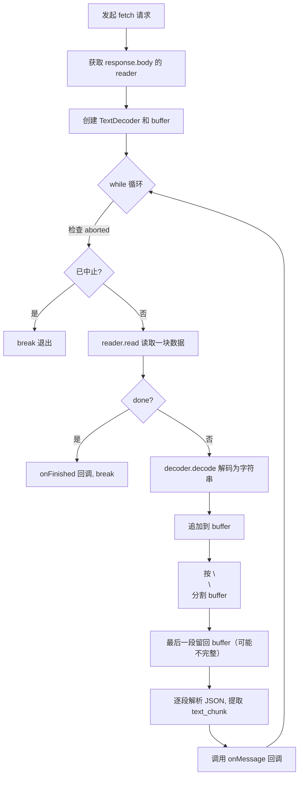

# `useSSE` 流式数据处理逻辑详解

> **版本说明**：本文解析的是旧版 `useSSE`（基于 `abortControllerMap` + `onMessage/onFinished/onError` 回调）。当前仓库 `hooks/useSSE.ts` 为改版实现（一实例一接口、`start(payload, onMessage)`、只读 `isActive`），API 不同，但本文讲解的流式读取核心机制（reader 循环、buffer 拼接、`\n\n` 分块、残留处理）两个版本一致，仍可对照阅读。

下面结合旧版 `src/hooks/useSSE.ts` 的代码，逐步解析整个 SSE（Server-Sent Events）流式读取的执行逻辑。

---

## 核心执行模型

整个处理流程是 **「异步迭代 + 同步处理」** 的组合：

```
┌─────────────────────────────────────────────────────────┐
│  await reader.read()    ← 异步等待：挂起线程，等网络数据到达  │
│         ↓                                                │
│  decoder.decode()       ← 同步处理：微秒级 CPU 操作        │
│  buffer += chunk        ← 同步处理：字符串拼接              │
│  buffer.split('\n\n')   ← 同步处理：消息边界分割            │
│  JSON.parse / 回调      ← 同步处理：解析 + 通知 UI          │
│         ↓                                                │
│  回到 await reader.read() 继续等待下一块数据               │
└─────────────────────────────────────────────────────────┘
```

- **等待时间**全部花在 `await reader.read()` 上（网络 I/O）。
- **同步处理阶段**耗时极短（微秒级），不会阻塞主线程，确保了消息处理的实时性。
- 这种模型让前端可以在数据「边到达边处理」，无需等待完整响应，是实现打字机效果的基础。

---

## 整体流程图



---

## 一、请求管理与取消机制

### 1.1 全局 AbortController 映射

```ts
export const abortControllerMap = new Map<string, AbortController>();
```

使用一个全局 `Map` 来管理所有正在进行的 SSE 请求。Key 是 `requestId`，Value 是对应的 `AbortController`。这样可以随时通过 `requestId` 找到并中止某个特定请求。

### 1.2 中止之前的同名请求

```ts
if (abortControllerMap.has(requestId)) {
  abortControllerMap.get(requestId)?.abort();
  abortControllerMap.delete(requestId);
}
```

**为什么这么做：** 防止同一个 `requestId` 发起多次请求导致数据混乱。比如用户快速点击了两次"生成"按钮，第二次请求会自动取消第一次。

### 1.3 创建新的 AbortController

```ts
const abortController = new AbortController();
abortControllerMap.set(requestId, abortController);
```

每次请求创建一个新的 `AbortController`，并注册到全局 Map 中，后续可以通过 `abortSSE(requestId)` 随时中止。

---

## 二、设置请求头

```ts
let headers: Record<string, string> = {
  rsp_type: 'stream',
};
if (!getIsProd()) {
  const envName = localStorage.getItem('envName') || '51dc3e3f';
  headers = {
    envname: envName,
    rsp_type: 'stream',
  };
}
```

- **`rsp_type: 'stream'`**：告知后端以流式（SSE）方式返回数据。
- **非生产环境**额外添加 `envname` 请求头，用于指向测试环境的后端服务。

---

## 三、发起 Fetch 请求

```ts
const response = await fetch(path, {
  method: 'GET',
  headers,
  signal: abortController.signal,
});

if (!response.ok) {
  throw new Error(`HTTP error! status: ${response.status}`);
}
```

- 使用原生 `fetch` API 发起 GET 请求。
- `signal: abortController.signal` 将中止控制器与请求绑定，调用 `abortController.abort()` 时请求会被自动取消。
- 如果 HTTP 状态码不在 200-299 范围内，直接抛出错误。

---

## 四、获取读取器（Reader）

```ts
const reader = response.body?.getReader();
if (!reader) {
  throw new Error('无法获取响应流读取器');
}
```

**为什么这么做：** `fetch` 返回的 `response.body` 是一个 `ReadableStream`（Web Streams API 标准接口）。与传统的 `XMLHttpRequest` 不同，`fetch` 不需要等整个响应体下载完才能访问数据——调用 `.getReader()` 获得一个 `ReadableStreamDefaultReader`，它提供了 `.read()` 方法，可以**逐块**读取数据。

> 这就像「用水管接水」——你不需要等水桶装满再倒，而是一边接水一边用。
>
> **对比**：如果使用 `response.json()` 或 `response.text()`，则必须等全部数据下载完才返回结果，无法实现流式处理。

---

## 五、准备解码器和缓冲区

```ts
const decoder = new TextDecoder();
let buffer = '';
```

**为什么这么做：**

- **`TextDecoder`**：`reader.read()` 返回的是 `Uint8Array`（二进制字节），需要用 `TextDecoder` 将其解码为人类可读的字符串。
- **`buffer`**：网络传输是按**字节块**分割的，和 SSE 消息的边界**不一定对齐**。比如一条 SSE 消息可能被拆成两个 chunk 传过来，所以需要一个 buffer 来暂存尚未处理完的数据。

> **例子**：假设一条完整 SSE 消息是：
> ```
> data: {"event":"text_chunk","data":{"text":"你好"}}\n\n
> ```
> 网络可能把它拆成两次传输：
> - 第一次：`data: {"event":"text_chu`
> - 第二次：`nk","data":{"text":"你好"}}\n\n`
>
> 没有 buffer 的话，第一次就会解析失败。

---

## 六、循环读取数据块

```ts
while (true) {
  // 检查请求是否已被中止
  if (abortController.signal.aborted) break;

  const { done, value } = await reader.read();

  if (done) {
    console.info('读取完成');
    onFinished();
    break;
  }
```

**为什么这么做：**

1. **`while (true)`**：持续读取，直到流结束或手动中止。
2. **检查 `aborted`**：每次循环开头检查用户是否主动取消了请求（比如用户切换页面），如果是就立即退出。
3. **`reader.read()`**：这是一个 **异步** 操作（需要 `await`），调用后 JavaScript 主线程会被**挂起**（让出控制权给事件循环），直到网络层有新数据到达才恢复执行。每次返回 `{ done, value }`：
   - `done === true` → 流已结束，即**服务端主动关闭了 HTTP 连接**（发送了 TCP FIN），调用 `onFinished()` 通知调用方。注意：只要服务端还在发送数据，`done` 就始终为 `false`。
   - `value` → 一个 `Uint8Array` 类型的**原始二进制数据块**，大小取决于网络传输的分包，通常为几百字节到几 KB。

> **注意**：`await reader.read()` 是整个循环中**唯一的异步等待点**。数据到达后，后续的 decode、split、parse、onMessage 回调全部是同步执行，确保当前 chunk 的数据被尽快处理完毕后，才进入下一次 `await` 等待。

---

## 七、解码并追加到缓冲区

```ts
const chunk = decoder.decode(value, { stream: true });
buffer += chunk;
```

**为什么这么做：**

- `decoder.decode(value, { stream: true })` 中的 `{ stream: true }` 很关键——它告诉解码器「**数据还没结束**，可能有多字节字符（如中文 UTF-8）被截断在块边界上，先不要处理它们」。
- 解码后的字符串追加到 `buffer`，等待后续按 SSE 协议分割。

> **例子**：中文字符「你」的 UTF-8 编码是 3 个字节 `0xE4 0xBD 0xA0`。如果第一个 chunk 只传了 `0xE4 0xBD`，`{ stream: true }` 会让解码器暂存这两个字节，等下一个 chunk 的 `0xA0` 到了再组合成「你」。

### ⚡ decode() 是同步阻塞的吗？影响大吗？

`TextDecoder.decode()` 确实是**同步操作**，但**阻塞影响极小**：

| 维度 | 说明 |
|------|------|
| 操作本质 | 纯 CPU 内存操作（将字节数组按编码表映射为字符串），没有任何 I/O 等待 |
| 典型耗时 | SSE 场景下每个 chunk 通常只有几百字节到几 KB，decode 耗时在**微秒级别**（远小于 1ms） |
| 主线程影响 | 几乎无感知。真正的等待时间全部花在 `await reader.read()` 的网络 I/O 上 |
| 极端情况 | 只有单个 chunk 达到几十 MB 时才可能有明显影响，但 SSE 场景不会出现 |

结论：在 SSE 流式场景下，**完全不需要担心 decode() 的同步阻塞问题**。

---

## 八、按 `\n\n` 分割缓冲区

```ts
const chunkDataArr = buffer.split('\n\n');
buffer = chunkDataArr.pop() || '';
```

**为什么这么做：** 这是 SSE 协议的核心——**每条 SSE 消息以两个连续换行 `\n\n` 分隔**。

`split('\n\n')` 后：
- **前面的元素** → 完整的 SSE 消息，可以安全解析。
- **最后一个元素** → 可能是不完整的消息（还没收到结尾的 `\n\n`），**用 `pop()` 取出放回 buffer**，下次循环继续拼接。

> **例子**：假设 buffer 内容为：
> ```
> data: {"event":"text_chunk","data":{"text":"你"}}\n\ndata: {"event":"text_chu
> ```
> `split('\n\n')` 得到：
> ```
> ["data: {\"event\":\"text_chunk\",\"data\":{\"text\":\"你\"}}", "data: {\"event\":\"text_chu"]
> ```
> - `chunkDataArr[0]` = 完整消息 ✅ → 可以解析
> - `chunkDataArr[1]` = 不完整 ❌ → `pop()` 放回 buffer，等下次数据到达

---

## 九、逐条解析 SSE 消息

```ts
const chunkTextArr = chunkDataArr
  .map((item) => {
    if (!item.startsWith('data: ')) return false;

    const jsonStr = item.replace('data: ', '');
    if (jsonStr.trim() === '') return false;

    try {
      const obj = jsonParse(jsonStr);

      if (obj?.event === 'text_chunk') {
        return obj?.data?.text as string;
      }
      return false;
    } catch (e) {
      console.warn('解析单行数据失败:', jsonStr);
      return false;
    }
  })
  .filter(data => data !== false);
```

**逐行解析：**

| 步骤 | 代码 | 说明 |
|------|------|------|
| 1 | `!item.startsWith('data: ')` | SSE 协议规定数据行以 `data: ` 开头，不符合的直接跳过（可能是注释行或空行） |
| 2 | `item.replace('data: ', '')` | 去掉 `data: ` 前缀，拿到纯 JSON 字符串 |
| 3 | `jsonStr.trim() === ''` | 过滤空数据 |
| 4 | `jsonParse(jsonStr)` | 将 JSON 字符串解析为对象 |
| 5 | `obj?.event === 'text_chunk'` | **只关心 `text_chunk` 类型的事件**，Agent 输出流可能还有其他事件类型（如 `start`、`end` 等），这里只提取文本内容 |
| 6 | `return obj?.data?.text` | 提取出实际的文本片段 |
| 7 | `.filter(data => data !== false)` | 过滤掉所有不满足条件的项 |

> **例子**：一个典型的 SSE 数据行：
> ```
> data: {"event":"text_chunk","data":{"text":"根据您的查询"}}
> ```
> 解析后提取出 `"根据您的查询"` 这个文本片段。

---

## 十、逐条回调

```ts
for (const text of chunkTextArr) {
  onMessage(text);
}
```

**为什么这么做：** 一次 `reader.read()` 可能包含**多条完整的 SSE 消息**，所以 `chunkTextArr` 可能有多个元素。逐条调用 `onMessage`，让调用方（通常是 UI 组件）能**实时追加显示**文本内容，实现「打字机效果」。

> **例子**：一个 chunk 中包含了 3 条消息，提取出 `["根据", "您的", "查询"]`，则依次调用：
> - `onMessage("根据")` → UI 显示「根据」
> - `onMessage("您的")` → UI 显示「根据您的」
> - `onMessage("查询")` → UI 显示「根据您的查询」

---

## 十一、错误处理

```ts
catch (error: any) {
  if (error.name === 'AbortError') {
    console.warn('请求被用户中止');
  } else {
    throw error;
  }
} finally {
  abortControllerMap.delete(requestId);
}
```

- **`AbortError`**：用户主动中止请求时，`fetch` 会抛出 `AbortError`，这里静默处理，不再向上抛出。
- **其他错误**：网络超时、服务端报错等，重新抛出让调用方感知并处理。
- **`finally`**：无论成功还是失败，都从全局 Map 中清理当前请求的 `AbortController`，防止内存泄漏。

---

## 十二、中止函数

```ts
export const abortSSE = (requestId?: string) => {
  if (requestId) {
    // 中止特定请求
    if (abortControllerMap.has(requestId)) {
      abortControllerMap.get(requestId)?.abort();
      abortControllerMap.delete(requestId);
    }
  } else {
    // 中止所有请求
    abortControllerMap.forEach(controller => controller.abort());
    abortControllerMap.clear();
  }
};
```

提供给外部使用的中止函数：
- 传入 `requestId` → 中止特定请求
- 不传参数 → 中止所有正在进行的 SSE 请求（适用于页面销毁等场景）

---

## 完整数据流示例

假设 Agent 要输出「你好世界」，服务端分 3 次 SSE 事件发送，网络层分 2 个 chunk 传输：

| 阶段 | 网络 chunk 内容 | buffer 状态 | 解析结果 |
|------|-----------------|-------------|----------|
| chunk 1 | `data: {"event":"text_chunk","data":{"text":"你"}}\n\ndata: {"event":"text_ch` | `data: {"event":"text_ch` | `["你"]` |
| chunk 2 | `unk","data":{"text":"好"}}\n\ndata: {"event":"text_chunk","data":{"text":"世界"}}\n\n` | `""` | `["好", "世界"]` |
| done | — | — | `onFinished()` |

---

## 总结

### 核心设计思想

1. **流式读取** — 不等全部数据到达，边收边处理，降低首屏响应时间
2. **缓冲区机制** — 用 `buffer` + `split('\n\n')` + `pop()` 优雅地处理了网络分包与 SSE 消息边界不对齐的问题
3. **健壮的解析** — 逐条 try-catch，单条解析失败不影响其他消息
4. **可中止** — 通过 `AbortController` 支持用户随时取消请求
5. **资源清理** — `finally` 块确保无论成功失败都清理全局状态，防止内存泄漏

### 关键执行模型

整个过程是 **「异步迭代 + 同步处理」** 的组合：
- `await reader.read()` — 异步等待数据到达（唯一的异步挂起点）
- `decode` → `split` → `parse` → `onMessage` — 全部同步执行（微秒级）
- 这种设计确保了：**数据一到就处理，处理完就等下一块**，最大化了消息的实时性
