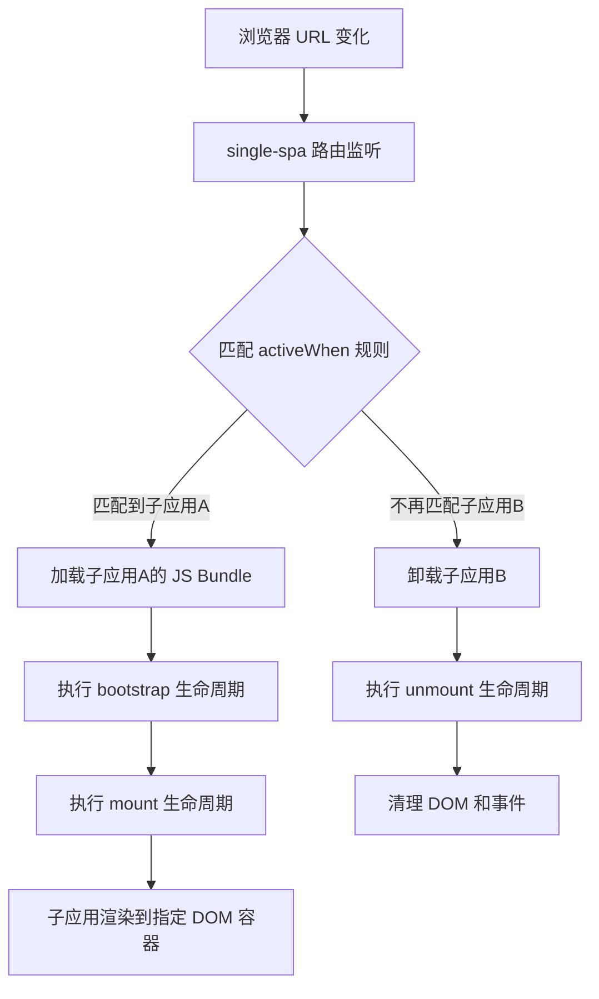
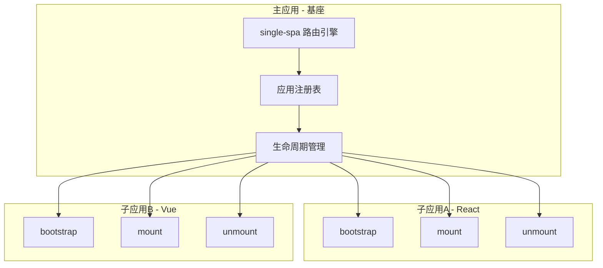
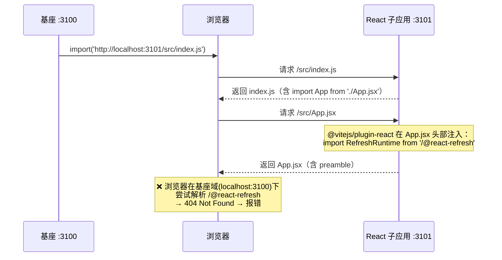
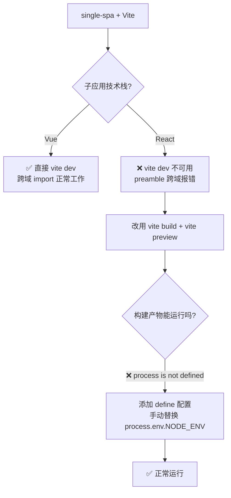
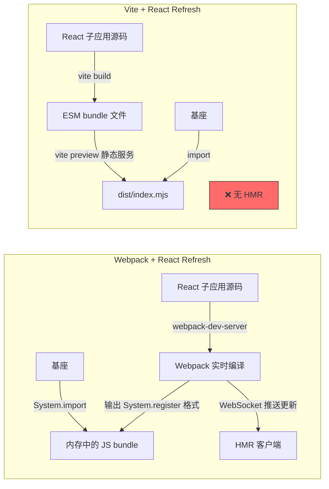

# Phase 1：single-spa 原理与实战

## 一、框架简介

single-spa 是微前端领域的**先驱框架**，2018 年发布，核心思想是：**一个页面上运行多个前端应用，通过路由来激活/卸载不同的子应用**。

它只做两件事：

1. **路由调度** — 监听 URL 变化，决定激活/卸载哪些子应用
2. **生命周期管理** — 按协议调用子应用的 `bootstrap` / `mount` / `unmount`

## 二、核心实现原理

### 2.1 整体流程



### 2.2 路由劫持

single-spa 劫持了浏览器的路由相关 API，在路由变化时判断应该激活哪些子应用：

- `window.addEventListener('hashchange', ...)`
- `window.addEventListener('popstate', ...)`
- 重写 `history.pushState` / `history.replaceState`

```javascript
// 简化的路由劫持原理
const originalPushState = history.pushState
history.pushState = function (...args) {
  originalPushState.apply(this, args)
  // 路由变化后，重新评估哪些子应用需要激活/卸载
  reroute()
}
```

### 2.3 应用状态机

每个子应用有明确的状态流转：

```
NOT_LOADED → LOADING_SOURCE_CODE → NOT_BOOTSTRAPPED → BOOTSTRAPPING
→ NOT_MOUNTED → MOUNTING → MOUNTED → UNMOUNTING → NOT_MOUNTED
```

### 2.4 生命周期协议

每个子应用**必须**导出三个生命周期函数：

```javascript
// 子应用入口文件
export function bootstrap(props) {
  // 初始化，只执行一次
  return Promise.resolve()
}

export function mount(props) {
  // 挂载，每次激活时执行
  // 在这里渲染你的应用
  return Promise.resolve()
}

export function unmount(props) {
  // 卸载，每次失活时执行
  return Promise.resolve()
}
```

### 2.5 JS Entry 加载方式

single-spa 通过 `<script>` 标签或 `System.import()` 加载子应用的 JS bundle，子应用需要打包成单个文件（通常使用 SystemJS 模块格式）。

> **官方推荐**：single-spa 官方推荐使用 `create-single-spa` 脚手架来生成项目，它默认使用 **Webpack + SystemJS** 的组合，开箱即用。本 Demo 选择 Vite 是为了学习目的，但也因此踩了不少坑（详见第六节）。

## 三、架构图



## 四、优劣分析

| ✅ 优势                                   | ❌ 劣势                                      |
| ----------------------------------------- | -------------------------------------------- |
| 概念简洁，核心只做路由调度 + 生命周期管理 | **没有 JS 沙箱**，子应用间全局变量会冲突     |
| 技术栈无关，支持任意框架                  | **没有 CSS 隔离**，样式会互相污染            |
| 社区成熟，生态丰富                        | 子应用需要改造导出生命周期（侵入性）         |
| 支持 SystemJS / Import Maps 等模块加载    | **JS Entry** 方式需要子应用打包成单个 bundle |
| 轻量，核心库很小                          | 没有预加载、通信机制等开箱即用的能力         |

## 五、Demo 搭建流程（Vite 构建）

> ⚠️ **重要提示**：single-spa 官方推荐使用 `create-single-spa` 脚手架（基于 Webpack + SystemJS），开箱即用无需额外配置。本 Demo 使用 Vite 是为了学习 Vite 构建体系，但 **Vite + single-spa 的组合存在已知兼容性问题**（尤其是 React 子应用），详见第六节踩坑记录。

### 5.1 项目结构

```
phase1/single-spa-demo1/
├── main-app/              # 基座应用（Vite + 原生 JS）  :3100
│   ├── index.html
│   ├── src/
│   │   └── index.js       # 注册子应用
│   ├── package.json
│   └── vite.config.js
├── sub-react/             # React 子应用（Vite + React） :3101
│   ├── src/
│   │   ├── App.jsx
│   │   └── index.js       # 导出生命周期
│   ├── package.json
│   └── vite.config.js
└── sub-vue/               # Vue 子应用（Vite + Vue）    :3102
    ├── src/
    │   ├── App.vue
    │   └── index.js        # 导出生命周期
    ├── package.json
    └── vite.config.js
```

### 5.2 Step 1：基座应用（main-app）

#### 初始化 & 安装依赖

```bash
mkdir main-app && cd main-app
pnpm init
pnpm add single-spa
pnpm add -D vite
```

#### vite.config.js

```javascript
// main-app/vite.config.js
import { defineConfig } from 'vite'

export default defineConfig({
  server: {
    port: 3100,
  },
})
```

#### index.html

```html
<!-- main-app/index.html -->
<!DOCTYPE html>
<html>
  <head>
    <meta charset="UTF-8" />
    <title>single-spa 基座</title>
    <style>
      nav {
        padding: 10px;
        background: #f0f0f0;
      }
      nav a {
        margin-right: 16px;
      }
    </style>
  </head>
  <body>
    <nav>
      <a href="/react">React 子应用</a>
      <a href="/vue">Vue 子应用</a>
    </nav>
    <h3>↓ 子应用挂载容器 ↓</h3>
    <div id="sub-app-container"></div>
    <script
      type="module"
      src="./src/index.js"
    ></script>
  </body>
</html>
```

#### index.js — 注册子应用

```javascript
// main-app/src/index.js
import { registerApplication, start } from 'single-spa'

// 注册 React 子应用
// ⚠️ React 子应用需要先 build，再用 vite preview 来 serve 构建产物
// 不能直接 import Vite dev server 的源码（会触发 preamble 错误，详见第六节）
registerApplication({
  name: 'sub-react',
  app: () => import('http://localhost:3101/index.mjs'),
  activeWhen: '/react',
  customProps: { authToken: 'xxx' },
})

// 注册 Vue 子应用
// ✅ Vue 子应用可以直接 import Vite dev server 的源码（无 preamble 问题）
registerApplication({
  name: 'sub-vue',
  app: () => import('http://localhost:3102/src/index.js'),
  activeWhen: '/vue',
})

// 启动 single-spa
start()
```

> **关键差异**：React 子应用加载的是 `vite build` 的构建产物（`/index.mjs`），而 Vue 子应用直接加载 Vite dev server 的源码（`/src/index.js`）。原因详见第六节。

---

### 5.3 Step 2：React 子应用（sub-react）

#### 初始化 & 安装依赖

```bash
mkdir sub-react && cd sub-react
pnpm init
pnpm add react react-dom single-spa-react
pnpm add -D vite @vitejs/plugin-react
```

#### vite.config.js

```javascript
// sub-react/vite.config.js
import { defineConfig } from 'vite'
import react from '@vitejs/plugin-react'
import { resolve } from 'path'

export default defineConfig({
  plugins: [react()],
  // 关键：Library Mode 默认不替换 process.env.NODE_ENV
  // React 源码依赖此变量判断开发/生产模式，必须手动 define
  define: {
    'process.env.NODE_ENV': JSON.stringify('production'),
  },
  // dev 模式：子应用独立运行时使用
  server: {
    port: 3101,
    cors: true,
  },
  // preview 模式：微前端模式下，serve 构建产物给基座加载
  preview: {
    port: 3101,
    cors: true,
  },
  build: {
    // 构建为 ESM 库模式，输出干净的 ESM bundle
    // 基座通过 import() 加载构建产物，避免 dev server 的 React Refresh preamble 问题
    lib: {
      entry: resolve(__dirname, 'src/index.js'),
      formats: ['es'],
      fileName: 'index',
    },
    outDir: 'dist',
  },
})
```

#### App.jsx

```jsx
// sub-react/src/App.jsx
export default function App() {
  return (
    <div style={{ border: '2px solid #61dafb', padding: '16px', margin: '16px' }}>
      <h2>🟦 React 子应用</h2>
      <p>这是通过 single-spa 加载的 React 子应用（Vite 构建）</p>
    </div>
  )
}
```

#### index.js — 导出生命周期

```javascript
// sub-react/src/index.js
import React from 'react'
import ReactDOMClient from 'react-dom/client'
import singleSpaReact from 'single-spa-react'
import App from './App.jsx'

const lifecycles = singleSpaReact({
  React,
  ReactDOMClient, // React 19 使用 react-dom/client
  rootComponent: App,
  // 指定在主应用挂载的 DOM 节点
  domElementGetter: () => document.getElementById('sub-app-container'),
})

// 必须导出这三个生命周期
export const { bootstrap, mount, unmount } = lifecycles
```

> **注意**：React 18+/19 使用 `react-dom/client`，传入 `ReactDOMClient` 而非 `ReactDOM`，`single-spa-react` v6+ 已自动适配 `createRoot` API。

---

### 5.4 Step 3：Vue 子应用（sub-vue）

#### 初始化 & 安装依赖

```bash
mkdir sub-vue && cd sub-vue
pnpm init
pnpm add vue single-spa-vue
pnpm add -D vite @vitejs/plugin-vue
```

#### vite.config.js

```javascript
// sub-vue/vite.config.js
import { defineConfig } from 'vite'
import vue from '@vitejs/plugin-vue'

export default defineConfig({
  plugins: [vue()],
  server: {
    port: 3102,
    // 关键：允许跨域
    cors: true,
  },
  build: {
    lib: {
      entry: './src/index.js',
      formats: ['es'],
      fileName: 'main',
    },
  },
})
```

#### App.vue

```vue
<!-- sub-vue/src/App.vue -->
<template>
  <div class="vue-app">
    <h2>🟩 Vue 子应用</h2>
    <p>这是通过 single-spa 加载的 Vue 子应用（Vite 构建）</p>
  </div>
</template>

<style scoped>
.vue-app {
  border: 2px solid #42b883;
  padding: 16px;
  margin: 16px;
}
</style>
```

#### index.js — 导出生命周期

```javascript
// sub-vue/src/index.js
import { h, createApp } from 'vue'
import singleSpaVue from 'single-spa-vue'
import App from './App.vue'

const vueLifecycles = singleSpaVue({
  createApp,
  appOptions: {
    render() {
      return h(App)
    },
  },
  handleInstance(app) {
    // 可以在这里注册路由、状态管理等
  },
})

export const { bootstrap, mount, unmount } = vueLifecycles
```

---

### 5.5 启动 & 验证

```bash
# ⚠️ React 和 Vue 子应用的启动方式不同！

# 终端 1：React 子应用 — 必须先构建再预览（不能用 vite dev）
cd sub-react && pnpm serve    # = vite build && vite preview → http://localhost:3101

# 终端 2：Vue 子应用 — 可以直接用 vite dev
cd sub-vue && pnpm dev        # → http://localhost:3102

# 终端 3：基座
cd main-app && pnpm dev       # → http://localhost:3100
```

打开 `http://localhost:3100`，点击导航链接：

- 点击 **React 子应用** → URL 变为 `/react`，React 子应用挂载
- 点击 **Vue 子应用** → URL 变为 `/vue`，React 卸载，Vue 子应用挂载

### 5.6 关键配置要点

| 配置项                         | 说明                                    | 必要性   |
| ------------------------------ | --------------------------------------- | -------- |
| `server.cors: true`            | 子应用允许跨域，基座需要跨域 `import()` | ✅ 必须  |
| `domElementGetter`             | 指定子应用挂载到基座的哪个 DOM 节点     | ✅ 必须  |
| 导出 `bootstrap/mount/unmount` | single-spa 生命周期协议                 | ✅ 必须  |
| `build.lib` 配置               | 生产构建时打包为 ESM 库                 | 生产必须 |
| `type="module"`                | 基座 HTML 中 script 标签需声明为 ESM    | ✅ 必须  |

---

## 六、踩坑记录：Vite + single-spa 的兼容性问题

> 这是本 Demo 最有价值的部分。使用 Vite 替代 Webpack 作为 single-spa 的构建工具时，React 子应用会遇到一系列问题，而 **Vue 子应用完全没有这些问题**。

### 6.1 为什么 Vue 没问题而 React 有问题？

**根本原因**：`@vitejs/plugin-react` 和 `@vitejs/plugin-vue` 在 Vite dev 模式下的行为差异。

| 对比项                 | `@vitejs/plugin-vue`                                                           | `@vitejs/plugin-react`                                                                 |
| ---------------------- | ------------------------------------------------------------------------------ | -------------------------------------------------------------------------------------- |
| HMR 实现方式           | `.vue` 文件通过 SFC 编译器处理，HMR 代码注入在**模块尾部**，且使用**相对路径** | 每个 JSX 文件**头部**注入 React Refresh preamble，依赖 Vite 内部路径 `/@react-refresh` |
| 跨域 import 兼容性     | ✅ 正常工作                                                                    | ❌ preamble 中的 `/@react-refresh` 在基座域下无法解析                                  |
| `process.env.NODE_ENV` | Vue 运行时不依赖此变量                                                         | React 源码大量使用此变量判断开发/生产模式                                              |

**结论**：Vue 子应用可以直接通过 `vite dev` 模式被基座跨域 `import()` 加载，而 React 子应用必须先 `vite build` 再 `vite preview`。

### 6.2 坑 1：`registerApplication` 的 `app` 配置报错

**错误信息**：

```
single-spa minified message #20: The config.app on registerApplication
must be an application or a loading function
```

**原因**：`registerApplication` 的 `app` 字段必须是一个**返回 Promise 的函数**，且 Promise resolve 的值必须包含 `bootstrap`、`mount`、`unmount` 生命周期。如果 `import()` 路径错误或子应用未正确导出生命周期，就会触发此错误。

**解决**：确保 `app: () => import('...')` 的路径正确，且子应用入口文件导出了三个生命周期函数。

### 6.3 坑 2：React Refresh Preamble 错误（React 独有）

**错误信息**：

```
@vitejs/plugin-react can't detect preamble. Something is wrong.
```

**原因**：



Vite 的 `@vitejs/plugin-react` 在 dev 模式下会给**每个 JSX 文件**头部注入 React Refresh（HMR）的 preamble 代码：

```javascript
// Vite 自动注入的 preamble（简化）
import RefreshRuntime from '/@react-refresh'
RefreshRuntime.injectIntoGlobalHook(window)
// ... 你的组件代码
```

当基座通过跨域 `import()` 加载子应用时，浏览器在**基座域**下执行这段代码，`/@react-refresh` 这个 Vite 内部路径无法解析 → 报错。

**而 Vue 不会有这个问题**：`@vitejs/plugin-vue` 的 HMR 代码注入在模块尾部，且使用相对路径引用 HMR 客户端，跨域场景下能正确解析。

**解决方案**：React 子应用不使用 `vite dev`，改为 `vite build`（Library Mode）构建出干净的 ESM bundle，再用 `vite preview` serve 构建产物。构建产物不包含 React Refresh preamble。

### 6.4 坑 3：`process is not defined`（React + Library Mode）

**错误信息**：

```
application 'sub-react' died in status LOADING_SOURCE_CODE:
process is not defined
```

**原因**：Vite 的 Library Mode（`build.lib`）**默认不替换 `process.env.NODE_ENV`**，因为它假设"库的消费者（bundler）会负责替换环境变量"。但我们的场景是浏览器直接 `import()` 这个 ESM bundle，没有二次打包。

| 模式                         | `process.env.NODE_ENV` 处理  |
| ---------------------------- | ---------------------------- |
| 普通 App 构建 (`vite build`) | ✅ 自动替换为 `'production'` |
| Library Mode (`build.lib`)   | ❌ **不替换**，保留原样      |

React 源码中大量使用 `process.env.NODE_ENV` 判断开发/生产模式，保留原样后浏览器没有 `process` 全局变量 → 报错。

**解决方案**：在 `vite.config.js` 中手动 `define`：

```javascript
// sub-react/vite.config.js
export default defineConfig({
  // ...
  define: {
    'process.env.NODE_ENV': JSON.stringify('production'),
  },
  // ...
})
```

### 6.5 坑 4：构建产物为 `.mjs` 而非 `.js`

**现象**：`vite build` 输出的文件是 `dist/index.mjs`，而非预期的 `dist/index.js`。

**原因**：Vite 8 的 Library Mode 默认根据 `package.json` 的 `type` 字段决定输出文件扩展名。当 `type` 未设置或为 `"commonjs"` 时，ESM 格式输出为 `.mjs`。

**影响**：基座的 `import()` 路径需要对应调整为 `/index.mjs`。

### 6.6 踩坑总结



| 问题                     | 根因                                   | 影响范围                     | 解决方案                       |
| ------------------------ | -------------------------------------- | ---------------------------- | ------------------------------ |
| preamble 报错            | `@vitejs/plugin-react` 的 HMR 注入机制 | 仅 React                     | 改用 `build + preview`         |
| `process is not defined` | Library Mode 不替换环境变量            | 仅 React（Vue 不依赖此变量） | `define` 手动替换              |
| 构建产物 `.mjs` 扩展名   | Vite 8 的命名规则                      | React（因为用了 build）      | 基座 import 路径对应调整       |
| 开发体验差（无 HMR）     | React 必须 build 后才能被基座加载      | 仅 React                     | 可用 `vite build --watch` 缓解 |

---

## 七、官方推荐方式：create-single-spa

single-spa 官方提供了 `create-single-spa` 脚手架工具，推荐使用它来生成项目。它默认使用 **Webpack + SystemJS** 的组合，避免了上述 Vite 兼容性问题。

### 7.1 使用方式

```bash
# 安装脚手架
npm install -g create-single-spa

# 创建基座（root config）
create-single-spa --moduleType root-config

# 创建子应用
create-single-spa --framework react
create-single-spa --framework vue
```

### 7.2 与本 Demo 的对比

| 维度       | create-single-spa（官方推荐）          | 本 Demo（Vite 手动搭建）     |
| ---------- | -------------------------------------- | ---------------------------- |
| 构建工具   | Webpack                                | Vite                         |
| 模块系统   | SystemJS（`System.import()`）          | 原生 ESM（`import()`）       |
| React HMR  | ✅ Webpack 的 React Refresh 无跨域问题 | ❌ Vite 的 preamble 跨域报错 |
| 配置复杂度 | 低（脚手架自动配置）                   | 高（需手动处理兼容性）       |
| 开发体验   | ✅ 所有子应用都支持 HMR                | ⚠️ React 子应用无 HMR        |
| 浏览器兼容 | 好（SystemJS polyfill）                | 仅现代浏览器                 |
| 学习价值   | 了解官方最佳实践                       | 深入理解底层机制和兼容性问题 |

### 7.3 为什么本 Demo 仍选择 Vite？

1. **学习目的**：通过手动搭建，深入理解 single-spa 的加载机制、生命周期协议、跨域问题
2. **踩坑价值**：遇到的问题（preamble、process.env、Library Mode）都是真实工程中会遇到的，理解这些有助于排查生产问题
3. **技术趋势**：Vite 是当前前端构建工具的主流趋势，了解它与微前端框架的兼容性边界很有价值

---

## 八、React 子应用开发体验：HMR 方案与 Webpack 对比

> 由于 React 子应用在 Vite 方案下无法使用 `vite dev`（详见第六节），开发体验受到较大影响。本节分析可行的 HMR 方案，并深入对比 Webpack 方案为什么没有这个问题。

### 8.1 当前 React 子应用的 HMR 可行方案

#### 方案 A：`vite build --watch`（当前可用，体验一般）

将 `pnpm serve` 改为 watch 模式，文件变化时自动重新构建：

```bash
# 子应用终端
vite build --watch &    # 后台 watch，文件变化自动重新构建
vite preview            # serve 构建产物
```

**效果**：修改代码 → 自动重新构建（~1-2s）→ **手动刷新**浏览器页面
**缺点**：不是真正的 HMR，需要手动刷新，且每次都是全量构建

#### 方案 B：子应用独立开发模式（推荐日常开发）

React 子应用可以**脱离基座**，以普通 Vite React 应用的方式独立运行，此时 HMR 完全正常：

```bash
cd sub-react && pnpm dev   # 独立运行在 http://localhost:3101
```

需要在入口文件中加一段独立运行的判断逻辑：

```javascript
// sub-react/src/index.js
// ... 现有的 single-spa 生命周期导出 ...

// 独立运行模式：不在 single-spa 环境下时，直接渲染
if (!window.singleSpaNavigate) {
  import('./App.jsx').then(({ default: App }) => {
    const root = ReactDOMClient.createRoot(document.getElementById('root'))
    root.render(React.createElement(App))
  })
}
```

**效果**：独立开发时有完整 HMR，集成到基座时用 `build + preview`
**缺点**：独立模式和集成模式是割裂的，无法在基座环境下调试路由、通信等集成逻辑

#### 方案 C：社区插件 `vite-plugin-single-spa`

[vite-plugin-single-spa](https://github.com/WJSoftware/vite-plugin-single-spa) 是一个专门解决 Vite + single-spa 兼容性问题的社区插件，核心思路是在 dev 模式下拦截并改写 Vite 的模块输出，移除 React Refresh preamble 中的跨域问题。

> ⚠️ **注意**：该插件作者已于 2025-04-13 宣布停止新功能开发（仅接受 bug 修复），因为与 single-spa 作者产生了分歧。不建议在生产项目中依赖。

### 8.2 为什么 Webpack 方案的 HMR 没问题？

核心差异在于 **HMR 的实现机制**不同：



**Webpack + React Refresh**：

- `react-refresh-webpack-plugin` 通过 **Webpack 的模块系统**注入 HMR 代码
- HMR 更新通过 **WebSocket** 推送到浏览器，不依赖任何特殊的 HTTP 路径
- 子应用的 `webpack-dev-server` 输出的是一个**完整的 SystemJS 模块**，基座通过 `System.import()` 加载
- SystemJS 的模块加载不会触发浏览器原生的 ESM 解析，所以不存在跨域路径解析问题

**Vite + React Refresh**：

- `@vitejs/plugin-react` 在每个 JSX 文件头部注入 `import RefreshRuntime from '/@react-refresh'`
- 这是一个**浏览器原生 ESM import 语句**，浏览器会尝试在**当前域**下解析这个路径
- 当基座（`:3100`）跨域 `import()` 子应用（`:3101`）的模块时，浏览器在基座域下解析 `/@react-refresh` → 404

```
Webpack: 模块系统内部处理 HMR → 不经过浏览器 URL 解析 → ✅
Vite:    浏览器原生 ESM import → 经过浏览器 URL 解析 → ❌ 跨域失败
```

此外，`create-single-spa` 还提供了 `standalone-single-spa-webpack-plugin`，它会在子应用独立运行时**自动生成一个临时的基座 HTML**，让子应用可以在类似基座的环境下独立开发和调试，而不需要手动写 `if (!window.singleSpaNavigate)` 的判断逻辑。

### 8.3 完整对比表

| 对比维度             | create-single-spa (Webpack)                                | 当前 Demo (Vite)                                        |
| -------------------- | ---------------------------------------------------------- | ------------------------------------------------------- |
| **构建工具**         | Webpack 5                                                  | Vite 8 (Rollup)                                         |
| **模块格式**         | SystemJS (`System.register`)                               | 原生 ESM (`import()`)                                   |
| **开发时 React HMR** | ✅ 完整支持（WebSocket 推送，不经过浏览器 URL 解析）       | ❌ 不支持（preamble 跨域失败）                          |
| **开发时 Vue HMR**   | ✅ 完整支持                                                | ✅ 完整支持                                             |
| **子应用独立运行**   | ✅ `standalone-single-spa-webpack-plugin` 自动生成临时基座 | ⚠️ 需手动加 `if (!window.singleSpaNavigate)` 判断       |
| **开发启动速度**     | ⚠️ 慢（Webpack 冷启动需全量编译）                          | ✅ 快（Vite 按需编译，但 React 子应用需先 build）       |
| **生产构建**         | 输出 `System.register` 格式 JS                             | 输出 ESM bundle                                         |
| **浏览器兼容**       | ✅ 好（SystemJS polyfill 支持老浏览器）                    | ⚠️ 仅现代浏览器                                         |
| **配置复杂度**       | 低（脚手架自动配置好一切）                                 | 高（需手动处理 preamble、process.env、Library Mode 等） |

### 8.4 日常开发建议

| 场景                      | 推荐方案                                                                           |
| ------------------------- | ---------------------------------------------------------------------------------- |
| **生产项目**              | 使用 `create-single-spa`（Webpack + SystemJS），开箱即用，HMR 完整                 |
| **学习理解原理**          | 当前 Vite 方案很有价值，踩坑过程就是学习过程                                       |
| **日常开发 React 子应用** | 独立模式 `pnpm dev`，有完整 HMR；集成调试时用 `pnpm serve`                         |
| **想用 Vite 做微前端**    | 考虑 Phase 2 的 **qiankun** 方案，或者直接用 **Module Federation**（Vite 5+ 支持） |

> **一句话总结**：single-spa 的设计初衷是配合 SystemJS 使用的，Vite 的原生 ESM 方案与它存在架构层面的不兼容（尤其是 React），这不是配置能解决的问题，而是两种模块加载机制的根本差异。

---

## 九、Vite 模式 vs SystemJS 模式对比

| 维度           | Vite + ESM import()           | SystemJS（官方推荐）           |
| -------------- | ----------------------------- | ------------------------------ |
| **开发体验**   | Vue ✅ / React ❌（需 build） | ✅ 所有框架都支持 HMR          |
| **浏览器兼容** | 现代浏览器（Chrome 63+）      | 可兼容老浏览器                 |
| **配置复杂度** | 高（需处理跨域、preamble 等） | 低（脚手架开箱即用）           |
| **生产部署**   | 需要 `build.lib` 打包         | 需要 `libraryTarget: 'system'` |
| **共享依赖**   | 通过 `rollupOptions.external` | 通过 Import Maps + externals   |
| **构建速度**   | ✅ Vite 极快                  | ⚠️ Webpack 较慢                |
