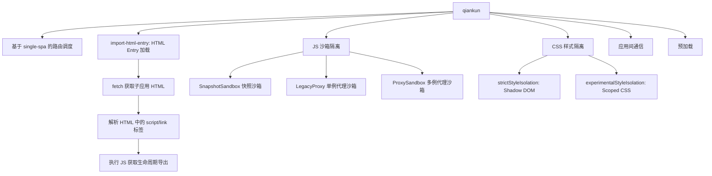
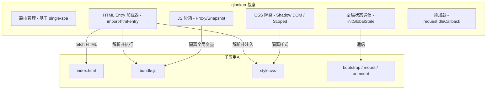
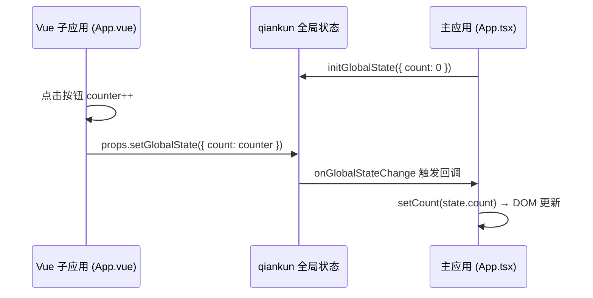

# Phase 2：qiankun 原理与实战

## 一、框架简介

qiankun（乾坤）是蚂蚁金服基于 single-spa 封装的微前端框架，2019 年开源。它在 single-spa 的基础上解决了 **JS 沙箱、CSS 隔离、HTML Entry、预加载** 等实际工程问题，是国内使用最广泛的微前端方案。

**qiankun = single-spa + 沙箱 + 样式隔离 + HTML Entry + 通信 + 预加载**

## 二、核心实现原理

### 2.1 整体架构



### 2.2 HTML Entry（核心差异点）

与 single-spa 的 JS Entry 不同，qiankun 使用 **HTML Entry**：

```
JS Entry (single-spa):  直接加载子应用的 JS bundle
HTML Entry (qiankun):   fetch 子应用的 HTML → 解析出 JS/CSS → 执行
```

**HTML Entry 的优势：**

- 子应用可以像独立应用一样开发，不需要特殊的打包配置
- 自动处理 CSS 加载
- 支持子应用使用多个 JS/CSS 文件

**实现流程（简化版 `import-html-entry` 原理）：**

```javascript
async function importHTML(url) {
  // 1. fetch 子应用的 HTML
  const html = await fetch(url).then(res => res.text())

  // 2. 解析 HTML，提取 script 和 style 标签
  const { scripts, styles, template } = parseHTML(html)

  // 3. 加载并内联所有外部样式
  const styleContent = await Promise.all(
    styles.map(href => fetch(href).then(res => res.text())),
  )

  // 4. 返回执行函数
  return {
    template, // 处理后的 HTML 模板
    execScripts: sandbox => {
      // 在沙箱环境中执行所有 JS
      scripts.forEach(script => {
        eval(script) // 实际使用 (0, eval)(code) 或 new Function
      })
      // 返回子应用导出的生命周期
      return sandbox.exports
    },
  }
}
```

### 2.3 JS 沙箱（三种实现）

#### ① SnapshotSandbox（快照沙箱）— 兼容 IE

```javascript
// 原理：激活时快照 window，卸载时恢复
class SnapshotSandbox {
  constructor() {
    this.windowSnapshot = {}
    this.modifyPropsMap = {}
  }

  active() {
    // 激活：保存当前 window 快照
    this.windowSnapshot = {}
    for (const key in window) {
      this.windowSnapshot[key] = window[key]
    }
    // 恢复上次的修改
    Object.keys(this.modifyPropsMap).forEach(key => {
      window[key] = this.modifyPropsMap[key]
    })
  }

  inactive() {
    // 失活：对比差异，记录修改，恢复 window
    this.modifyPropsMap = {}
    for (const key in window) {
      if (window[key] !== this.windowSnapshot[key]) {
        this.modifyPropsMap[key] = window[key] // 记录修改
        window[key] = this.windowSnapshot[key] // 恢复原值
      }
    }
  }
}
```

**特点**：遍历 window 所有属性做 diff，性能差，不支持多实例。

#### ② ProxySandbox（代理沙箱）— 推荐，支持多实例

```javascript
// 原理：每个子应用有独立的 fakeWindow，通过 Proxy 拦截读写
class ProxySandbox {
  constructor() {
    const fakeWindow = {}
    this.proxy = new Proxy(fakeWindow, {
      get(target, key) {
        // 优先从 fakeWindow 读取，否则从真实 window 读取
        return key in target ? target[key] : window[key]
      },
      set(target, key, value) {
        // 所有写操作都写入 fakeWindow，不污染真实 window
        target[key] = value
        return true
      },
      has(target, key) {
        return key in target || key in window
      },
    })
  }
}
```

**特点**：每个子应用有独立的 fakeWindow，互不影响，支持多实例并行。

#### 三种沙箱对比

| 沙箱类型        | 原理                    | 多实例 | 性能              | 兼容性   |
| --------------- | ----------------------- | ------ | ----------------- | -------- |
| SnapshotSandbox | 快照 + diff             | ❌     | 差（遍历 window） | IE 11+   |
| LegacySandbox   | 单例 Proxy              | ❌     | 好                | 需 Proxy |
| ProxySandbox    | 多例 Proxy + fakeWindow | ✅     | 好                | 需 Proxy |

### 2.4 CSS 隔离

```javascript
// 方案一：Shadow DOM（严格隔离）
// qiankun 配置：{ sandbox: { strictStyleIsolation: true } }
// 原理：将子应用包裹在 Shadow DOM 中
const shadow = container.attachShadow({ mode: 'open' })
shadow.innerHTML = subAppHTML

// 方案二：Scoped CSS（实验性）
// qiankun 配置：{ sandbox: { experimentalStyleIsolation: true } }
// 原理：给子应用的所有 CSS 选择器加上前缀
// .btn { color: red; }  →  div[data-qiankun="sub-app"] .btn { color: red; }
```

| 方案       | 原理           | 优点     | 缺点                             |
| ---------- | -------------- | -------- | -------------------------------- |
| Shadow DOM | 浏览器原生隔离 | 完全隔离 | 弹窗等挂载到 body 的元素样式丢失 |
| Scoped CSS | 选择器加前缀   | 兼容性好 | 不完全隔离，可能有遗漏           |

### 2.5 全局状态通信

```javascript
// 基座应用
import { initGlobalState } from 'qiankun'

const { onGlobalStateChange, setGlobalState } = initGlobalState({
  user: 'admin',
  theme: 'dark',
})

// 监听变化
onGlobalStateChange((state, prev) => {
  console.log('主应用监听到状态变化：', state, prev)
})

// 修改状态
setGlobalState({ theme: 'light' })
```

```javascript
// 子应用（通过 mount props 获取）
export async function mount(props) {
  props.onGlobalStateChange(state => {
    console.log('子应用收到全局状态变化：', state)
  })
  props.setGlobalState({ user: 'guest' })
}
```

## 三、架构图



## 四、优劣分析

| ✅ 优势                          | ❌ 劣势                                   |
| -------------------------------- | ----------------------------------------- |
| **开箱即用**的 JS 沙箱、CSS 隔离 | Proxy 沙箱不支持 IE（需降级快照沙箱）     |
| **HTML Entry**，子应用改造成本低 | CSS 隔离不完美（Shadow DOM 会影响弹窗等） |
| 内置全局状态通信机制             | 性能开销：HTML 解析 + 沙箱代理            |
| 预加载能力，提升用户体验         | 嵌套微前端场景支持不好                    |
| 国内社区活跃，文档完善           | 对 Vite 等 ESM 构建工具支持不佳           |
| 基于 single-spa，概念一致        | 项目维护节奏放缓（2.x 版本长期未发布）    |

## 五、Demo 搭建流程（Vite 构建）

> 本 Demo 使用 **Vite** 作为所有应用的构建工具。由于 qiankun 原生基于 Webpack 的 UMD 导出机制，Vite 子应用需要借助 `vite-plugin-qiankun` 插件来适配。

### 5.1 项目结构

```
qiankun-demo/
├── main-app/              # 基座应用（Vite + React）
│   ├── index.html
│   ├── src/
│   │   ├── App.jsx
│   │   └── main.jsx
│   ├── package.json
│   └── vite.config.js
├── sub-react/             # React 子应用（Vite + React）
│   ├── src/
│   │   ├── App.jsx
│   │   └── main.jsx       # 导出生命周期
│   ├── package.json
│   └── vite.config.js
└── sub-vue/               # Vue 子应用（Vite + Vue）
    ├── src/
    │   ├── App.vue
    │   └── main.js         # 导出生命周期
    ├── package.json
    └── vite.config.js
```

### 5.2 Step 1：基座应用（main-app）

#### 初始化 & 安装依赖

```bash
# 使用 Vite 脚手架创建 React 项目
npm create vite@latest main-app -- --template react
cd main-app
npm install qiankun
npm install
```

#### vite.config.js

```javascript
// main-app/vite.config.js
import { defineConfig } from 'vite'
import react from '@vitejs/plugin-react'

export default defineConfig({
  plugins: [react()],
  server: {
    port: 3000,
  },
})
```

#### index.html

```html
<!-- main-app/index.html -->
<!DOCTYPE html>
<html lang="zh-CN">
  <head>
    <meta charset="UTF-8" />
    <title>qiankun 基座</title>
  </head>
  <body>
    <div id="root"></div>
    <script
      type="module"
      src="/src/main.jsx"
    ></script>
  </body>
</html>
```

#### main.jsx — 注册子应用 & 启动 qiankun

```jsx
// main-app/src/main.jsx
import React from 'react'
import ReactDOM from 'react-dom/client'
import App from './App.jsx'
import { registerMicroApps, start, initGlobalState } from 'qiankun'

// 先渲染基座自身
ReactDOM.createRoot(document.getElementById('root')).render(<App />)

// 注册子应用
registerMicroApps(
  [
    {
      name: 'sub-react',
      // HTML Entry：直接填子应用的开发服务器地址
      entry: '//localhost:3001',
      // 子应用挂载的 DOM 容器
      container: '#sub-app-container',
      // 激活路由规则
      activeRule: '/react',
      // 传递给子应用的 props
      props: { user: 'admin' },
    },
    {
      name: 'sub-vue',
      entry: '//localhost:3002',
      container: '#sub-app-container',
      activeRule: '/vue',
    },
  ],
  {
    // 全局生命周期钩子
    beforeLoad: [async app => console.log('加载前', app.name)],
    beforeMount: [async app => console.log('挂载前', app.name)],
    afterUnmount: [async app => console.log('卸载后', app.name)],
  },
)

// 全局状态通信
const { onGlobalStateChange, setGlobalState } = initGlobalState({
  user: 'admin',
  theme: 'dark',
})

onGlobalStateChange((state, prev) => {
  console.log('主应用监听到状态变化：', state, prev)
})

// 启动 qiankun
start({
  prefetch: 'all',
  sandbox: {
    experimentalStyleIsolation: true,
  },
})
```

#### App.jsx — 基座 UI

```jsx
// main-app/src/App.jsx
function App() {
  // 使用原生 a 标签 + history API 导航，避免引入路由库
  const navigate = path => e => {
    e.preventDefault()
    window.history.pushState(null, '', path)
    // 手动触发 popstate 让 qiankun 感知路由变化
    window.dispatchEvent(new PopStateEvent('popstate'))
  }

  return (
    <div>
      <nav style={{ padding: '10px', background: '#f0f0f0' }}>
        <a
          href="/react"
          onClick={navigate('/react')}
          style={{ marginRight: 16 }}
        >
          React 子应用
        </a>
        <a
          href="/vue"
          onClick={navigate('/vue')}
        >
          Vue 子应用
        </a>
      </nav>
      <h3>↓ 子应用挂载容器 ↓</h3>
      {/* 子应用挂载容器 */}
      <div id="sub-app-container"></div>
    </div>
  )
}

export default App
```

---

### 5.3 Step 2：React 子应用（sub-react）

#### 初始化 & 安装依赖

```bash
npm create vite@latest sub-react -- --template react
cd sub-react
npm install vite-plugin-qiankun
npm install
```

#### vite.config.js

```javascript
// sub-react/vite.config.js
import { defineConfig } from 'vite'
import react from '@vitejs/plugin-react'
import qiankun from 'vite-plugin-qiankun'

export default defineConfig({
  plugins: [
    react(),
    // 参数为子应用名称，必须与基座 registerMicroApps 中的 name 一致
    qiankun('sub-react', {
      useDevMode: true, // 开发模式下启用，确保 HMR 正常
    }),
  ],
  server: {
    port: 3001,
    // 关键：允许跨域，基座需要 fetch 子应用的 HTML
    cors: true,
    // 关键：指定 origin，确保资源路径正确
    origin: 'http://localhost:3001',
  },
})
```

#### App.jsx

```jsx
// sub-react/src/App.jsx
export default function App() {
  return (
    <div style={{ border: '2px solid #61dafb', padding: '16px', margin: '16px' }}>
      <h2>🟦 React 子应用</h2>
      <p>这是通过 qiankun 加载的 React 子应用（Vite 构建）</p>
    </div>
  )
}
```

#### main.jsx — 导出生命周期

```jsx
// sub-react/src/main.jsx
import React from 'react'
import ReactDOM from 'react-dom/client'
import App from './App.jsx'
import { renderWithQiankun, qiankunWindow } from 'vite-plugin-qiankun/dist/helper'

let root = null

function render(props = {}) {
  const { container } = props
  const mountNode = container
    ? container.querySelector('#root')
    : document.getElementById('root')
  root = ReactDOM.createRoot(mountNode)
  root.render(<App />)
}

// 使用 vite-plugin-qiankun 提供的 renderWithQiankun 注册生命周期
renderWithQiankun({
  bootstrap() {
    console.log('React 子应用 bootstrap')
  },
  mount(props) {
    console.log('React 子应用 mount，收到 props：', props)
    render(props)
  },
  unmount(props) {
    console.log('React 子应用 unmount')
    root?.unmount()
    root = null
  },
  update(props) {
    console.log('React 子应用 update', props)
  },
})

// 独立运行时直接渲染
if (!qiankunWindow.__POWERED_BY_QIANKUN__) {
  render()
}
```

---

### 5.4 Step 3：Vue 子应用（sub-vue）

#### 初始化 & 安装依赖

```bash
npm create vite@latest sub-vue -- --template vue
cd sub-vue
npm install vite-plugin-qiankun
npm install
```

#### vite.config.js

```javascript
// sub-vue/vite.config.js
import { defineConfig } from 'vite'
import vue from '@vitejs/plugin-vue'
import qiankun from 'vite-plugin-qiankun'

export default defineConfig({
  plugins: [
    vue(),
    qiankun('sub-vue', {
      useDevMode: true,
    }),
  ],
  server: {
    port: 3002,
    cors: true,
    origin: 'http://localhost:3002',
  },
})
```

#### App.vue

```vue
<!-- sub-vue/src/App.vue -->
<template>
  <div class="vue-app">
    <h2>🟩 Vue 子应用</h2>
    <p>这是通过 qiankun 加载的 Vue 子应用（Vite 构建）</p>
  </div>
</template>

<style scoped>
.vue-app {
  border: 2px solid #42b883;
  padding: 16px;
  margin: 16px;
}
</style>
```

#### main.js — 导出生命周期

```javascript
// sub-vue/src/main.js
import { createApp } from 'vue'
import App from './App.vue'
import { renderWithQiankun, qiankunWindow } from 'vite-plugin-qiankun/dist/helper'

let app = null

function render(props = {}) {
  const { container } = props
  app = createApp(App)
  app.mount(container ? container.querySelector('#app') : '#app')
}

renderWithQiankun({
  bootstrap() {
    console.log('Vue 子应用 bootstrap')
  },
  mount(props) {
    console.log('Vue 子应用 mount')
    render(props)
  },
  unmount() {
    console.log('Vue 子应用 unmount')
    app?.unmount()
    app = null
  },
  update(props) {
    console.log('Vue 子应用 update', props)
  },
})

// 独立运行
if (!qiankunWindow.__POWERED_BY_QIANKUN__) {
  render()
}
```

---

### 5.5 启动 & 验证

```bash
# 分别在三个终端中启动（或使用 concurrently）
# 终端 1：启动基座
cd main-app && npm run dev    # http://localhost:3000

# 终端 2：启动 React 子应用
cd sub-react && npm run dev   # http://localhost:3001

# 终端 3：启动 Vue 子应用
cd sub-vue && npm run dev     # http://localhost:3002
```

打开 `http://localhost:3000`：

- 点击 **React 子应用** → URL 变为 `/react`，React 子应用挂载到 `#sub-app-container`
- 点击 **Vue 子应用** → URL 变为 `/vue`，React 卸载，Vue 子应用挂载
- 子应用也可以独立访问 `http://localhost:3001` / `http://localhost:3002`

### 5.6 关键配置要点

| 配置项                                 | 说明                                | 必要性      |
| -------------------------------------- | ----------------------------------- | ----------- |
| `vite-plugin-qiankun`                  | Vite 子应用适配 qiankun 的核心插件  | ✅ 必须     |
| `useDevMode: true`                     | 开发模式下确保 HMR 和生命周期正常   | ✅ 开发必须 |
| `server.cors: true`                    | 允许基座跨域 fetch 子应用 HTML      | ✅ 必须     |
| `server.origin`                        | 确保子应用资源 URL 使用绝对路径     | ✅ 必须     |
| `renderWithQiankun()`                  | 替代直接导出生命周期，适配 Vite ESM | ✅ 必须     |
| `qiankunWindow.__POWERED_BY_QIANKUN__` | 判断是否在 qiankun 环境中运行       | ✅ 必须     |
| `container.querySelector('#root')`     | 在 qiankun 容器内查找挂载节点       | ✅ 必须     |
| `experimentalStyleIsolation`           | 开启 CSS 隔离                       | 推荐        |
| `prefetch`                             | 预加载子应用资源                    | 推荐        |

### 5.7 qiankun + Vite 的注意事项

| 问题                           | 原因                                          | 解决方案                                         |
| ------------------------------ | --------------------------------------------- | ------------------------------------------------ |
| 子应用加载失败                 | qiankun 原生不支持 ESM 模块                   | 使用 `vite-plugin-qiankun` 插件适配              |
| 子应用资源 404                 | Vite dev server 的资源路径是相对的            | 配置 `server.origin` 为子应用完整地址            |
| HMR 不生效                     | qiankun 沙箱拦截了 WebSocket                  | 插件中设置 `useDevMode: true`                    |
| `__webpack_public_path__` 无效 | Vite 不是 Webpack，没有此变量                 | 插件内部已处理，无需手动设置                     |
| 子应用独立运行报错             | `renderWithQiankun` 在非 qiankun 环境下的兼容 | 使用 `qiankunWindow.__POWERED_BY_QIANKUN__` 判断 |

### 5.8 两种加载模式对比：registerMicroApps vs loadMicroApp

qiankun 提供了两种加载子应用的方式，适用于不同场景：

| 特性               | `registerMicroApps` + `start`    | `loadMicroApp`                           |
| ------------------ | -------------------------------- | ---------------------------------------- |
| **加载方式**       | 自动挡：路由变化自动匹配加载     | 手动挡：代码中显式调用加载               |
| **适用场景**       | 不同路由对应不同子应用（一对一） | 同一页面需要同时显示多个子应用           |
| **多应用同时显示** | ❌ 不推荐（存在竞争条件）        | ✅ 官方推荐方案                          |
| **生命周期管理**   | 框架自动管理 mount/unmount       | 需要手动管理（调用返回值的 `unmount()`） |
| **灵活性**         | 低（受限于路由规则）             | 高（可在任意时机加载/卸载）              |

**本 Demo 使用 `registerMicroApps` 模式**，这是最常见的微前端场景：每个路由对应一个子应用，框架自动管理生命周期。

> 💡 如果需要在同一页面同时显示多个子应用（如仪表盘场景），应使用 `loadMicroApp` 手动加载。

### 5.9 应用间通信实战 Demo：子应用 Count → 主应用同步

本节在 5.2~5.4 的基础上，演示 **Vue 子应用的 count 变化实时同步到主应用 DOM** 的完整流程，涵盖两种通信方式：

- **局部 props**：基座通过 `registerMicroApps` 的 `props` 字段一次性传入初始数据
- **全局状态**：基座通过 `initGlobalState` 建立响应式通信通道，子应用可读可写

#### 数据流



#### 两种通信方式对比

| 维度           | 局部 props                          | 全局状态                              |
| -------------- | ----------------------------------- | ------------------------------------- |
| **传递方式**   | `registerMicroApps` 的 `props` 字段 | `initGlobalState`                     |
| **子应用获取** | `props.initCount`（直接读）         | `props.onGlobalStateChange(cb, true)` |
| **是否响应式** | ❌ 只在 mount 时传一次              | ✅ 任何时候变化都能监听到             |
| **谁能改**     | 只有基座传入                        | 基座和子应用都能 `setGlobalState`     |

> 简单说：**局部 props 是"配置"，全局状态是"通信通道"**。

#### Step 1：基座 main.tsx — 初始化全局状态 & 暴露 API

在 `initGlobalState` 中加入 `count` 字段，并将通信 API 挂到 `window` 上供 React 组件订阅：

```jsx
// main-app/src/main.tsx
...
// 全局状态通信
const { onGlobalStateChange, setGlobalState } = initGlobalState({
  user: 'admin',
  theme: 'dark',
  count: 0, // 用于演示子应用 → 主应用的状态同步
})

onGlobalStateChange((state, prev) => {
  console.log('[qiankun] 主应用监听到状态变化：', state, prev)
})

// 暴露给 React 组件使用（通过 window 传递，避免模块循环依赖）
;(window as any).__QIANKUN_GLOBAL__ = { onGlobalStateChange, setGlobalState }
...
```

> 💡 为什么用 `window` 传递？因为 `main.tsx` 中初始化 qiankun 的代码和 React 组件树是分离的，通过 `window` 是最简单的桥接方式。

#### Step 2：基座 App.tsx — 监听全局状态并展示 count

```jsx
// main-app/src/App.tsx
import { useState, useEffect } from 'react'

function App() {
  const [count, setCount] = useState(0)

  useEffect(() => {
    // 订阅 qiankun 全局状态变化，同步子应用的 count 到主应用
    const globalApi = (window as any).__QIANKUN_GLOBAL__
    if (globalApi) {
      globalApi.onGlobalStateChange((state: any) => {
        if (state.count !== undefined) {
          setCount(state.count)
        }
      })
    }
  }, [])

  ...
  return (
    <div>
      <header>
        ...
        {/* 展示从子应用同步过来的 count */}
        <p>📡 主应用同步的 Count：<strong>{count}</strong></p>
      </header>
      ...
    </div>
  )
}
```

#### Step 3：Vue 子应用 main.js — 通过 provide 透传 props

在 `render` 函数中使用 `app.provide()` 将 qiankun 传入的 `props`（含 `setGlobalState`）注入 Vue 组件树：

```javascript
// sub-vue/src/main.js
...
function render(props) {
  ...
  appInstance = createApp(App)
  // 将 qiankun props 注入 Vue 组件树（子组件通过 inject('qiankunProps') 获取）
  appInstance.provide('qiankunProps', props || {})
  appInstance.mount(mountNode)
}
...
```

#### Step 4：Vue 子应用 App.vue — 点击按钮同步 count

通过 `inject` 获取 `qiankunProps`，在 `increment` 中调用 `setGlobalState` 将 count 同步到全局状态：

```vue
<!-- sub-vue/src/App.vue -->
<template>
  <div class="vue-app">
    <h2>🟩 Vue 子应用</h2>
    <p>这是通过 qiankun 加载的 Vue 子应用（Vite 构建）</p>
    <button @click="increment">Count is {{ counter }}</button>
    <p style="color: #666; font-size: 14px">↑ 点击按钮，主应用头部的 Count 会同步变化</p>
  </div>
</template>

<script setup>
import { ref, inject } from 'vue'

// 通过 inject 获取 qiankun 传入的 props（包含 setGlobalState）
const qiankunProps = inject('qiankunProps', {})

const counter = ref(0)

const increment = () => {
  counter.value++
  // 通过 qiankun 全局状态通信，将 count 同步到主应用
  if (qiankunProps.setGlobalState) {
    qiankunProps.setGlobalState({ count: counter.value })
  }
}
</script>
```

#### 补充：子应用如何读取全局状态？

子应用通过 `props.onGlobalStateChange` 监听全局状态，**第二个参数 `true` 表示立即触发一次回调**，可以拿到当前的全局状态值：

```javascript
// 在 Vue 子应用的 onMounted 中
props.onGlobalStateChange(state => {
  console.log('当前全局状态：', state)
  // state.user, state.theme, state.count 等
}, true) // ← true = 立即触发，拿到当前值
```

#### 验证效果

1. 启动基座和 Vue 子应用
2. 访问 `http://localhost:3000`，点击导航栏的 **Vue 子应用**
3. 在 Vue 子应用中点击 **Count is X** 按钮
4. 观察主应用头部的 **📡 主应用同步的 Count：X** 实时同步变化
