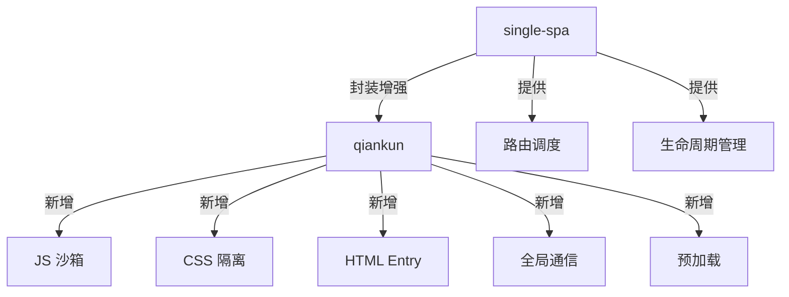
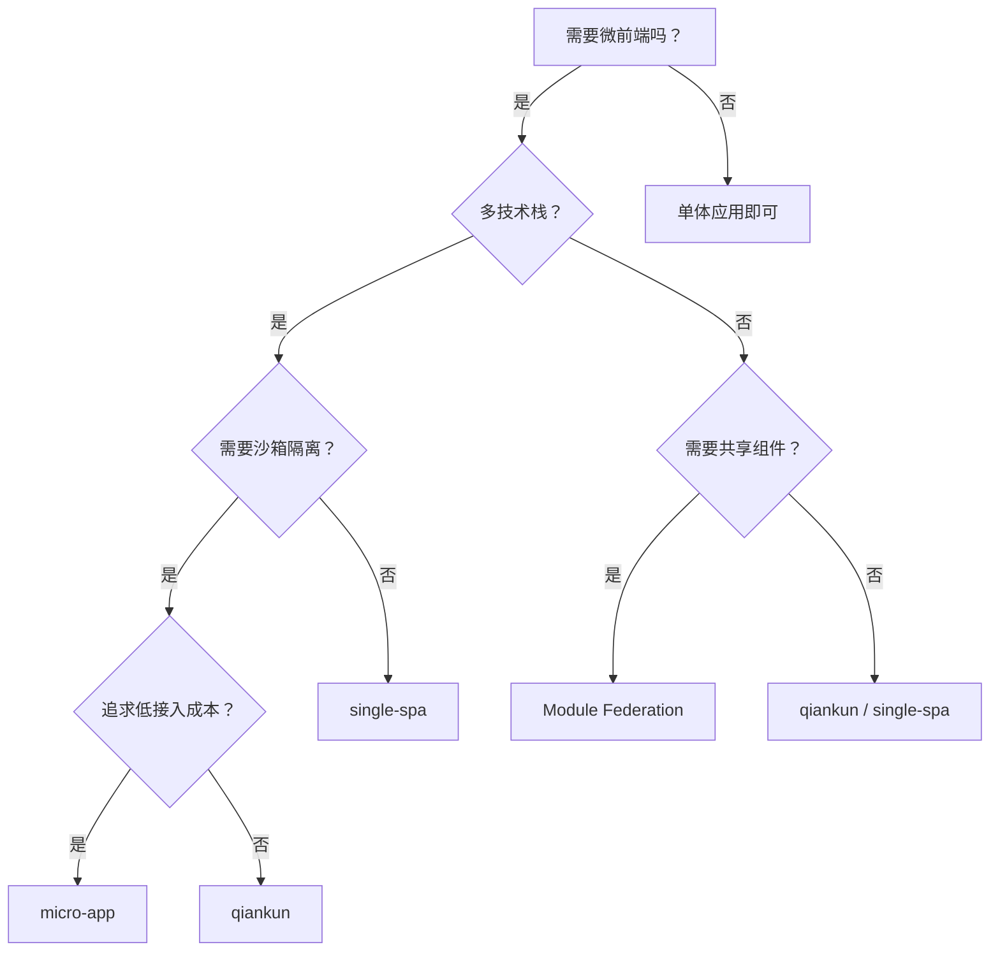

# Phase 3：框架对比、总结与综合实战

## 一、single-spa vs qiankun 全面对比

| 维度               | single-spa                          | qiankun                           |
| ------------------ | ----------------------------------- | --------------------------------- |
| **定位**           | 微前端底层框架                      | 基于 single-spa 的完整解决方案    |
| **加载方式**       | JS Entry                            | HTML Entry                        |
| **JS 沙箱**        | ❌ 无                               | ✅ Proxy / Snapshot 沙箱          |
| **CSS 隔离**       | ❌ 无                               | ✅ Shadow DOM / Scoped CSS        |
| **通信机制**       | ❌ 需自行实现                       | ✅ initGlobalState                |
| **预加载**         | ❌ 无                               | ✅ prefetch                       |
| **子应用改造成本** | 高（需特殊打包配置 + 导出生命周期） | 低（只需导出生命周期 + 跨域配置） |
| **学习曲线**       | 中等                                | 较低（封装完善）                  |
| **灵活性**         | 高（可自由组合）                    | 中等（约定大于配置）              |
| **适用场景**       | 需要高度定制的场景                  | 企业级中后台应用                  |
| **社区**           | 国际社区活跃                        | 国内社区活跃                      |

### 关系图



## 二、子应用接入 Checklist

### 通用（single-spa & qiankun）

- [ ] 导出 `bootstrap`、`mount`、`unmount` 三个生命周期
- [ ] 挂载节点使用 `container.querySelector` 而非全局 `document.getElementById`
- [ ] 路由使用 `basename`，避免与基座路由冲突
- [ ] `unmount` 中彻底清理 DOM、事件监听、定时器

### qiankun 专属

- [ ] 配置跨域（`Access-Control-Allow-Origin: *`）
- [ ] 打包格式设为 `umd`（`libraryTarget: 'umd'`）
- [ ] 动态设置 `publicPath`（`public-path.js`）
- [ ] 使用 `window.__POWERED_BY_QIANKUN__` 判断运行环境
- [ ] 独立运行和 qiankun 环境下都能正常工作

### single-spa 专属

- [ ] 打包格式设为 `system`（`libraryTarget: 'system'`）
- [ ] 配置 SystemJS Import Maps
- [ ] 通过 `externals` 排除共享依赖

## 三、常见坑点与解决方案

| 问题                 | 原因                               | 解决方案                                     |
| -------------------- | ---------------------------------- | -------------------------------------------- |
| 子应用样式丢失       | CSS 隔离导致全局样式失效           | 使用 `experimentalStyleIsolation` 或手动处理 |
| 子应用路由跳转失败   | 子应用路由没有设置 `basename`      | 配置 `basename` 为 `activeRule` 的值         |
| 子应用资源 404       | `publicPath` 不正确                | 动态设置 `__webpack_public_path__`           |
| 全局变量冲突         | 沙箱逃逸（如 `document.body.xxx`） | 避免直接操作 `document`，使用 `container`    |
| Vite 子应用接入困难  | qiankun 不支持 ESM                 | 使用 `vite-plugin-qiankun` 插件              |
| 子应用间样式互相影响 | single-spa 无 CSS 隔离             | 使用 CSS Modules / BEM 命名 / CSS-in-JS      |
| 子应用切换白屏       | 加载时间长                         | 开启 qiankun 预加载 `prefetch: 'all'`        |
| 子应用内存泄漏       | `unmount` 未清理干净               | 确保清理所有事件监听、定时器、全局状态订阅   |

## 四、其他微前端方案简介

### 4.1 micro-app（京东）

- **原理**：基于 Web Components（Custom Element + Shadow DOM）
- **特点**：
  - 子应用零改造，不需要导出生命周期
  - 使用 `<micro-app>` 自定义标签加载子应用
  - 天然的 CSS 隔离（Shadow DOM）
  - JS 沙箱基于 Proxy
- **适用场景**：追求最低接入成本的项目

```html
<!-- 使用方式极其简单 -->
<micro-app
  name="sub-app"
  url="http://localhost:3001/"
></micro-app>
```

### 4.2 Module Federation（Webpack 5）

- **原理**：构建时声明共享模块，运行时动态加载远程模块
- **特点**：
  - 不是传统意义的微前端框架，而是模块共享方案
  - 可以在不同应用间共享组件、工具函数等
  - 无沙箱、无 CSS 隔离
  - 与 Webpack 5 深度绑定
- **适用场景**：同技术栈、需要共享组件的项目

```javascript
// webpack.config.js
const { ModuleFederationPlugin } = require('webpack').container

module.exports = {
  plugins: [
    new ModuleFederationPlugin({
      name: 'app1',
      remotes: {
        app2: 'app2@http://localhost:3002/remoteEntry.js',
      },
      shared: ['react', 'react-dom'],
    }),
  ],
}
```

### 4.3 方案选型决策树



## 五、面试高频问题

### Q1：微前端的核心价值是什么？

> 技术栈无关、独立开发部署、增量升级、故障隔离。本质是解决大型前端应用的**组织架构**和**技术演进**问题。

### Q2：qiankun 的 JS 沙箱是怎么实现的？

> 三种方案：SnapshotSandbox（快照 diff）、LegacySandbox（单例 Proxy）、ProxySandbox（多例 Proxy + fakeWindow）。推荐 ProxySandbox，每个子应用有独立的 fakeWindow，写操作不污染真实 window。

### Q3：HTML Entry 和 JS Entry 的区别？

> JS Entry 直接加载子应用的 JS bundle，子应用需要打包成单个文件；HTML Entry 先 fetch 子应用的 HTML，解析出 JS/CSS 再执行，子应用可以像独立应用一样开发，改造成本更低。

### Q4：qiankun 的 CSS 隔离有什么问题？

> Shadow DOM 方案会导致弹窗等挂载到 body 的元素样式丢失；Scoped CSS 方案通过给选择器加前缀实现，但可能有遗漏。实际项目中通常结合 CSS Modules 或 CSS-in-JS 使用。

### Q5：single-spa 和 qiankun 怎么选？

> qiankun 是 single-spa 的上层封装，提供了沙箱、隔离、通信等开箱即用的能力。大多数企业级项目选 qiankun；需要高度定制或国际化团队选 single-spa。
