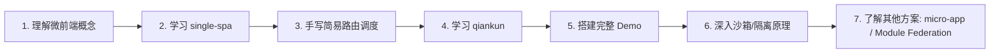

# 微前端学习路线图

## 一、整体学习路线

## 二、阶段规划

### Phase 1：single-spa — 理解微前端底层原理

> 📄 详见 [phase1-single-spa.md](./phase1-single-spa.md)

**目标**：理解微前端的核心思想 — 路由调度 + 生命周期协议

**关键学习点**：

- single-spa 的路由劫持机制（`pushState` / `popstate` 拦截）
- 应用状态机流转（NOT_LOADED → MOUNTED → NOT_MOUNTED）
- 生命周期协议（`bootstrap` / `mount` / `unmount`）
- JS Entry 加载方式与 SystemJS
- 使用 `single-spa-react` / `single-spa-vue` 适配器

**产出**：

- [ ] 搭建 single-spa 基座 + React 子应用 + Vue 子应用 Demo
- [ ] 理解为什么 single-spa 没有沙箱和样式隔离

---

### Phase 2：qiankun — 掌握企业级微前端方案

> 📄 详见 [phase2-qiankun.md](./phase2-qiankun.md)

**目标**：掌握 qiankun 在 single-spa 基础上解决的工程问题

**关键学习点**：

- HTML Entry 原理（`import-html-entry` 库）
- JS 沙箱三种实现（SnapshotSandbox / LegacySandbox / ProxySandbox）
- CSS 隔离方案（Shadow DOM / Scoped CSS）
- 全局状态通信（`initGlobalState`）
- 预加载机制（`requestIdleCallback`）

**产出**：

- [ ] 搭建 qiankun 基座 + React 子应用 + Vue 子应用 Demo
- [ ] 能手写简化版 ProxySandbox
- [ ] 理解 HTML Entry 与 JS Entry 的差异

---

### Phase 3：对比总结与综合实战

> 📄 详见 [phase3-comparison-and-practice.md](./phase3-comparison-and-practice.md)

**目标**：形成完整的微前端知识体系，能在实际项目中做技术选型

**关键学习点**：

- single-spa vs qiankun 全维度对比
- 子应用接入 Checklist
- 常见坑点与解决方案
- 了解其他方案（micro-app / Module Federation）

**产出**：

- [ ] 完成框架对比总结文档
- [ ] 能在面试中清晰阐述微前端方案选型思路

---

## 三、学习建议

1. **先学 single-spa**：理解微前端的核心思想（路由调度 + 生命周期协议），这是所有方案的基础
2. **再学 qiankun**：理解它在 single-spa 基础上解决了哪些工程问题（沙箱、隔离、通信）
3. **动手搭建 Demo**：建议先用 qiankun 搭建（上手快），再用 single-spa 搭建（理解底层）
4. **深入原理**：阅读 `import-html-entry` 和 `ProxySandbox` 的源码
5. **扩展视野**：了解 micro-app（Web Components 方案）和 Module Federation（构建时方案）
