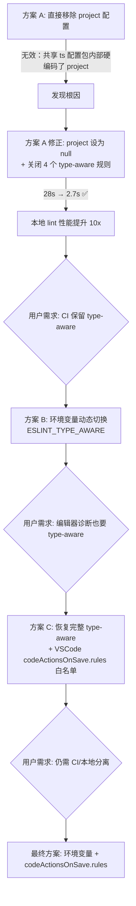
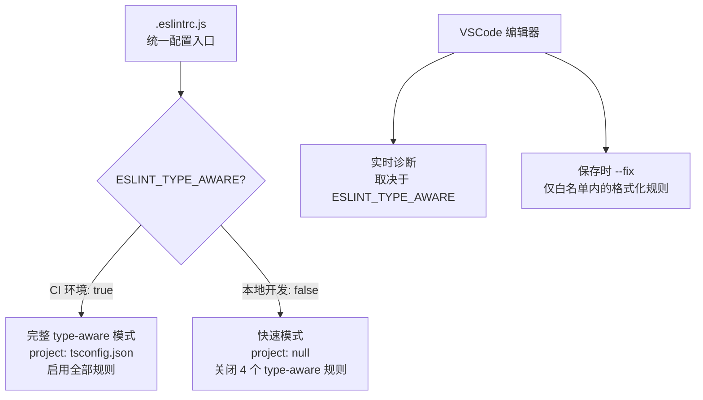

# ESLint 性能优化 — 问题定位与解决方案

> 本文记录一次真实的 ESLint 性能排查与优化过程。文中以 `@internal/eslint-config-team` 代称公司内部共享的 ESLint 配置包（包含基础规则与 `ts` 扩展包），业务文件路径已化名，其余技术细节均为通用经验。

## 1. 背景

### 1.1 项目概况

- **技术栈**：Vue 3 + TypeScript + Vite + Koa
- **Node 版本**：18.20
- **ESLint 版本**：v8（使用 `.eslintrc.js` 配置）
- **代码规模**：src 目录下约数百个 `.ts`/`.tsx`/`.vue` 文件
- **ESLint 配置继承**：`plugin:vue/vue3-recommended` + `@internal/eslint-config-team` + `@internal/eslint-config-team/ts`

### 1.2 痛点描述

| 使用场景 | 现状 | 痛点程度 |
|---|---|---|
| **CI 增量检查**（PR 阶段） | 仅检查变更文件，耗时 10-40s | ⬜ 可接受 |
| **本地保存时格式化**（`eslint --fix`） | 每次保存触发完整 lint，耗时 **5-10s** | 🟥 严重影响开发体验 |
| **实时诊断**（编辑器波浪线提示） | 提示不够及时 | 🟧 影响效率 |

Prettier 的配置项无法满足项目需求，团队统一使用 `eslint --fix` 在文件保存时执行格式化。

### 1.3 曾调研的替代方案

在优化 ESLint 之前，还调研了以下方案：

| 方案 | 结论 |
|---|---|
| **迁移到 oxlint** | oxlint 不支持代码格式化、import 排序、Vue 模板规则、命名规范、团队自定义规则集，**无法完全替代 ESLint**（约 60%+ 规则不兼容） |
| **ESLint + Biome 混合** | Biome 格式化极快（Rust 实现），但 import 排序不支持 pathGroups 自定义分组，Vue SFC 支持仍在进化中 |
| **升级 ESLint v9** | v9 的 flat config 仅减少配置解析开销（约 5-15%），核心瓶颈（type-aware linting）无变化 |

最终决定：**在现有 ESLint v8 基础上针对性优化**。

---

## 2. 问题定位

### 2.1 初步排查：移除 `project` 配置无效

`.eslintrc.js` 中配置了 `parserOptions.project`，这会让 ESLint 启用 **type-aware linting**（类型感知检查）：

```js
parserOptions: {
  project: ['./tsconfig.json', './server/tsconfig.json'],
}
```

**第一次尝试**：注释掉 `project` 配置。

```js
// project: ['./tsconfig.json', './server/tsconfig.json'],
```

**结果**：lint 耗时没有任何改善，仍然是 **~28s**。

### 2.2 根因定位：`@internal/eslint-config-team/ts` 内部硬编码了 `project`

通过 `--debug` 模式发现：

```bash
npx eslint --debug ... 2>&1 | grep "project"
```

输出：

```
'--config » @internal/eslint-config-team/ts', parserOptions: { project: [Array] }
```

**根因**：`@internal/eslint-config-team/ts` 这个 npm 包**内部硬编码了 `parserOptions.project: ['./tsconfig.json']`**。

在 ESLint v8 的配置合并机制中，如果你只是注释掉（删除）顶层 `project` 字段，等同于不提供该字段，**无法覆盖** extends 链中已设置的 `project` 值。必须**显式设置为 `null`** 才能覆盖。

### 2.3 深入分析：type-aware linting 的性能开销

**什么是 type-aware linting？**

普通 ESLint 规则只分析代码的**语法结构（AST）**，而 type-aware 规则会额外利用 **TypeScript 编译器提供的类型信息**做更深层次的检查。

```
普通 linting：  源代码 → AST 解析 → 规则匹配      （毫秒级）
type-aware：   源代码 → AST 解析 → TS 编译器构建类型系统 → 规则匹配（秒级）
```

当配置了 `parserOptions.project` 时，`@typescript-eslint/parser` 每次 lint **哪怕一个文件**，都需要：

1. 读取 `tsconfig.json` 的 `include` 范围
2. **解析该范围内的所有文件**（数百个 `.ts`/`.vue` 文件）
3. 构建完整的类型依赖图（等同于执行 `tsc --noEmit`）
4. 然后才能对目标文件执行需要类型信息的规则

### 2.4 定位需要 type-aware 的规则

通过脚本分析 `@internal/eslint-config-team/ts` 中启用的规则，找出所有需要 `requiresTypeChecking` 的规则：

```js
// 分析脚本
const rules = require('@typescript-eslint/eslint-plugin').rules;
const tsConfig = require('@internal/eslint-config-team/ts');
// 过滤出需要 type checking 的规则...
```

**结果：4 个规则需要 type-aware linting**

| 规则 | 功能 | 耗时占比 |
|---|---|---|
| `@typescript-eslint/no-misused-promises` | 检测 Promise 误用（如 `if(promise)` 恒为真） | **74%** |
| `@typescript-eslint/dot-notation` | 强制使用 `.` 访问属性（TS 增强版，识别 private） | 较低 |
| `@typescript-eslint/naming-convention` | 命名规范（支持 `typeLike` 等类型选择器） | 较低 |
| `@typescript-eslint/prefer-optional-chain` | 建议将 `a && a.b` 改为 `a?.b` | 较低 |

### 2.5 性能测试对比

以 `src/components/rule-node/editor.vue`（430 行，化名）为基准：

| 测试配置 | 耗时 | 说明 |
|---|---|---|
| 空规则（仅 parser 启动） | **1.3s** | ESLint 引擎 + parser 自身开销 |
| 不加载 `@internal/eslint-config-team/ts` | **2.7s** | 无 type-aware |
| 加载完整配置 + `project: null` | **2.7s** | 成功禁用 type-aware |
| 加载完整配置 + `project: []`（空数组） | **21s** | ⚠️ 空数组未能正确禁用 |
| 加载完整配置 + `project: ['./tsconfig.json']` | **28.2s** | 完整 type-aware |

> **关键发现**：`project: []`（空数组）不等于禁用，`@typescript-eslint/parser` 仍然会尝试创建 TypeScript Program。必须使用 `project: null` 才能彻底禁用。

---

## 3. 解决方案

### 3.1 方案演进过程



### 3.2 最终方案

**核心思路**：通过环境变量 `ESLINT_TYPE_AWARE` 在同一份配置文件中动态切换两种模式，结合 VSCode 的 `eslint.codeActionsOnSave.rules` 白名单机制实现保存时只修复格式化规则。



### 3.3 配置修改详情

#### 文件 1：`.eslintrc.js`

```js
// 是否启用类型感知检查（很慢, 影响开发体验）
// CI 环境设置 ESLINT_TYPE_AWARE=true 开启完整类型检查
const typeAware = process.env.ESLINT_TYPE_AWARE === 'true';

module.exports = {
  parserOptions: {
    // CI：启用类型感知检查；本地开发：关闭以提升性能
    ...(typeAware
      ? { project: ['./tsconfig.json', './server/tsconfig.json'] }
      : { project: null }),  // 必须用 null 覆盖共享 ts 配置包内部的 project 配置
  },
  rules: {
    // 类型感知规则（仅在 ESLINT_TYPE_AWARE=true 时启用）
    '@typescript-eslint/no-misused-promises': typeAware ? 'error' : 'off',
    '@typescript-eslint/dot-notation': typeAware ? ['warn', {}] : 'off',
    '@typescript-eslint/prefer-optional-chain': typeAware ? 'warn' : 'off',
    '@typescript-eslint/naming-convention': typeAware ? ['warn', {}] : 'off',
    camelcase: typeAware ? 'off' : ['warn', {}],  // 本地降级替代
    // ...其他非 type-aware 规则不变
  },
};
```

#### 文件 2：`package.json`（scripts）

```json
{
  "lint":         "ESLINT_TYPE_AWARE=true eslint src --ext .ts,.tsx,.vue",
  "lint:fix":     "eslint src --fix --ext .ts,.tsx,.vue",
  "lint:staged":  "ESLINT_TYPE_AWARE=true eslint $(git diff ...)",
  "lint:staged:fix": "eslint --fix $(git diff ...)"
}
```

- CI 相关命令（`lint`、`lint:staged`）加 `ESLINT_TYPE_AWARE=true` → 完整检查
- 本地修复命令（`lint:fix`、`lint:staged:fix`）不加环境变量 → 快速模式

#### 文件 3：`.vscode/settings.json`

```jsonc
{
  // 保存时仅自动修复格式化规则（跳过慢速的类型感知规则）
  "eslint.codeActionsOnSave.rules": [
    "object-curly-newline",
    "import-newlines/*",
    "import/order",
    "import/newline-after-import",
    "no-multi-spaces",
    "no-extra-semi",
    "no-restricted-imports",
    "@typescript-eslint/member-delimiter-style",
    "@typescript-eslint/space-before-blocks",
    "@typescript-eslint/space-infix-ops",
    "@typescript-eslint/padding-line-between-statements",
    "vue/*"
  ]
}
```

> 该配置需要 **ESLint VSCode 扩展 v4.x+** 支持。

---

## 4. 效果验证

### 4.1 性能对比

基准文件：`src/components/rule-node/editor.vue`（430 行，化名）

| 场景 | 优化前 | 优化后 | 提升 |
|---|---|---|---|
| CLI 冷启动 lint（单文件） | **28.2s** | **2.7s** | **~10x** |
| CLI --fix 模式（单文件） | **~30s** | **3.3s** | **~9x** |
| VSCode 保存时（ESLint server 热状态） | **5-10s** | **~0.5-1s** | **~10x** |
| CI 增量检查 | 10-40s | 10-40s（不变） | — |

### 4.2 功能影响矩阵

| 场景 | type-aware 诊断 | 格式化 --fix | 速度 |
|---|---|---|---|
| **本地开发（保存）** | 取决于是否启用 `ESLINT_TYPE_AWARE` | ⚡ 仅白名单格式化规则 | 快 |
| **CI（`npm run lint`）** | ✅ 完整 type-aware | — | 正常 |

### 4.3 关闭规则的影响评估

| 关闭的规则 | 检查能力损失 | 替代方案 |
|---|---|---|
| `no-misused-promises` | 无法检测 `if(promise)` 恒真等 Promise 误用 | TypeScript 编译器部分覆盖；CI 阶段完整检查 |
| `dot-notation`（TS 版） | 无法识别 private 属性的括号访问豁免 | 使用原生 `dot-notation` 替代 |
| `prefer-optional-chain` | 不再提示 `a && a.b` → `a?.b` | VSCode TS 语言服务会给出重构建议 |
| `naming-convention` | 无法检查 `typeLike` 必须 PascalCase 等类型级命名 | 本地降级为 `camelcase` 做基本检查；CI 完整检查 |

---

## 5. 关键技术细节

### 5.1 为什么 `project: []` 不等于禁用？

`@typescript-eslint/typescript-estree` 的 `resolveProjectList` 函数中：

```js
// node_modules/@typescript-eslint/typescript-estree/dist/parseSettings/resolveProjectList.js
if (options.project != null) {
  // project: [] → 进入循环但 sanitizedProjects 为空
  // project: null → null == null 为 true，跳过
}
```

理论上 `[]` 也应该跳过，但在 ESLint v8 的配置合并过程中，`project: []`（数组类型）会与共享 ts 配置包的 `project: ['./tsconfig.json']`（数组类型）发生**数组合并**，导致最终 `project` 不为空。而 `project: null` 通过 `Object.assign` 直接用 `null` 覆盖原值，彻底禁用。

### 5.2 ESLint v8 配置合并顺序

```
extends 配置（从左到右依次合并）
  ↓
plugin:vue/vue3-recommended
  ↓
@internal/eslint-config-team        → 基础规则
  ↓
@internal/eslint-config-team/ts     → 设置 project: ['./tsconfig.json']
  ↓
顶层 .eslintrc.js 的 parserOptions   → project: null 覆盖上面的值 ✅
```

**顶层配置的优先级最高**，但前提是必须显式设置字段（`null` / `false`），而非简单地不提供该字段。

### 5.3 VSCode ESLint 扩展的 `codeActionsOnSave.rules`

该配置从 ESLint VSCode 扩展 v4.x 开始支持，允许指定保存时只 autofix 哪些规则：

- 支持**精确规则名**：如 `"import/order"`
- 支持**通配符**：如 `"vue/*"` 匹配所有 vue 相关规则
- 不在列表中的规则：仍然会在编辑器中显示诊断（波浪线），但保存时**不会触发 autofix**

---

## 6. 后续可优化方向

| 方向 | 说明 | 优先级 |
|---|---|---|
| **oxlint 并行检查** | 用 oxlint 负责基础代码质量检查（Rust 实现，毫秒级），ESLint 仅保留格式化和项目定制规则 | 低（当前痛点已解决） |
| **Biome 替代格式化** | 用 Biome 接管纯格式化（缩进、分号等），ESLint 只处理逻辑规则 | 低（Biome 对 Vue SFC 支持仍在进化） |
| **升级 ESLint v9** | flat config 减少配置解析开销，但对 type-aware 瓶颈无帮助 | 低（内部共享配置包需先适配 flat config） |
| **typescript-eslint v8+ projectService** | 新版 typescript-eslint 提供 `projectService` 模式，复用 VSCode 的 TS 语言服务，理论上可大幅提升 type-aware 性能 | 中（需要升级 typescript-eslint） |
