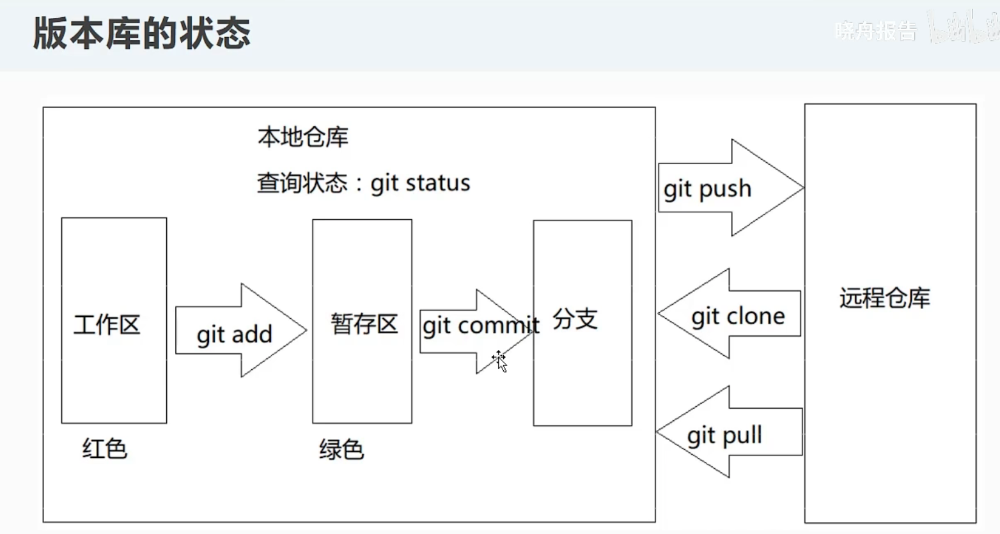

[https://www.liaoxuefeng.com/wiki/896043488029600/](https://www.liaoxuefeng.com/wiki/896043488029600/)


# Git 工作流自我学习总结

右键 - `open git bash here`


## 个人信息配置(首次commit 前会询问)

```bash
git config --global user.email "qiu5873@gmail.com"
git config --global user.name  "zn_dk"
```



## 配置公钥免密推送SSH

1. 生成公钥

   ```bash
   ssh-keygen -t rsa
   # 一路回车
   # 生成的目录位于  C盘用户文件夹\.ssh
   ```

   

2. 复制公钥文件 id_rsa.pub  (id_rsa 为私钥)

3. 复制公钥到 gitee 添加 SSH 公钥

4. done 可以免密提交了

5. 免密的克隆 不使用 HTTPS 可以使用 SSH 链接 


## 代理

有些时候由于连不上git服务器而我们又需要推送代码，这时就需要设定git代理服务器。


### 1. http和https代理


如果说使用的是项目http或者https地址，就配置http与https代理即可，输入以下命令：

```bash
git config --global http.proxy "socks5://地址:端口"
git config --global https.proxy "socks5://地址:端口"
```


例如设定本地代理：

```bash
git config --global http.proxy "socks5://127.0.0.1:7890"
git config --global https.proxy "socks5://127.0.0.1:7890"
```


这样使用git clone/push/pull所有http或者https地址项目都会走代理。

还可以使用下面命令取消代理设置：

```bash
git config --global --unset http.proxy
git config --global --unset https.proxy
```

### 2. ssh代理设定


如果说项目使用的ssh地址，那么就需要配置ssh代理。

我们需要编辑ssh的配置文件，位于用户文件夹下的.ssh文件夹下。

Windows ssh配置文件路径：`C:\Users\你的用户名.ssh\config`

Linux ssh配置文件路径：`/home/你的用户名/.ssh/config`

使用文本编辑器打开配置文件config加入下列配置：

`ProxyCommand connect -S 代理地址:端口 %h %p`  
如果说.ssh文件夹不存在或者config文件不存在就自己创建一个。

配置好了，ssh就会走代理了。

上面是配置全局走代理，事实上一般只需要为指定网址配置代理，例如只为github配置代理，就在配置文件加入：

```bash
Host github.com
	ProxyCommand connect -S 代理地址:端口 %h %p
```


Host后面接的就是指定要走代理的地址，可以接多个地址例如：

```bash
Host github.com gitlab.com
	ProxyCommand connect -S 代理地址:端口 %h %p
```


可见多个地址使用空格隔开放在Host后面即可，这个例子就是同时指定ssh访问github和gitlab时走代理。


例如配置ssh访问github走本地代理：

```bash
Host github.com
	ProxyCommand connect -S 127.0.0.1:1080 %h %p
```


## init 创建

Git 使用 **git init** 命令来初始化一个 Git 仓库，Git 的很多命令都需要在 Git 的仓库中运行，所以 **git init** 是使用 Git 的第一个命令。

在执行完成 **git init** 命令后，Git 仓库会生成一个 .git 目录，该目录包含了资源的所有元数据，其他的项目目录保持不变。

### 使用方法

使用当前目录作为 Git 仓库，我们只需使它初始化。

```
git init
```

该命令执行完后会在当前目录生成一个 .git 目录。

使用我们指定目录作为Git仓库。

```
git init newrepo
```

初始化后，会在 newrepo 目录下会出现一个名为 .git 的目录，所有 Git 需要的数据和资源都存放在这个目录中。

## status 状态

查看当前仓库状态 (包括未跟踪待 commit 的文件等)

```shell
git status
```

## remote 远程管理

```shell
git remote     #  查看当前远程库名称
```

### 查看状态

```shell
git remote -v  #  查看远程库状态
```

典型的示例:

```shell
> git remote -v
# origin  git@github.com:Zn-Dk/branch-test.git (fetch)
# origin  git@github.com:Zn-Dk/branch-test.git (push)
```

- 这便是在告诉你, 现在你要pull/push 等操作的库, 对应名称是 `origin` 以及相应的地址, 比如 `git push origin master` 就是在 `origin` 库的 `master` 分支上做操作。

(在同时有其他远程库,比如 Gitee Github 共存的时候起好名字区分是有必要的)

### 添加远程库

```shell
git remote add <name> <url> 
```

添加一个 <name> 的远程库, 远程库地址为 <url>

比如:

```shell
git remote add github git:xxxxx
```

后续操作:

```shell
git push github <branch-name> ...
```

### 移除远程库

```shell
git remote remove <name>
```


## clone 克隆

将仓库的内容拉取到本地, .git 地址从托管库中获取

```bash
git clone "https://XXXX.git"
```

## push/pull  推送/拉取

将本地仓库的代码推送到远程仓库 origin

```bash
git push origin main(github)/master(gitee)
```

从远程仓库拉取最新代码(本地已有版本库,非公开库需要输入用户名密码)

```bash
git pull origin main(github)/master(gitee)
```


## add/commit 添加/提交

- **git add** 命令可将该文件添加到暂存区。

添加一个或多个文件到暂存区：

```
git add [file1] [file2] ...
```

添加指定目录到暂存区，包括子目录：

```
git add [dir]
```

添加当前目录下的所有文件到暂存区：

```
git add .
```

以上命令将目录下以 .c 结尾及 README 文件提交到仓库中。

> **注：** 在 Linux 系统中，commit 信息使用单引号 **'**，Windows 系统，commit 信息使用双引号 **"**。
>
> 所以在 git bash 中 **git commit -m '提交说明'** 这样是可以的，在 Windows 命令行中就要使用双引号 **git commit -m "提交说明"**。
>


例子  本地文件更新之后 执行的顺序

```bash
git add .  
git commit -m "commit的注释写在这里"
git push origin main
```


- **commit** 附加说明

```bash
# git commit [OPTIONS]
OPTIONS
    -a, --all
      Tell the command to automatically stage files that have been modified and deleted, but new files you have not told Git about are not affected.
```

“加了 -a ，后，会自动把 modified 和 deleted add 到 stage 里，但是新增文件不会受影响。 ”

也就是在 commit 的时候，能帮你省一步 git add ，但只是对**修改和删除**文件有效， 新文件还是要 git add，不然就是 **UNtracked** ！什么是 **UNtracked** ？就是没有跟踪，不在git的代码仓里面，你更改了什么是不会提示你更改的，你提交也是不会提交到远程仓库的。


## reset 版本追溯


在仓库网页上可以看到项目提交的历史记录和浏览历史版本文件


如果需要在本地回溯之前的版本 需要使用 `reset` 命令

- 硬回滚(所有状态都回到目标 commit, **其他更新文件会被一并抹去**)

  > **彻底抹除这次提交**，谨慎使用，一般用在误提交 master
  >
  > 如果需要保留记录供 review ， 建议使用 revert

```
git reset --hard <commit>
```

- 软回滚(现在已经添加了新文件,**还想保留修改和新增的其他文件**)

```
git reset --soft <commit> 
```


### 示例(硬回滚):

这里做的操作是将版本的 head 指针指向了历史提交树, 可以通过日志 git reflog 进行查看, 示例代码: 

1. 创建了一个 commit 52fb314 添加文件 3.txt 此时指针在本次 commit

```bash
git reflog

# 52fb314 (HEAD -> main, origin/main, origin/HEAD) HEAD@{0}: commit: 3.txt added
# 6bfe69f HEAD@{1}: clone: from github.com:Zn-Dk/branch-test.git
```

2. reset 回退到之前的版本, 我们检查目录文件 3.txt 已经不存在了

而且 .git/refs/heads/main 的版本号也已经改变

```bash
git reset --hard 6bfe69f

# HEAD is now at 6bfe69f "Merge branch 'dev'"
```

3. 再次查看 reflog, 可以发现指针回退到了之前的版本

```bash
git reflog

# 6bfe69f (HEAD -> main) HEAD@{0}: reset: moving to 6bfe69f  #  越往前越新
# 52fb314 (origin/main, origin/HEAD) HEAD@{1}: commit: 3.txt added
# 6bfe69f (HEAD -> main) HEAD@{2}: clone: from github.com:Zn-Dk/branch-test.git
```

4. 也可以返回到之前的状态

```bash
git reset --hard 52fb314
 
# HEAD is now at 52fb314 3.txt added
```

5. 提交这次回滚到远程，此时会提示本地的版本落后于远程

```bash
git push
error: failed to push some refs to 'gitlab.com:Zn-Dk/fetch-rebase.git'
hint: Updates were rejected because the tip of your current branch is behind
hint: its remote counterpart. Integrate the remote changes (e.g.
```

6. 使用  push -f 强制提交（慎用，因为别人的代码提交到 master 的代码可能会被搞没，这个需要权限，建议和 leader 沟通好）

   > 如果是自己的项目 权限可以在仓库设置中允许 force push


## revert 回退修改

> 上面的示例代码是回溯, 那么如果我们要撤回 commit 就得使用 revert 命令了


`git revert`用于撤销文件，**撤销文件后不会影响其他的提交。**

>  需要注意的是，`reset` 指要回滚到哪个版本，此版本以后的提交都会被回滚（**不包含当前版本**），而 `revert` 只能撤销某一条提交

1. `git revert <commit-id>`：撤销某个提交
2. `git revert -n|--no-commit <commit-id>`：撤销某个提交，但执行命令后不进入编辑界面，也就是不会自动帮你提交文件，需要手动提交，这与第1点的差别就是撤销和提交分开了。


1. 这里回退版本 控制台显示删除了刚才的文件

```bash
git revert 52fb314

[main 54c39b9] Revert "3.txt added"
 1 file changed, 1 deletion(-)
 delete mode 100644 3.txt
```

2. 可以看到现在指向了一个新版本 54c39b9 此时我们推送到远程

```bash
git reflog
54c39b9 (HEAD -> main) HEAD@{0}: revert: Revert "3.txt added"
52fb314 (origin/main, origin/HEAD) HEAD@{1}: reset: moving to 52fb314
6bfe69f HEAD@{2}: reset: moving to 6bfe69f
52fb314 (origin/main, origin/HEAD) HEAD@{3}: commit: 3.txt added
6bfe69f HEAD@{4}: clone: from github.com:Zn-Dk/branch-test.git
```

```bash
git push origin main
 
Enumerating objects: 3, done.
Counting objects: 100% (3/3), done.
Delta compression using up to 8 threads
Compressing objects: 100% (2/2), done.
Writing objects: 100% (2/2), 244 bytes | 244.00 KiB/s, done.
Total 2 (delta 1), reused 0 (delta 0), pack-reused 0
remote: Resolving deltas: 100% (1/1), completed with 1 local object.
remote: no repo id givemno repo id givem
To github.com:Zn-Dk/branch-test.git
   52fb314..54c39b9  main -> main
```


3. 在 github 上面查看, 这次的提交被注明为指定版本的撤销 回滚状态


> 合并错误代码后的处理方法如下:
>
> 1. 找到对应的merge记录
> 2. 执行revert操作
> 3. 将revert产生的分支，重新merge到master，将更改抵消


>#### 总结
>
>1. commit 之后 本地文件是否删除都可以通过版本追溯找回
>2. 团队开发时 commit 备注一定要写清楚 方便追溯.
>3. 开发项目过程中, 每天至少 commit 一次.(保险 防丢失)
>4.  要知道使用 git reset --hard 和 git revert 的场景


## branch 分支

### 查看所有分支

```shell
git branch    #  列出所有本地分支

git branch -r #  列出所有远程分支

git branch -a # 列出所有本地和远程分支

git branch -v #  查看所属分支 commit ID message
```

### 分支管理

```shell
git branch <name>(分支名) #  创建指定分支
git branch -d 分支名    #  删除指定分支
```

## checkout/switch 切换分支

```shell
git checkout develop #  切换到刚才的 develop
git checkout -b dev  #  -b参数表示创建并切换
```


- 完成后续操作之后, 在该分支下对文件的更改就会被记录到新分支中正常的 add commit push

  > 注意后续 pull/push 是从/到 **origin develop**

  ```bash
  git push origin develop:develop
  ```

  

- 如果切换回原有 master/main 分支 则新分支的文件会不可见(物理上也是)

#### **switch**

切换分支使用`git checkout <branch>`，而撤销修改则是`git checkout -- <file>`，同一个命令，有两种作用，确实有点令人迷惑。

**因此，最新版本的Git提供了新的`git switch`命令来切换分支(推荐)：**

创建并切换到新的 `branchName` 分支，可以使用：

```bash
git switch -c <branchName>
```

直接切换到已有的 `branchName` 分支，可以使用：

```bash
git switch <branchName>
```


## merge 合并

#### 合并到主分支

先 checkout 切换到master/main

执行以下:

```shell
git merge <分支名>
git push origin master/main
```

在项目正式完成开发后, dev 分支的文件需要和原始的文件进行合并, 新增的文件会自动添加.

#### 合并其他分支

 但是如果项目由不同开发组开发(假定devA devB),devA devB要先合并到dev,再提交到master, 如果有版本冲突, 需要A B组人员沟通核实确认后, 选择一个版本进行覆盖

```bash
git checkout devA
git merge devB
# ...冲突 解决后 merge
git checkout dev
git merge devA/devB
# ....
git checkout master
git merge dev

```


## rebase 变基

基本工作流程图解：

```
      A---B---C topic
     /
D---E---F---G master
```

```bash
git rebase master # 当前的分支变基自 master
git rebase master topic # 变基自 master （明确分支名，效果一样）
```

```
               A'--B'--C' topic
             /
D---E---F---G master
```

### 对比 merge 和 rebase

 **git merge** 适合 多个**私有分支的提交合并到**(**共享**)分支

 **git rebase** 适合 将**共享分支**的提交**合并到**自己的私有分支里(rebase不好追溯)

>rebase 的最大好处并不是消除 merge，而是避免 merge 的交织。
>简要来说，就是在 merge 进被合分支（如master）之前，最好将自己的分支给 rebase 到最新的被合分支（如master）上，然后用pull request创建merge请求。
>在pull request里面还是采用普通的merge，当然可能有的人喜欢rebase merge等，要看具体情况。


### 用 rebase 合并提交

> 使用 rebase 可以使提交的历史记录显得更简洁。

- 现在有 3 个 commit 需要合并成一个进行最终 push
-  rebase - i

```
git rebase -i HEAD~~~(或者 HEAD~3) # 代表合并之前三次提交
```

- 输出

```bash
pick b456172 A
pick 03b28ac B
pick ded0eee C

# Rebase cf6f52b..ded0eee onto cf6f52b (3 commands)

# p, pick <commit> = use commit 使用此次提交
# r, reword <commit> = use commit, but edit the commit message 修改这次提交的 message
# e, edit <commit> = use commit, but stop for amending
# s, squash <commit> = use commit, but meld into previous commit 压缩这次提交
# f, fixup [-C | -c] <commit> = like "squash" but keep only the previous  压缩提交 追加而不改变之前的策略
#                    commit's log message, unless -C is used, in which case
#                    keep only this commit's message; -c is same as -C but
#                    opens the editor
# x, exec <command> = run command (the rest of the line) using shell
# b, break = stop here (continue rebase later with 'git rebase --continue')
# d, drop <commit> = remove commit 丢弃这次提交
# l, label <label> = label current HEAD with a name
# t, reset <label> = reset HEAD to a label
# m, merge [-C <commit> | -c <commit>] <label> [# <oneline>]
```

- 
- 提示修改 commit message

```bash
On branch feature2
pick b456172 A
# This is a combination of 3 commits. <-提示 这是一次合并提交
# This is the 1st commit message:

ABC  # <-改成ABC

# This is the commit message #2:

B

# This is the commit message #3:

C

# Please enter the commit message for your changes. Lines starting
```

-  :wq 保存 此时3次提交被合并


## cherry-pick 获取某次提交

> 用于获取某一分支的某一次提交，而不需要将整个时间线进行同步
>
> cherry-pick 获取后 commit 的信息是与源头一致的

```bash
git cherry-pick <commit>
```

典型例子：

- 现有 feature1 feature2 两个分支都由你管理
- 在 feature1 新建了文件 cherry.txt 并且 commit push 远程
- 切换到 feature2 分支，此时想要获取这个  cherry.txt 
- 复制 feature1 的提交号，比如 `git cherry-pick ab9702f8`
- 此时可以看到  cherry.txt  已经出现在 feature2 分支里面了


## stash 暂存

> 用于临时切换分支，但是**修改**(注意是修改，而不是新增)的文件还未 commit 又要保留当前文件更改的情况

```bash
git stash # 将当前更改暂存
git stash -m <message> # 将当前更改暂存(自定义message)
git stash list # 查看 stash 暂存栈
git stash pop [index] # 弹出暂存栈 可以指定 index
git stash apply [index]  # 应用储藏（不清空栈）

git stash drop <stash idx> 删除指定下标的储藏
git stash clear 清空储藏栈
```


典型例子：

- 现有 feature1 feature2 两个分支都由你管理
- 在 feature1 修改了文件 feature1.txt
- 暂存 feature1 的更改

```bash
git stash
# Saved working directory and index state WIP on feature1: 099a42e add feature1.txt
```

- 切换新的分支 feature2 继续工作
- 暂存 feature2 的更改

```bash
git stash
# Saved working directory and index state WIP on feature2: 3855ed3 add feature2.txt
```

- 查看 stash 暂存栈

```bash
git stash list
stash@{0}: WIP on feature2: 3855ed3 add feature2.txt
stash@{1}: WIP on feature1: 099a42e add feature1.txt
# 可以看到 对 feature2 的修改位于栈顶，之前 feature1 的暂存在栈底部
```

- 选择恢复在 feature1 做的更改 

```bash
git stash pop # 弹出栈顶储藏 - vscode 叫弹出最新储藏
git stash pop 1 # 弹出储藏 [1] - vscode 叫弹出储藏... <-使用这个
```

- 查看 feature1.txt 发现已经恢复了之前的状态


## prune

根据官方的解释，直白一点的翻译就是删除 git 数据库中不可访问的对象，那我的理解是这样的，git prune删除的是你本地 .git 下的 object 目录下，没有被使用到的 hash 值，我理解的是它会删除 origin/xx 开头的没有用到的分支，这个分支在你的远程的 git 服务器中已经删除但是本地任然存在 origin/xxx 的映射，这个时候你就可以使用git prune来删除本地的 origin/xxx 的映射。

但是官方推荐使用的是 git gc，而想删除本地的 xxx 分支，就只能只用git branch -D XXX，

清除本地无用分支的shell :

```bash
git fetch --all --prune && git branch -vv | grep gone | awk '{ print $1 }' | grep -v pit | xargs git branch -D
```


作者：agatex
链接：https://www.jianshu.com/p/f215964f40a5
来源：简书
著作权归作者所有。商业转载请联系作者获得授权，非商业转载请注明出处。


## 提交规范

多人协作时，为了更好管理分支以及提交日志，我们最好建立相关规范，提高协作效率。

**示例分支规范**

| 分支            | 介绍                                                         | 环境     |
| --------------- | ------------------------------------------------------------ | -------- |
| master          | 仓库默认分支，暂无使用                                       | -        |
| release         | 线上保护分支                                                 | Prd      |
| release-pre     | 预发环境分支，用于 QA 做固定 Pre 测试                        | Pre      |
| test            | 测试环境分支，用于 QA 做固定 Test 测试                       | Test     |
| feature/xxx     | 功能开发分支                                                 | Dev/Test |
| hotfix/xxx      | 热修复分支                                                   | Pre/Prd  |
| release-2022xxx | 上线分支；上线当日部署到 Pre 进行验证，通过以后直接作为上线分支使用 | Pre/Prd  |

日常开发中，对于线上环境、预发环境和测试环境建议使用固定分支进行部署，所有分支以 `release` 作为基线分支。之所以不用`release-pre` 或者 `release` 作为上线分支，是因为上线当天经常因为各种原因导致只有部分`feature`是可以上线的。上线当天创建 `release-20220818` 并部署到Pre，如果验证通过直接部署上线，如果部分上线，则直接丢弃，再创建一个新的上线分支即可，避免污染 `release` 。

**提交规范**

提交代码时，务必填写提交日志，日志清晰明了，说明本次提交的目的。同时需要遵循一定的提交规范。

```text
<type>(<scope>): <subject>  
```

1. Header：包括三个字段：type（必需）、scope（可选）和 subject（必需）。

2. Type：提交 commit 的类别，建议使用下面标识

> feat: 加入新特性
> fix: 修复 bug
> improvement: 在现有特性上的改进
> docs: 更改文档
> style: 修改了代码的格式
> refactor: 代码重构,不包含 bug 的修复以及新增特性
> perf: 提升性能的改动
> test: 测试用例的改动
> build: 改变了构建系统或者增加了新的依赖
> ci: 修改了自动化流程的配置文件或者脚本
> chore: 除了源码目录以及测试用例的其他修改
> revert: 回退到之前的一个 commit

3. Scope：用于说明 commit 影响的范围，默认可忽略。

4. Subject：简短精炼的提交描述。


## github 仓库搜索技巧**

1. xxx in:name 按照名称搜索
   xxx in:description 按照描述搜索
   xxx in:readme 按照readme中包搜索
2. xxx stars:>n language:java   这个非常有用。
   xxx forks:>n language:java
3.  将某个文件代码行高亮，编辑 URL 链接（#L行号）。如果多行就是（#L行号-#L行号）

> 例如 
>
> ```
> https://github.com/Zn-Dk/zn-web-learn/blob/master/vue3-learn/jsconfig.json
> 
> // 高亮第 7-11 行文本
> 
> https://github.com/Zn-Dk/zn-web-learn/blob/master/vue3-learn/jsconfig.json#L7-#L11
> ```
>
> 

1.  **按  T  键， 在项目网页中调出搜索，搜索指定文件**
2.  **按 "."  键**， 打开github中vscode

## 业务场景（引自知乎）

### **场景一**

如果我们正在开发一个功能，突然告知有线上问题，我们**做了一半的代码如何保存**？

```bash
# 缓存本地开发文件  
git stash 

# 取出最后一条缓存记录并删除 
git stash pop 

# 查看所有缓存列表 
git stash list 

# 应用某一条缓存 
git stash apply stash@{index} 
```

1. 使用 `git stash` 可以临时存储本地所有变动的文件，并从当前分支删除修改的代码。
2. 切换到 `release` 创建 `hotfix-xxx` 修复问题。
3. 切换到 `feature/xxx` ，执行 `git stash pop` 还原刚刚开发的代码。

一切都像没发生一样，很丝滑。


### **场景二**

`release-pre` 合并了 5 次提交，最终`QA`反馈只有一个功能对应的2次提交可以上线，我们如何把其中 2 次提交代码合并到`release`?

- 方法一：把需要上线的功能分支直接合并到 `release` 进行上线。
- 方法二：使用`git revert` 回滚其中不必要的提交。
- 方法三：使用`git cherry-pick`挑选需要的提交进行合并。

```bash
# 把某一次提交应用到当前分支 
git cherry-pick <commit-hash> 
 
# 把某几次提交应用到当前分支 
git cherry-pick <commit-hash> <commit-hash> 
 
# 把某个区间的提交应用到当前分支，注意不包含起始提交 
git cherry-pick <start-commit>..<end-commit> 
```


如上图，如果想要挑选 4 和 5 的提交代码到 `feature/order` 分支，则执行：`git cherry-pick 0c20eb75..6938e5e0` 即可，注意不包含起始提交，左开右闭。


### **场景三**

某需求做完以后，提测的时候通过`git log`发现 `feature/order` 分支有无数的提交记录，如下图，如何在提测的时候，让**提交日志更干净**？


使用 `git rebase -i <start-commit> <end-commit>` 注意：**左开右闭**

1. 执行命令，弹出交互式界面

```text
git rebase -i 6938e5e0 
```


2. 修改指令


我们只需要把最后三次提交的`pick`指令改为`squash`或者`fixup`即可，更多参数可参考如下：

> \- pick：保留该 commit（缩写:p）
> \- reword：保留该 commit，但我需要修改该commit的注释（缩写:r）
> \- edit：保留该 commit, 但我要停下来修改该提交(不仅仅修改注释)（缩写:e）
> \- squash：将该 commit 和前一个 commit 合并（缩写:s）
> \- fixup：将该 commit 和前一个 commit 合并，但我不要保留该提交的注释信息（缩写:f）
> \- exec：执行 shell 命令（缩写:x）
> \- drop：我要丢弃该 commit（缩写:d）

3. 输入 `:wq` 保存后，会进入到从新修改提交日志界面


4. 我们只需要删除这些日志，从新输入我们本次功能开发的日志即可：


\5. 再次输入：`:wq` 保存退出即可，最后查看日志如下：


这个世界真的很美好！！！

### **场景四**

多人协作时，分支提交错综复杂，如何让分支提交变的更加线性？

**现实是这样的？**


**使用 `rebase` 变基前后对比**


已知线上分支 `release` 和 功能分支 `feature/order` ，当功能分支开发的同时，`release` 也同步做了修改（hotfix合并进来），此时我们通过 `rebase` 进行**变基**

```text
# 切换到功能分支 
git checkout feature/order 

# 执行变基 
git rebase release 
```

相当于临时保存 `feature/order` 分支代码，从新拉取 `release` 最新代码到本地，然后把 `feature/order` 合并进来，这个过程称之为**变基**，如果中间发生冲突，我们需要正常处理冲突，处理完以后，使用 `git add .`添加到暂存区，使用`git rebase --continue`继续执行，直到所有冲突解决完为止。如果中途想要放弃，可使用 `git rebase --abort` 进行终止。

> `git merge` 是以提交的时间为先后顺序，而 `git rebase` 不同， `release` 代码提交在前，功能分支提交在后，哪怕功能分支先提交的也不行。


