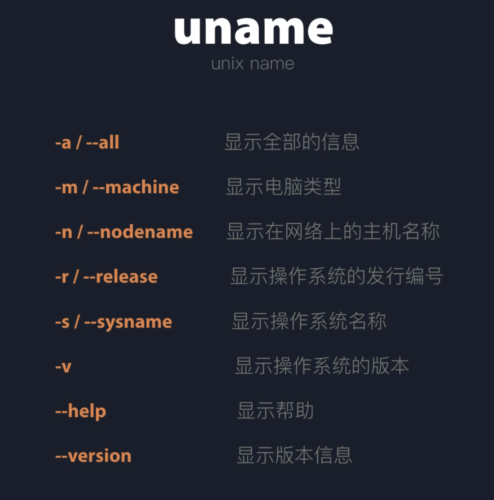

### ls
  可组合修饰符
    -t  时间排序
    -r  倒序
    -i  显示indexnodes

### chmod 权限等级
   > -r 4
   > -w 2
   > -x 1

   - 默认 如果不加前缀 是给所有用户类型修改权限(用户/组/其他人)
    `chmod +x filename`
   - 给当前用户下 某个文件 修改
    `chmod u+x filename` 添加 权限
    `chmod u-x filename` 删除 权限
   - 给当前用户组
    `chmod g+x filename`
   - 给当前用户+组
    `chmod ug+x filename`
   - 使用数字代替权限 (当前用户有 rwx, 其他都是 rx 权限)
    `chmod 755 filename`

### touch
  除了用来创建一个具名空文件外, 其原本的真实作用是更新文件的修改时间
   比如 touch + 已有file, 会更新文件的修改时间到当前
   - 更高级的用户还有指定 --date isostring, 或者 --time 修改时间戳
### cd
  `cd -` 可以跳转到上次的目录

### rm / cp
  如果涉及到多级目录都需要加上 -r 递归复制

### mkdir
  `mkdir -p foo/bar/baz` 可以创建多级目录

### tree
   命令树形展示 (可能不一定自带 参考安装方法)
   如果不安装 也可以使用 du 命令去看
   du 命令原本是显示文件大小的, 但也会显示文件夹的结构

## uname
Linux 操作系统信息 默认 -s 即系统名
